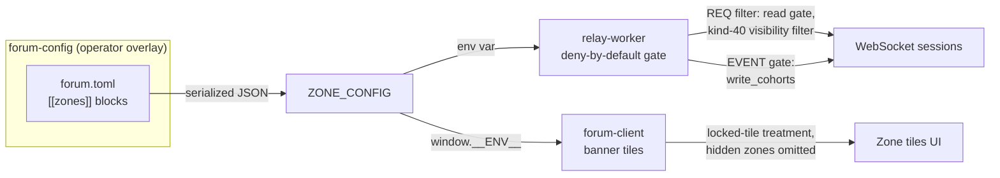
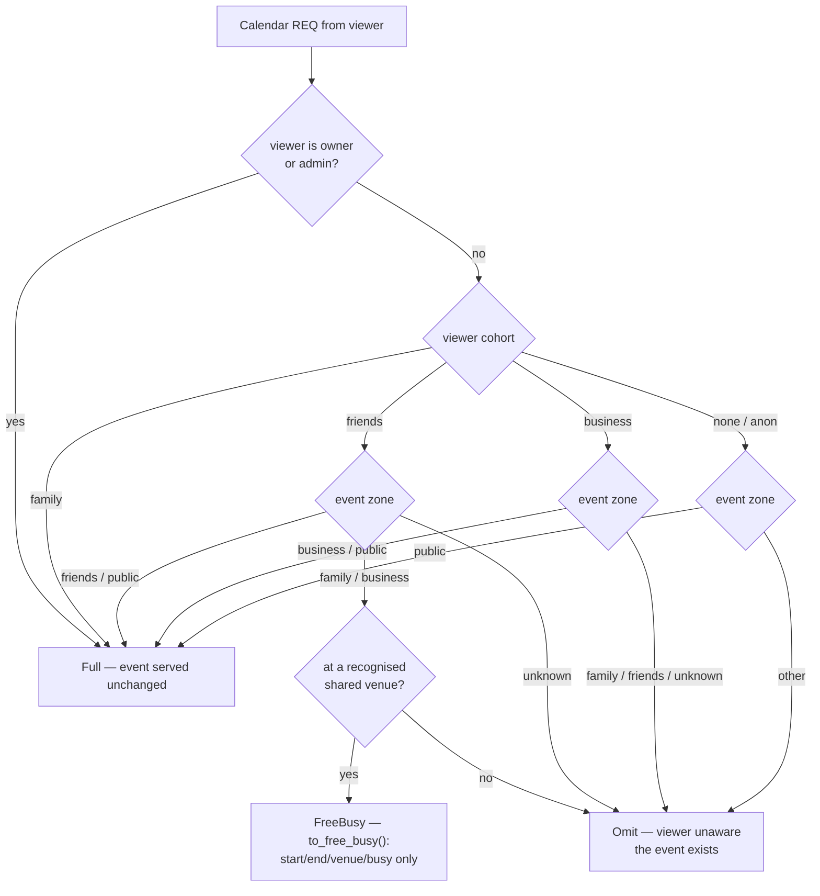

# nostr-rust-forum — a decentralized community forum kit, in Rust

A full-stack, self-hostable forum kit built on the **Nostr** protocol and **Solid**
pods. Passkey-first sign-up with no passwords and no email, **`did:nostr` Multikey**
cryptographic identity, per-user Solid pod storage, config-driven zones with
cohort-gated access, a tiered NIP-52 calendar that projects events to free/busy
across trust boundaries, semantic search, and a universal human-in-the-loop agent
governance plane — all compiled to Rust + WebAssembly and deployable on Cloudflare
Workers.

The kit ships **vanilla**. An operator stands up a community by copying
[`forum.example.toml`](forum.example.toml) to `forum.toml`, filling in their zones,
branding, and deployment values — no forking, no code changes.

[](CHANGELOG.md)
[](LICENSE)
[](#identity--keys)
[](#architecture)

**Maintainer**: [John O'Hare](https://github.com/jjohare) · **Upstream IP**: [Melvin Carvalho](https://github.com/melvincarvalho) ([JSS](https://github.com/JavaScriptSolidServer/JavaScriptSolidServer), [solid-pod-rs](https://github.com/melvincarvalho/solid-pod-rs)) · [MAINTAINERS.md](MAINTAINERS.md)

---

## Why this kit

- **No passwords, no email, no central account.** A WebAuthn passkey *is* the
  account; its PRF extension deterministically derives the user's Nostr key, which
  never leaves the device. Lose nothing to a breached credential database — there
  isn't one.
- **The user owns their identity and their data.** Identity is a `did:nostr`
  Multikey DID; storage is a per-user W3C Solid pod with WAC access control. Both
  are portable and the user controls them.
- **Access is data, not code.** Who can see and post to what is described entirely
  by `forum.toml` zones and cohorts. The relay enforces deny-by-default; the client
  renders what the config describes. Stand up an open community, an invite-only
  circle, or a layered org with one config file.
- **One forum, many trust tiers.** A single deployment hosts a public landing zone,
  inner-circle sections, and private cohorts simultaneously — and the tiered
  calendar lets neighbours see *that you're busy* without seeing *what you're doing*.
- **A governance plane for agents.** Any agent system can publish interactive
  control panels into the forum and get cryptographically-signed human decisions
  back — a universal human-in-the-loop surface over Nostr.
- **Rust everywhere, edge-native.** Core protocol, relay, pod server, auth, search,
  and the browser client are all Rust → WASM, running on Cloudflare Durable Objects,
  D1, R2, KV, and Workers AI, with an optional native (server-Tokio) pod tier.

---

## Feature tour

*A walk through what a member actually sees. (Earlier releases shipped screenshots;
this tour describes the same three signature experiences in prose.)*

**1 · The zone wall — access you can see.**
On arrival a member sees a wall of banner-headed **zone tiles**. The tiles are
generated from config, not hardcoded. Hold the `friends` cohort and the public zone
and the Friends zone render as bright, enterable tiles; Family and Business render
as greyed **locked** tiles — their definitions are served so the tile draws, but the
relay withholds their content. Zones marked `hidden` don't appear at all: a
non-member can't even enumerate that they exist. The wall is the access model made
visible — and it's the same `ZONE_CONFIG` the relay enforces from, so the picture
never lies about what you can reach.

**2 · Inside a cohort-gated section — identity that resolves itself.**
Enter a section and you're in a kind-42 group chat that the relay only streams to
you *after* a NIP-42 AUTH handshake proves your cohort. Every name in the room flows
through a single reactive resolver — `display_name › name › NIP-05 › short pubkey` —
so a freshly-seeded user with no profile metadata shows as a short pubkey and then
**fills in live** the moment their kind-0 arrives. Mentions resolve too: both `@hex`
and `nostr:npub1…` light up as real names. No raw hex hanging around the UI.

**3 · The tiered calendar — busy, not nosy.**
The events page renders a NIP-52 calendar that the **relay projects per viewer**.
Your own circle's events arrive in full — title, time, RSVP. But an event in a
neighbouring cohort held at a *shared venue* is projected down to an anonymous
**free/busy** block: start, end, and "busy", with title, location, participants, and
even the signature stripped server-side. Off-site private events you simply never
see. You learn the room is booked without learning whose party it is.

Around those three: an offline-first PWA (service worker + IndexedDB, 30-day
eviction), a printable one-page **recovery sheet** issued at signup, a Source-Control
pod browser, a semantic search box backed by real embeddings, and a governance
dashboard that turns agent requests into approve/reject/configure cards.

---

## Feature highlights

**Identity & access**
- **Passkey-first auth** — WebAuthn PRF deterministically derives the Nostr key;
  private keys are never stored or transmitted.
- **`did:nostr` Multikey identity** — canonical W3C DID documents on the
  create-agent / did-nostr Multikey form (`publicKeyMultibase`), shared across the
  whole deployment and any federating system. See [Identity & Keys](#identity--keys).
- **Deterministic subkey derivation** — `derive_subkey(root, tag)` =
  HMAC-SHA-256(root, tag) → validated secp256k1 key; one tested primitive (native +
  WASM) for rotatable, recoverable, purpose-scoped keys (ADR-094).
- **Recovery & device-onboarding sheet** — signup issues a 100% client-side
  printable sheet (nsec/npub/relay QRs + restore steps + optional relay sweep),
  Save-as-PDF, with a 0xchat mobile on-ramp and an insist-with-override gate (ADR-095).
- **Revocable device keys & multi-device DM** — per-device keys with revocation and
  NIP-17 multi-device delivery (ADR-099/100/101).
- **First-user-is-admin** — no hardcoded admin keys; the first registrant becomes admin.
- **`/connect` magic-link onboarding** — frictionless invite flow (ADR-098).

**Community & content**
- **Config-driven zones** — arbitrary cohort-gated sections defined in `forum.toml`:
  banner tiles, `public`/`locked`/`hidden` visibility, per-zone read *and* write
  cohorts, optional NIP-44 client-side encryption flag, deny-by-default relay enforcement.
- **Tiered NIP-52 calendar** — per-cohort full / free-busy / omit projection with
  shared-venue awareness and anti-spoof RSVP gating.
- **Semantic search** — Workers AI `bge-small-en-v1.5` embeddings (384-dim,
  L2-normalized), cosine k-NN over an RVF vector store, with a truthful `/status`.
- **Reactive display-name resolution** — one path for every identity render site.
- **Relay-enforced moderation** — NIP-56 reporting (kind-1984).

**Storage & the open web**
- **Solid pods** — per-user W3C storage with WAC ACL, LDP containers, JSON Patch,
  conditional requests, quotas, and WebID.
- **Per-container delegation** — opt-in `PUT {"@delegation":{agent,modes}}` grants
  that never confer Control and never lock the owner out (ADR-096).
- **Git-backed pods** — on native deployments, pods are clone-able git repos with a
  VS Code-style Source Control panel in the browser (ADR-093).
- **Federated NIP-05** — resolve usernames against the local whitelist first, then
  the user's pod over HTTP (ADR-086).
- **Micropayments** — HTTP 402 + Web Ledgers for per-resource satoshi costs.

**Agents & federation**
- **Agent Control Surface Protocol** — agents publish interactive control panels
  (kinds 31400-31405); the forum renders them as signed human-in-the-loop decisions.
- **Private relay mesh (designed, not shipped)** — cross-system relay federation
  via `did:nostr` (ADR-073/104). The `nostr-bbs-mesh` crate is **scaffold only**:
  it defines the `MeshTransport` trait and session state but ships no concrete
  transport, and it is not a dependency of `nostr-bbs-relay-worker`. **Standalone
  is the supported deployment mode**; federation lands in a later sprint.
- **Edge + native two-tier pods** — Cloudflare Workers pods plus an optional native
  solid-pod-rs tier fronted by a Cloudflare Tunnel, routed by WebID.

**Operability**
- **Vanilla kit + operator overlay** — brand and configure via a `forum.toml`
  overlay; the kit ships zero operator branding.
- **Offline-first PWA**, **WebGPU→Canvas2D→CSS** tiered effects, shared KV rate
  limiting across all workers, anti-drift lint keeping the kit vendor-neutral.

---

## Identity & Keys

Identity in the kit is a **`did:nostr` Multikey DID** — the same canonical form used
by the wider did-nostr / create-agent ecosystem, so a forum member's identity is
portable across every system that speaks the method.

- The DID is `did:nostr:<x-only-hex>`; the DID document carries a single
  `Multikey` verification method whose `publicKeyMultibase` is the multibase/multicodec
  encoding of the BIP-340 x-only key (`fe70102` + the 32-byte x-only hex), with
  relative `authentication` / `assertionMethod` and an empty `service` array at
  Tier-1. The identity string and key bytes are invariant — only the document
  encoding is canonical.
- **The passkey is the root of trust.** WebAuthn's PRF extension derives the root
  Nostr key on-device; it is never stored server-side. Purpose-scoped subkeys derive
  deterministically from the root via `derive_subkey` (HMAC-SHA-256), so device keys
  and capability keys are rotatable and recoverable from the root alone.
- **Auth reads the raw signature, not the document.** NIP-98 (HTTP) and NIP-42
  (relay) verify a Schnorr signature against the raw event pubkey — re-encoding the
  DID document can never affect the auth path.
- The pod + identity layers run on **solid-pod-rs `0.5.0-alpha.2`** (the JSS Rust
  port), which is the single canonical encoder of record for the Multikey DID document.

---

## Zones & Cohorts

Zones are the kit's access primitive. A zone is a named group of channels gated by
cohort membership; cohorts are string slugs stored on the relay whitelist
(`whitelist.cohorts`) and granted via the NIP-98 admin API. The zone list is operator
data, defined once in the deployment's `forum.toml` and fanned out to both
enforcement points:



The client renders what the config describes; **the relay is the real access
boundary**. Visibility controls what non-members can see of a zone's existence:

| `visibility` | Listed to non-members | Content readable | Kind-40 definition served |
|--------------|----------------------|------------------|---------------------------|
| `public` | Yes | Yes (no auth required) | Yes |
| `locked` (default) | Yes — greyed banner tile | No | Yes (so the tile renders) |
| `hidden` | No | No | No |

Read/write access per viewer:

| Viewer | Read zone content | Write to zone |
|--------|-------------------|---------------|
| Admin | Always | Always |
| Member of a `required_cohorts` entry | Yes | If member of `write_cohorts ?? required_cohorts` |
| Authenticated, no matching cohort | `public` zones only | `public` zones only if cohort matches `write_cohorts` |
| Unauthenticated | `public` zones only | No |

A `public` zone with `write_cohorts = ["friends"]` gives the common pattern of an
openly readable landing zone that only an inner circle can post to. The `encrypted`
flag marks a zone's content as client-side NIP-44 encrypted; the relay records the
flag only. Each zone may also carry an `accent_hex` for client-side theming.

## Tiered NIP-52 Calendar

Calendar events (kinds 31922/31923) bind to a zone via a `["zone", <slug>]` tag and
optionally to a shared venue via `["venue", <name>]`. The relay's projector
(`relay_do/calendar_projection.rs`) decides, for every (viewer, event) pair, one of
three outcomes — and it is the complete access decision for calendar kinds,
deny-by-default for unknown zones:



The projection matrix (operator-approved, encoded in 25 unit tests):

| Viewer ↓ / Event zone → | family | business | friends | public | unknown |
|-------------------------|--------|----------|---------|--------|---------|
| admin / owner | full | full | full | full | full |
| family | full | full | full | full | full |
| friends | free/busy\* | free/busy\* | full | full | omit |
| business | omit | full | omit | full | omit |
| no cohort / anon | omit | omit | omit | full | omit |

\* Friends see family/business events as free/busy **only at a recognised shared
venue**; off-site events are omitted — friends see venue blocking, never private
off-site time. Shared venues are operator-defined in `forum.toml`
(`[calendar].shared_venues`); the kit ships generic examples `primary`/`secondary`.

`to_free_busy()` keeps start/end, venue, and a busy flag; it strips title, location,
content, and participants, and clears the signature (the result is a derived view,
not the signed original). **RSVPs (kind 31925) are served only when the viewer's tier
for the target event is Full** — participant lists must not leak through a free/busy
block — and the target's zone and venue resolve exclusively from the stored
referenced event, so a spoofed zone tag mirrored onto the RSVP cannot widen access.
An unresolvable target serves only admin/owner.

## Agent Control Surface Protocol

The forum acts as a universal human-in-the-loop (HITL) control plane for any agent
system. Agents publish structured Nostr events into the forum relay; the forum
renders them as interactive decision surfaces. Humans respond through the same relay
with cryptographically signed events.

```mermaid
sequenceDiagram
    participant Agent
    participant Relay as relay-worker (DO)
    participant Client as forum-client (WASM)
    participant Human

    Agent->>Relay: kind 31400 PanelDefinition
    Relay-->>Client: subscription (kinds 31400-31405)
    Agent->>Relay: kind 31402 ActionRequest
    Relay-->>Client: push to PanelRegistry
    Client-->>Human: render decision UI
    Human->>Client: approve / reject / configure
    Client->>Relay: kind 31403 ActionResponse (Schnorr-signed; relay admits admins only)
    Relay-->>Agent: subscription on kind 31403
```

**Event kinds (parameterized replaceable, `d`-tag addressable):**

| Kind  | Name            | Publisher | Purpose                                      |
|-------|-----------------|-----------|----------------------------------------------|
| 31400 | PanelDefinition | Agent     | Declare a control panel (schema, fields, actions, layout) |
| 31401 | PanelState      | Agent     | Publish current panel data snapshot           |
| 31402 | ActionRequest   | Agent     | Request a human decision (approve/reject/configure) |
| 31403 | ActionResponse  | Human     | Respond to an action request (signed by human's key) |
| 31404 | PanelUpdate     | Agent     | Incremental state diff                        |
| 31405 | PanelRetired    | Agent     | Retire a control panel                        |

**Trust model:** agent pubkeys must be registered in the `agent_registry` D1 table
(admin-gated); governance events from unregistered agents are rejected at relay
ingress; human responses (kind 31403) are signed Nostr events the relay admits only
from admins; decisions form an immutable, cryptographically-signed audit trail.

**REST API** (9 endpoints on the auth-worker, all NIP-98 gated): list/provision/
register/revoke agents, list/get broker cases, grant/revoke/list roles. The full
governance schema (`agent_registry`, `broker_cases`, `broker_decisions`,
`broker_roles`) deploys via the `0002_governance.sql` migration.

## Architecture

Fourteen crates in a Cargo workspace:

| Crate | Type | Purpose |
|-------|------|---------|
| `nostr-bbs-core` | Library | Shared Nostr protocol: NIP-01/07/09/29/33/40/42/44/45/50/52/98, key management, event validation, NIP-52 zone/venue tags + `to_free_busy()`, `did:nostr` Multikey DID rendering, governance domain model (kinds 31400-31405), WASM bridge |
| `nostr-bbs-config` | Library | Complete operator configuration schema: zones (visibility, cohorts, banners, accent, encryption), deployment, webauthn, pod, relay, admin, branding, trust, invites, moderation, mesh, ratelimit, features, nip05, native-pod, provision, export, git, governance, payments, calendar |
| `nostr-bbs-mesh` | Library | **Scaffold only** (ADR-073, deferred): `MeshTransport` trait + `PeerSession` state for a future NIP-42-gated relay federation. No concrete transport is implemented and the crate is **not** a dependency of `nostr-bbs-relay-worker`; standalone is the supported mode |
| `nostr-bbs-setup-skill` | Library | Provider-abstracted AI configurator for operator onboarding |
| `nostr-bbs-ascii` | Library | On-theme ASCII-art image rendering: server-side decode in the workers, phosphor-level HTML emit consumed by the retro BBS client |
| `nostr-bbs-auth-worker` | CF Worker | WebAuthn register/login (passkey), NIP-98 verification, pod provisioning (CF + native-tier), governance REST API, rate limiting (D1 + KV + R2) |
| `nostr-bbs-pod-worker` | CF Worker | Solid pod storage: LDP containers, WAC ACL, JSON Patch, conditional requests, quotas, WebID, micropayments (R2 + KV) |
| `nostr-bbs-preview-worker` | CF Worker | Link preview with SSRF protection, OG/meta parsing, oEmbed, rate limiting |
| `nostr-bbs-relay-worker` | CF Worker | NIP-01 WebSocket relay via Durable Objects, hibernation-safe sessions, config-driven zone gating, tiered calendar projection, agent-registry gate, governance routing, subscription persistence (D1 + DO) |
| `nostr-bbs-search-worker` | CF Worker | Semantic vector search via Workers AI BGE-small embeddings, RVF binary format, in-memory cosine k-NN, rate limiting (R2 + KV) |
| `nostr-bbs-rate-limit` | Library | Shared application-layer rate limiting via Cloudflare KV, consumed by all workers |
| `nostr-bbs-forum-client` | Leptos App | Browser client (Leptos 0.7 CSR + Trunk): passkey auth, 22 pages, 60+ components, config-driven zone tiles, reactive display-name resolution, admin panel, Source-Control pod browser, governance dashboard |
| `nostr-bbs-bbs-client` | Leptos App | Retro ASCII/BBS terminal client served at `/community/bbs/` (Leptos CSR + Trunk): phosphor-CRT render skin, door games, message-base/roster/pod browsing. Read-only render skin today; the M2 write-path reuses the forum's signer (ADR-105) |
| `nostr-bbs-upstream-canary` | Test | Validates upstream `nostr` crate compatibility on the WASM/CF Workers build matrix |

```
nostr-bbs-forum-client ----+
nostr-bbs-auth-worker  ----+
nostr-bbs-relay-worker ----+--> nostr-bbs-core
nostr-bbs-pod-worker   ----+
nostr-bbs-search-worker ---+
nostr-bbs-config ------------> nostr-bbs-core
nostr-bbs-mesh --------------> nostr-bbs-core + nostr-bbs-config
nostr-bbs-rate-limit --------> nostr-bbs-core (shared KV rate limiter)
nostr-bbs-bbs-client --------> nostr-bbs-core + nostr-bbs-config (retro client, /community/bbs/)
nostr-bbs-preview-worker       (standalone)
nostr-bbs-ascii                (standalone; ASCII-art render helpers)
nostr-bbs-upstream-canary      (standalone, publish = false)
```

## NIP Coverage

The relay advertises its supported NIPs in the NIP-11 information document
(`crates/nostr-bbs-relay-worker/src/nip11.rs`): `1, 9, 11, 16, 29, 33, 40, 42, 45,
50, 56, 59, 65, 98`.

| NIP | Description | Crate |
|-----|-------------|-------|
| 01 | Basic protocol, event signing | nostr-bbs-core, nostr-bbs-relay-worker |
| 07 | Browser extension signer | nostr-bbs-forum-client |
| 09 | Event deletion | nostr-bbs-core, nostr-bbs-relay-worker |
| 11 | Relay information document | nostr-bbs-relay-worker |
| 16 | Event treatment (replaceable/ephemeral) | nostr-bbs-relay-worker |
| 17 | Gift-wrapped DM transport via NIP-59; inbox routing (kind-14/10050) not implemented — **not advertised** in NIP-11 | nostr-bbs-core |
| 29 | Relay-based groups | nostr-bbs-core, nostr-bbs-relay-worker |
| 33 | Parameterized replaceable events | nostr-bbs-core, nostr-bbs-relay-worker |
| 40 | Expiration timestamp | nostr-bbs-core, nostr-bbs-relay-worker |
| 42 | Authentication of clients to relays | nostr-bbs-relay-worker, nostr-bbs-mesh, nostr-bbs-forum-client |
| 44 | Encrypted payloads v2 | nostr-bbs-core |
| 45 | Event counts | nostr-bbs-relay-worker |
| 50 | Search (semantic, Workers AI embeddings) | nostr-bbs-search-worker |
| 52 | Calendar events (31922/31923, tiered per-cohort projection) | nostr-bbs-core, nostr-bbs-relay-worker |
| 56 | Reporting (kind-1984, relay-enforced moderation) | nostr-bbs-relay-worker |
| 59 | Gift wrap | nostr-bbs-core, nostr-bbs-relay-worker |
| 65 | Relay list metadata | nostr-bbs-relay-worker |
| 98 | HTTP Auth | nostr-bbs-core, all workers |
| app:31400-31405 | Agent Control Surface Protocol | nostr-bbs-core, relay-worker, auth-worker, forum-client |

The NIP-11 document also carries a `nostr_bbs.agent_control_surface` namespaced
extension block advertising the governance kinds (31400-31405), `agent_auth =
"nip98"`, and `agent_identity = "did:nostr"`, so a NIP-11-reading agent can discover
the mesh's agent control surface and its registry gate.

## Quick Start

```bash
# Prerequisites
rustup target add wasm32-unknown-unknown
cargo install trunk
npm i -g wrangler

# Build + test the whole workspace
cargo build --workspace
cargo test  --workspace

# Serve the forum client locally
cd crates/nostr-bbs-forum-client && trunk serve
```

See [SETUP.md](SETUP.md) for full deployment instructions (Cloudflare resources,
DNS, client build).

## Configuration

The kit ships generic. Stand up a community by copying the fully-commented template
and editing it for your deployment:

```bash
cp forum.example.toml forum.toml
$EDITOR forum.toml          # set your hostname, zones, cohorts, admin pubkey…
```

[`forum.example.toml`](forum.example.toml) documents **every** section with safe
generic defaults: `deployment`, `webauthn`, `pod`, `relay`, `admin`, `branding`,
`[[zones]]` (public / friends / family / business, each with display name, accent,
banner, cohorts, visibility), `trust`, `invites`, `moderation`, `mesh`, `ratelimit`,
`features`, `nip05`, `native_pod`, `provision`, `export`, `git`, `governance`,
`payments`, and `calendar`. The schema lives in `nostr-bbs-config`; the relay reads
zones from a `ZONE_CONFIG` env var (the serde JSON of the `[[zones]]` blocks) and the
client reads the same JSON from `window.__ENV__.ZONE_CONFIG`, so the tiles and the
gate always describe the same model. When the config is absent the relay denies
non-public reads — nothing regresses open. An operator who wants branding and bespoke
config keeps it in their **own** overlay repo (a `forum-config/` package that pins
this kit and supplies values); the kit itself stays vendor-neutral, enforced by
`scripts/anti-drift-lint.sh`.

> **Consuming-repo dual pin:** a deployment pins the kit in two places that must move
> together — `KIT_REF` in the deploy workflow (the SHA the WASM client + workers build
> from) and `rev = "<sha>"` on every `nostr-bbs-*` git dependency in the overlay's
> `Cargo.toml`. Bump both in the same commit, or the client and the config schema
> drift apart.

## Federation Transports

> **Status (2026-07-03): designed, not shipped.** `nostr-bbs-mesh` is a scaffold
> crate (`MeshTransport` trait + session state only, no concrete transport) and is
> not wired into `nostr-bbs-relay-worker`. **Standalone is the supported deployment
> mode.** The `[mesh]` config block below is accepted by the schema but the relay
> short-circuits when `mode = "standalone"` (the default) and has no federated
> code path to take when set to `"federated"`. The section below describes the
> intended design (ADR-073), not a live capability.

As a Cloudflare Workers application the forum cannot join a Tailscale tailnet
directly, so private peers are reached over relay transports.

**Nostr relays (all components).** `nostr-bbs-mesh` is designed to connect to peer
relays over standard NIP-01 WebSocket — private infrastructure relays (e.g. over
Tailscale between your nodes) or public relays for censorship resistance:

```toml
# forum.toml
[mesh]
mode = "federated"
peer_relays = [
    "ws://node.tailnet-name.ts.net:7777",   # private peer relay
    "wss://relay.damus.io",                  # public relay
]
```

The forum's Durable-Objects relay bridges browser WebSocket sessions and the wider
relay mesh; governance events propagate from any registered agent system to the
governance dashboard. All relay traffic is authenticated via NIP-98/NIP-42
`did:nostr` Schnorr signatures — authentication is independent of transport.

**Cloudflare Tunnels (edge ↔ local).** CF Workers reach local solid-pod-rs / native
pod instances through Cloudflare Tunnels for federated NIP-05 resolution, pod
resource access, and the `.pods` creation endpoint.

## Pod Storage Tiers

Pods resolve across two tiers, routed by WebID (ADR-093). NIP-98 provides cross-tier
authentication without shared state.

| Tier | Backend | Git | Provisioning |
|------|---------|-----|--------------|
| CF Workers | `nostr-bbs-pod-worker` — LDP containers on R2 | None (no `tokio::process`, no `wasm32` git target) | `POST /.pods` (NIP-98) |
| Native | `solid-pod-rs-server`, fronted by a Cloudflare Tunnel | Smart HTTP git transport at `/_git/<pubkey>/` | `POST /api/native-pod/provision` (admin NIP-98) |

The native tier is gated by the `[native_pod]` config section and disabled by
default. When reachable, the pod browser renders two extra panes: a VS Code-style
**GitPanel** (staged/unstaged/untracked, per-file stage/diff/discard, commit box,
history) and an **AppManifestPanel** (apps as first-class pod repositories).

## Documentation

- [SETUP.md](SETUP.md) — full deployment guide (Cloudflare resources, DNS, client build)
- [forum.example.toml](forum.example.toml) — the canonical, fully-commented config template
- [CHANGELOG.md](CHANGELOG.md) — release history · [CONTRIBUTING.md](CONTRIBUTING.md) · [SECURITY.md](SECURITY.md)
- [docs/architecture.md](docs/architecture.md) — architecture overview, request lifecycle, data flow, governance routing
- [docs/adr/](docs/adr/) — architecture decision records (identity, pods, mesh, key lifecycle, onboarding)

## Upstream & Foundations

nostr-rust-forum is a self-hostable **forum kit and governance UI** built on
`did:nostr` Multikey identity and Nostr message passing. It deploys standalone or
embeds as the governance surface of a larger agent platform.

| Foundation | Project | Role |
|:-----------|:--------|:-----|
| **solid-pod-rs** | [solid-pod-rs](https://github.com/melvincarvalho/solid-pod-rs) | Cryptographic foundation — JSS Rust port, `did:nostr` Multikey identity (`0.5.0-alpha.2`) |
| **JSS** | [JavaScriptSolidServer](https://github.com/JavaScriptSolidServer/JavaScriptSolidServer) | Upstream Solid server reference and AGPL-3.0 lineage |
| **did-nostr** | [did:nostr](https://github.com/nicholasgasior/did-nostr) | Nostr-keyed DID method for cross-system identity |

## License

Licensed under [AGPL-3.0-only](LICENSE), inherited from upstream JSS
([JavaScriptSolidServer](https://github.com/JavaScriptSolidServer/JavaScriptSolidServer)).
