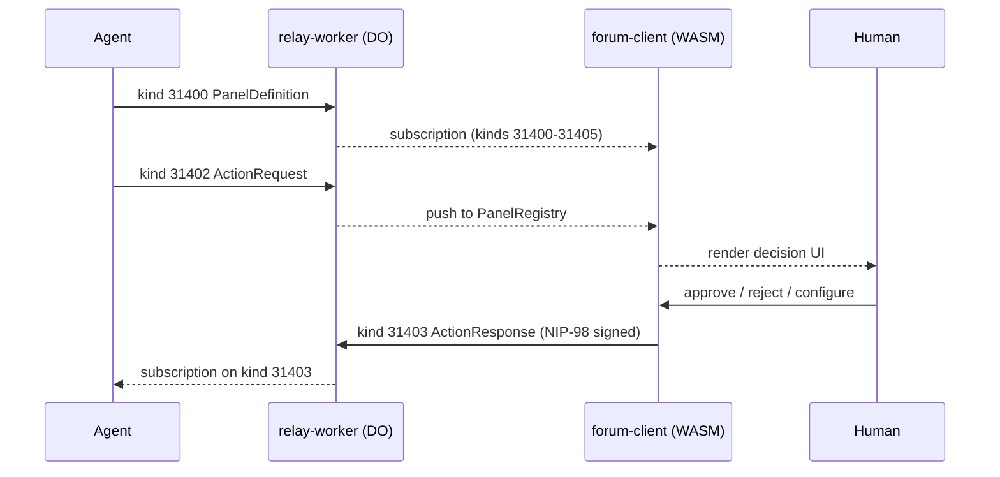
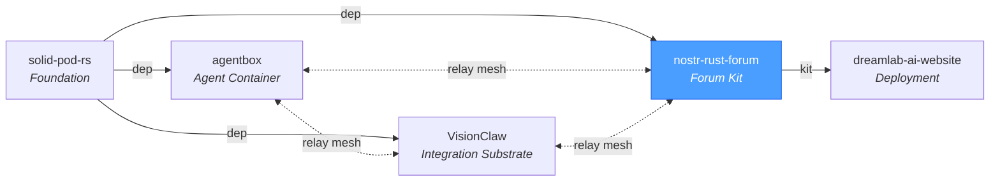

# nostr-rust-forum -- Decentralized Forum Kit on Nostr

A full-stack, open-source forum kit built on the Nostr protocol. Passkey-first
authentication, Solid pod storage, config-driven zone access, and Cloudflare
Workers backend -- all in Rust. Operators consume this kit by creating a
`forum-config/` package that overlays branding, zones, and deployment config.

**Current release:** `v3.0.0-rc7` (see [CHANGELOG.md](CHANGELOG.md))

## Architecture

Twelve crates in a Cargo workspace:

| Crate | Type | Purpose |
|-------|------|---------|
| `nostr-bbs-core` | Library | Shared Nostr protocol: NIP-01/07/09/29/33/40/42/44/45/50/52/98, key management, event validation, governance domain model (kinds 31400-31405), WASM bridge |
| `nostr-bbs-config` | Library | Operator configuration schema, zone definitions, deployment topology |
| `nostr-bbs-mesh` | Library | Private relay mesh federation, NIP-42 AUTH gate, peer discovery |
| `nostr-bbs-setup-skill` | Library | Provider-abstracted AI configurator for operator onboarding |
| `nostr-bbs-auth-worker` | CF Worker | WebAuthn register/login (passkey), NIP-98 verification, pod provisioning, governance REST API (agent registry, broker cases, roles), rate limiting (D1 + KV + R2) |
| `nostr-bbs-pod-worker` | CF Worker | Solid pod storage: LDP containers, WAC ACL, JSON Patch, conditional requests, quotas, WebID, micropayments (R2 + KV) |
| `nostr-bbs-preview-worker` | CF Worker | Link preview with SSRF protection, OG/meta parsing, oEmbed, rate limiting |
| `nostr-bbs-relay-worker` | CF Worker | NIP-01 WebSocket relay via Durable Objects, hibernation-safe sessions, agent registry gate, governance event routing (kinds 31400-31405), subscription persistence (D1 + DO) |
| `nostr-bbs-search-worker` | CF Worker | Vector search, RVF binary format, in-memory cosine k-NN, rate limiting (R2 + KV) |
| `nostr-bbs-rate-limit` | Library | Shared application-layer rate limiting via Cloudflare KV, consumed by all workers |
| `nostr-bbs-forum-client` | Leptos App | Browser client (Leptos 0.7 CSR + Trunk), passkey auth, 19 pages, 60+ components, admin panel, governance dashboard with PanelRegistry |
| `nostr-bbs-upstream-canary` | Test | Validates upstream `nostr` crate compatibility on WASM/CF Workers build matrix |

## Crate Dependency Graph

```
nostr-bbs-forum-client ----+
nostr-bbs-auth-worker  ----+
nostr-bbs-relay-worker ----+--> nostr-bbs-core
nostr-bbs-pod-worker   ----+
nostr-bbs-search-worker ---+
nostr-bbs-config ------------> nostr-bbs-core
nostr-bbs-mesh --------------> nostr-bbs-core + nostr-bbs-config
nostr-bbs-rate-limit --------> nostr-bbs-core (shared KV rate limiter)
nostr-bbs-preview-worker       (standalone)
nostr-bbs-upstream-canary      (standalone, publish = false)
```

## Features

- **Agent Control Surface Protocol** -- Agents publish interactive control panels (kinds 31400-31405) to the relay; the forum renders them as decision surfaces with approve/reject/configure actions, creating a universal human-in-the-loop governance plane
- **Passkey-first auth** -- WebAuthn PRF extension derives Nostr keys deterministically; private keys never stored
- **3-zone access model** -- Configurable public/members/private zones with cohort-based access control
- **First-user-is-admin** -- No hardcoded admin keys; first registrant gets admin privileges
- **Solid pods** -- Per-user W3C-compliant storage with WAC ACL, LDP containers, and JSON Patch
- **Offline-first** -- Service worker + IndexedDB caching with 30-day eviction
- **WebGPU effects** -- 3-tier rendering: WebGPU compute > Canvas2D > CSS fallback
- **Micropayments** -- HTTP 402 + Web Ledgers for per-resource satoshi costs
- **Relay mesh** -- Private NIP-42 relay mesh for cross-system federation via `did:nostr`
- **Operator overlay** -- Operators inject branding, zones, and config via `forum-config/` without forking

## Agent Control Surface Protocol

The forum acts as a universal human-in-the-loop (HITL) control plane for any
agent system. Agents publish structured nostr events into the forum relay; the
forum renders them as interactive decision surfaces. Humans respond through the
same relay with cryptographically signed events.



**Event kinds (parameterized replaceable, `d`-tag addressable):**

| Kind  | Name            | Publisher | Purpose                                      |
|-------|-----------------|-----------|----------------------------------------------|
| 31400 | PanelDefinition | Agent     | Declare a control panel (schema, fields, actions, layout) |
| 31401 | PanelState      | Agent     | Publish current panel data snapshot           |
| 31402 | ActionRequest   | Agent     | Request a human decision (approve/reject/configure) |
| 31403 | ActionResponse  | Human     | Respond to an action request (signed by human's key) |
| 31404 | PanelUpdate     | Agent     | Incremental state diff                        |
| 31405 | PanelRetired    | Agent     | Retire a control panel                        |

**Trust model:**
- Agent pubkeys must be registered in the `agent_registry` D1 table (admin-gated)
- Governance events from unregistered agents are rejected at relay ingress
- Human responses require standard NIP-98 auth; broker-role users can act on any case
- Decisions are cryptographically signed nostr events -- immutable audit trail

**D1 governance schema** (4 tables, deployed via `0002_governance.sql` migration):
- `agent_registry` -- registered agent pubkeys with per-agent rate limits
- `broker_cases` -- case aggregate (category, subject, state, priority, assignment)
- `broker_decisions` -- append-only decision audit trail with provenance chain
- `broker_roles` -- role assignments (contributor, auditor, broker, admin)

**REST API** (7 endpoints on auth-worker, all NIP-98 gated):

| Method | Path                            | Gate  | Purpose                  |
|--------|---------------------------------|-------|--------------------------|
| GET    | /api/governance/agents          | any   | List registered agents   |
| POST   | /api/governance/agents/register | admin | Register an agent pubkey |
| POST   | /api/governance/agents/revoke   | admin | Deactivate an agent      |
| GET    | /api/governance/cases           | any   | List broker cases        |
| GET    | /api/governance/cases/:id       | any   | Get a single broker case |
| POST   | /api/governance/roles/grant     | admin | Grant a broker role      |
| GET    | /api/governance/roles           | any   | List role assignments    |

See [docs/architecture.md](docs/architecture.md) for data flow diagrams and
[docs/sprint/enterprise-lift-value-assessment.md](docs/sprint/enterprise-lift-value-assessment.md)
for the full ADR and protocol specification.

## NIP Coverage

| NIP | Description | Crate |
|-----|-------------|-------|
| 01 | Basic protocol, event signing | nostr-bbs-core, nostr-bbs-relay-worker |
| 07 | Browser extension (NIP-07) | nostr-bbs-forum-client |
| 09 | Event deletion | nostr-bbs-core, nostr-bbs-relay-worker |
| 11 | Relay information document | nostr-bbs-relay-worker |
| 16 | Ephemeral events | nostr-bbs-relay-worker |
| 29 | Group access (relay-enforced) | nostr-bbs-core, nostr-bbs-relay-worker |
| 33 | Parameterized replaceable events | nostr-bbs-core, nostr-bbs-relay-worker |
| 40 | Channel creation/metadata | nostr-bbs-core, nostr-bbs-relay-worker |
| 42 | Channel messages | nostr-bbs-relay-worker |
| 44 | Encrypted direct messages v2 | nostr-bbs-core |
| 45 | Event counts | nostr-bbs-relay-worker |
| 50 | Search | nostr-bbs-search-worker |
| 52 | Calendar events | nostr-bbs-core |
| 98 | HTTP Auth | nostr-bbs-core, all workers |
| app:31400-31405 | Agent Control Surface Protocol | nostr-bbs-core, nostr-bbs-relay-worker, nostr-bbs-auth-worker, nostr-bbs-forum-client |

## Quick Start

```bash
# Prerequisites
rustup target add wasm32-unknown-unknown
cargo install trunk
npm i -g wrangler

# Build all crates
cargo build --workspace

# Run tests
cargo test --workspace

# Serve the forum client locally
cd crates/nostr-bbs-forum-client && trunk serve
```

See [SETUP.md](SETUP.md) for full deployment instructions.

## Zone Model

The forum uses a 3-zone access model configurable via `BbsConfig`:

| Default Zone | Default ID | Purpose |
|-------------|-----------|---------|
| Public | `home` | Open to all authenticated users |
| Members | `members` | Restricted to approved members |
| Private | `private` | Invite-only / admin-granted |

Zone names, IDs, and cohort mappings are all runtime-configurable. See
`crates/nostr-bbs-forum-client/src/stores/zone_access.rs` for the `BbsConfig` struct.

## Ecosystem

nostr-rust-forum is the forum kit of the DreamLab open-source ecosystem -- five
repositories federated via `did:nostr` identity. Operators consume this kit by
creating a `forum-config/` package that overlays branding, zones, and deployment
config.



| Repository | Role | Key Technology |
|---|---|---|
| [solid-pod-rs](https://github.com/DreamLab-AI/solid-pod-rs) | Foundation library | Solid Protocol, DID:Nostr, WAC |
| **[nostr-rust-forum](https://github.com/DreamLab-AI/nostr-rust-forum)** | **Forum kit** | **12 `nostr-bbs-*` Rust crates, CF Workers** |
| [agentbox](https://github.com/DreamLab-AI/agentbox) | Agent container | Nix, nostr-rs-relay, mesh peer |
| [VisionClaw](https://github.com/DreamLab-AI/VisionClaw) | Integration substrate | Knowledge graph, GPU physics, XR |
| [dreamlab-ai-website](https://github.com/DreamLab-AI/dreamlab-ai-website) | Branded deployment | React SPA, WASM forum, `forum-config/` |

Cross-substrate normative decisions (ADRs, PRDs, DDD bounded-context maps,
fixture corpus) live in the
[VisionClaw monorepo](https://github.com/DreamLab-AI/VisionClaw) under
`docs/adr/`, `docs/prd/`, and `docs/specs/`. This kit pulls shared test
fixtures from `docs/specs/fixtures/` via `scripts/sync-fixtures.sh`.

## Documentation

- [SETUP.md](SETUP.md) -- Full deployment guide (Cloudflare resources, DNS, client build)
- [CHANGELOG.md](CHANGELOG.md) -- Release history
- [CONTRIBUTING.md](CONTRIBUTING.md) -- How to contribute
- [SECURITY.md](SECURITY.md) -- Responsible disclosure policy
- [docs/architecture.md](docs/architecture.md) -- Architecture overview, request lifecycle, data flow, governance event routing
- [docs/sprint/enterprise-lift-value-assessment.md](docs/sprint/enterprise-lift-value-assessment.md) -- Agent Control Surface Protocol ADR, value assessment, sprint plan
- [docs/sprint/milestone-0-sso-parity.md](docs/sprint/milestone-0-sso-parity.md) -- NIP-98 cross-repo SSO parity report

## License

Dual-licensed under [MIT](LICENSE-MIT) or [Apache 2.0](LICENSE-APACHE), at your option.
