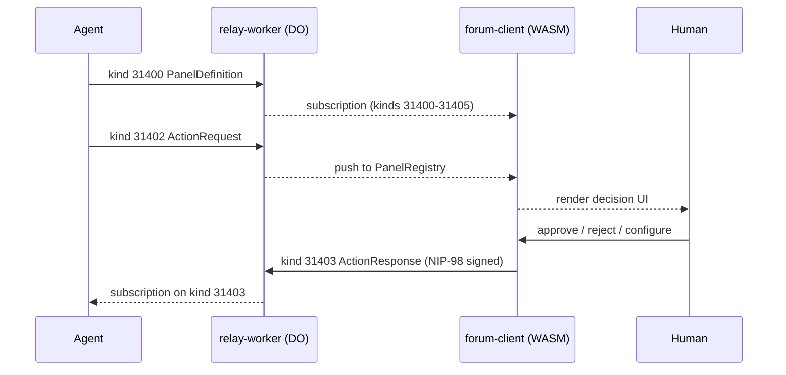

# nostr-rust-forum — Decentralized Forum Kit on Nostr

A full-stack, open-source forum kit built on the Nostr protocol. Passkey-first
authentication, Solid pod storage, config-driven zone access, and Cloudflare
Workers backend — all in Rust. Operators consume this kit by creating a
`forum-config/` package that overlays branding, zones, and deployment config.

**Maintainer**: [John O'Hare](https://github.com/jjohare) · **Upstream IP**: [Melvin Carvalho](https://github.com/melvincarvalho) ([JSS](https://github.com/JavaScriptSolidServer/JavaScriptSolidServer), [DID:Nostr](https://github.com/nicholasgasior/did-nostr)) · [MAINTAINERS.md](MAINTAINERS.md)

**Current release:** `v3.0.0-rc11` (see [CHANGELOG.md](CHANGELOG.md))

## Phase 1 (May 2026)

The JSS Phase 1 cross-repo sprint (closed 2026-05-16) landed federated
identity, pod-resident key provisioning, and pod data export across
the ecosystem. From this kit's perspective:

- **Federated NIP-05 resolution** -- `nostr-bbs-auth-worker` resolves
  `/.well-known/nostr.json?name=<local>` against the local D1
  whitelist first and falls back to the user's pod over HTTP when
  `[nip05].resolver_mode = "federated"` (the new default; legacy
  operators can pin `"d1-only"`). The federated path is documented in
  [ADR-086 §9](docs/adr/ADR-086-nip05-pod-federation.md).
- **Schema-typed `[nip05]` config** -- `nostr-bbs-config` now exposes
  a first-class `Nip05Config` block (resolver mode, pod base URL,
  fallback timeouts, CORS policy). Operators wire it via
  `forum-config/`; runtime values flow into `wrangler.toml` as
  `NIP05_RESOLVER_MODE` and `POD_BASE_URL`.
- **solid-pod-rs JSS v0.0.197 alignment** -- workspace dependency is pinned
  to `solid-pod-rs` `0.4.0-alpha.15` (published on crates.io; earlier rc builds
  used git revisions `8668792` / `4ac7670`). The
  forum consumes the WASM-safe `core` surface and mirrors the new server
  browser contract in the Worker tier: JSS-compatible CORS, Solid auth
  challenge headers, exposed notification discovery, and an authenticated
  `POST /.pods` creation alias mapped to `/pods/{nostr-pubkey}/`.

Two follow-up ADRs are open:
[ADR-087](docs/adr/ADR-087-cf-workers-portable-cores.md) (draft) tracks
the CF-Workers portability gap in solid-pod-rs that currently blocks
shipping the pod-resident signup UX, data export UX, and NIP-05 badge
inside the CF Workers runtime.
[ADR-088](docs/adr/ADR-088-wac-turtle-serializer-quirk.md) (draft)
tracks a small bare-path IRI quirk in the upstream WAC Turtle
serializer.

### Phase 1 extension: git-pods (2026-05-16)

Upstream `solid-pod-rs` v0.4.0-alpha.12 (JSS #471) ships **git-auto-init**
at pod provisioning: pods become clone-able `git` repositories on
deployments that can spawn a `git init` subprocess (server-Tokio
runtimes, e.g. agentbox). The NRF kit surfaces the per-user clone
command on the Settings page so users on those deployments can see and
copy it. **The Cloudflare Workers tier cannot auto-init git** — no
process-spawning capability, no Tokio runtime, no `wasm32` target for
`tokio::process`. CF-Workers-provisioned pods remain LDP+R2 prefixes
with no git history; the clone URL is rendered with a caveat advising
that resolution depends on the operator's deployment.
[ADR-089](docs/adr/ADR-089-git-pods-cf-workers-limitation.md) (draft)
documents the option matrix and the shipping default (defer on CF
Workers; `gix`-on-R2 and external git-init sidecar tracked as future
options).

### JSS v0.0.197 HTTP parity surface (2026-05-17)

The pod-worker now follows the same browser-facing envelope as the native
`solid-pod-rs-server` for high-value Solid flows:

- `POD_CORS_HEADERS` exposes Solid, WAC, payment, and notification headers used
  by pod browser, upload, and agent clients.
- `401` Solid pod responses include `WWW-Authenticate: DPoP realm="Solid",
  Bearer realm="Solid"`.
- LDP responses include `Updates-Via` pointing at the Worker notification
  subscription sidecar for the requested resource.
- `POST /.pods` accepts `{"name":"<64-hex-nostr-pubkey>"}` with a matching
  NIP-98 signature and returns the JSS-shaped `{ name, webId, podUri }` body.
  The Worker intentionally keeps pod names tied to Nostr pubkeys because WAC
  ownership is `did:nostr:<pubkey>`.

## Architecture

Twelve crates in a Cargo workspace:

| Crate | Type | Purpose |
|-------|------|---------|
| `nostr-bbs-core` | Library | Shared Nostr protocol: NIP-01/07/09/29/33/40/42/44/45/50/52/98, key management, event validation, governance domain model (kinds 31400-31405), WASM bridge |
| `nostr-bbs-config` | Library | Operator configuration schema, zone definitions, deployment topology |
| `nostr-bbs-mesh` | Library | Private relay mesh federation, NIP-42 AUTH gate, peer discovery |
| `nostr-bbs-setup-skill` | Library | Provider-abstracted AI configurator for operator onboarding |
| `nostr-bbs-auth-worker` | CF Worker | WebAuthn register/login (passkey), NIP-98 verification, pod provisioning (CF + native-tier admin provisioning), governance REST API (agent registry, broker cases, roles), rate limiting (D1 + KV + R2) |
| `nostr-bbs-pod-worker` | CF Worker | Solid pod storage: LDP containers, WAC ACL, JSON Patch, conditional requests, quotas, WebID, micropayments (R2 + KV) |
| `nostr-bbs-preview-worker` | CF Worker | Link preview with SSRF protection, OG/meta parsing, oEmbed, rate limiting |
| `nostr-bbs-relay-worker` | CF Worker | NIP-01 WebSocket relay via Durable Objects, hibernation-safe sessions, agent registry gate, governance event routing (kinds 31400-31405), subscription persistence (D1 + DO) |
| `nostr-bbs-search-worker` | CF Worker | Vector search, RVF binary format, in-memory cosine k-NN, rate limiting (R2 + KV) |
| `nostr-bbs-rate-limit` | Library | Shared application-layer rate limiting via Cloudflare KV, consumed by all workers |
| `nostr-bbs-forum-client` | Leptos App | Browser client (Leptos 0.7 CSR + Trunk), passkey auth, 22 pages, 60+ components, admin panel (incl. NativePods tab), pod browser with VS Code-style GitPanel + AppManifestPanel, governance dashboard with PanelRegistry |
| `nostr-bbs-upstream-canary` | Test | Validates upstream `nostr` crate compatibility on WASM/CF Workers build matrix |

## Crate Dependency Graph

```
nostr-bbs-forum-client ----+
nostr-bbs-auth-worker  ----+
nostr-bbs-relay-worker ----+--> nostr-bbs-core
nostr-bbs-pod-worker   ----+
nostr-bbs-search-worker ---+
nostr-bbs-config ------------> nostr-bbs-core
nostr-bbs-mesh --------------> nostr-bbs-core + nostr-bbs-config
nostr-bbs-rate-limit --------> nostr-bbs-core (shared KV rate limiter)
nostr-bbs-preview-worker       (standalone)
nostr-bbs-upstream-canary      (standalone, publish = false)
```

## Features

- **Agent Control Surface Protocol** -- Agents publish interactive control panels (kinds 31400-31405) to the relay; the forum renders them as decision surfaces with approve/reject/configure actions, creating a universal human-in-the-loop governance plane
- **Passkey-first auth** -- WebAuthn PRF extension derives Nostr keys deterministically; private keys never stored
- **3-zone access model** -- Configurable public/members/private zones with cohort-based access control
- **First-user-is-admin** -- No hardcoded admin keys; first registrant gets admin privileges
- **Solid pods** -- Per-user W3C-compliant storage with WAC ACL, LDP containers, and JSON Patch
- **Offline-first** -- Service worker + IndexedDB caching with 30-day eviction
- **WebGPU effects** -- 3-tier rendering: WebGPU compute > Canvas2D > CSS fallback
- **Micropayments** -- HTTP 402 + Web Ledgers for per-resource satoshi costs
- **Relay mesh** -- Private NIP-42 relay mesh for cross-system federation via `did:nostr`
- **Operator overlay** -- Operators inject branding, zones, and config via `forum-config/` without forking

## Agent Control Surface Protocol

The forum acts as a universal human-in-the-loop (HITL) control plane for any
agent system. Agents publish structured nostr events into the forum relay; the
forum renders them as interactive decision surfaces. Humans respond through the
same relay with cryptographically signed events.



**Event kinds (parameterized replaceable, `d`-tag addressable):**

| Kind  | Name            | Publisher | Purpose                                      |
|-------|-----------------|-----------|----------------------------------------------|
| 31400 | PanelDefinition | Agent     | Declare a control panel (schema, fields, actions, layout) |
| 31401 | PanelState      | Agent     | Publish current panel data snapshot           |
| 31402 | ActionRequest   | Agent     | Request a human decision (approve/reject/configure) |
| 31403 | ActionResponse  | Human     | Respond to an action request (signed by human's key) |
| 31404 | PanelUpdate     | Agent     | Incremental state diff                        |
| 31405 | PanelRetired    | Agent     | Retire a control panel                        |

**Trust model:**
- Agent pubkeys must be registered in the `agent_registry` D1 table (admin-gated)
- Governance events from unregistered agents are rejected at relay ingress
- Human responses require standard NIP-98 auth; broker-role users can act on any case
- Decisions are cryptographically signed nostr events -- immutable audit trail

**D1 governance schema** (4 tables, deployed via `0002_governance.sql` migration):
- `agent_registry` -- registered agent pubkeys with per-agent rate limits
- `broker_cases` -- case aggregate (category, subject, state, priority, assignment)
- `broker_decisions` -- append-only decision audit trail with provenance chain
- `broker_roles` -- role assignments (contributor, auditor, broker, admin)

**REST API** (7 endpoints on auth-worker, all NIP-98 gated):

| Method | Path                            | Gate  | Purpose                  |
|--------|---------------------------------|-------|--------------------------|
| GET    | /api/governance/agents          | any   | List registered agents   |
| POST   | /api/governance/agents/register | admin | Register an agent pubkey |
| POST   | /api/governance/agents/revoke   | admin | Deactivate an agent      |
| GET    | /api/governance/cases           | any   | List broker cases        |
| GET    | /api/governance/cases/:id       | any   | Get a single broker case |
| POST   | /api/governance/roles/grant     | admin | Grant a broker role      |
| GET    | /api/governance/roles           | any   | List role assignments    |

See [docs/architecture.md](docs/architecture.md) for data flow diagrams and
[docs/sprint/enterprise-lift-value-assessment.md](docs/sprint/enterprise-lift-value-assessment.md)
for the full ADR and protocol specification.

## NIP Coverage

The relay advertises its supported NIPs in the NIP-11 information document
(`crates/nostr-bbs-relay-worker/src/nip11.rs`): `1, 9, 11, 16, 17, 29, 33, 40,
42, 45, 50, 56, 59, 65, 90, 98`.

| NIP | Description | Crate |
|-----|-------------|-------|
| 01 | Basic protocol, event signing | nostr-bbs-core, nostr-bbs-relay-worker |
| 07 | Browser extension signer | nostr-bbs-forum-client |
| 09 | Event deletion | nostr-bbs-core, nostr-bbs-relay-worker |
| 11 | Relay information document | nostr-bbs-relay-worker |
| 16 | Event treatment (replaceable/ephemeral) | nostr-bbs-relay-worker |
| 17 | Private direct messages | nostr-bbs-core, nostr-bbs-relay-worker |
| 29 | Relay-based groups | nostr-bbs-core, nostr-bbs-relay-worker |
| 33 | Parameterized replaceable events | nostr-bbs-core, nostr-bbs-relay-worker |
| 40 | Expiration timestamp | nostr-bbs-core, nostr-bbs-relay-worker |
| 42 | Authentication of clients to relays | nostr-bbs-relay-worker, nostr-bbs-mesh |
| 44 | Encrypted payloads v2 | nostr-bbs-core |
| 45 | Event counts | nostr-bbs-relay-worker |
| 50 | Search capability | nostr-bbs-search-worker |
| 52 | Calendar events | nostr-bbs-core |
| 56 | Reporting (kind-1984, relay-enforced moderation) | nostr-bbs-relay-worker |
| 59 | Gift wrap | nostr-bbs-core, nostr-bbs-relay-worker |
| 65 | Relay list metadata | nostr-bbs-relay-worker |
| 90 | Data vending machines | nostr-bbs-relay-worker |
| 98 | HTTP Auth | nostr-bbs-core, all workers |
| app:31400-31405 | Agent Control Surface Protocol | nostr-bbs-core, nostr-bbs-relay-worker, nostr-bbs-auth-worker, nostr-bbs-forum-client |

The relay's NIP-11 document also carries a `dreamlab.agent_control_surface`
namespaced extension block advertising the governance kinds (31400-31405,
sourced from `nostr_bbs_core::governance` constants), `agent_auth = "nip98"`,
and `agent_identity = "did:nostr"`, so a NIP-11-reading agent can discover the
mesh's agent control surface and its registry gate.

## Quick Start

```bash
# Prerequisites
rustup target add wasm32-unknown-unknown
cargo install trunk
npm i -g wrangler

# Build all crates
cargo build --workspace

# Run tests
cargo test --workspace

# Serve the forum client locally
cd crates/nostr-bbs-forum-client && trunk serve
```

See [SETUP.md](SETUP.md) for full deployment instructions.

## Zone Model

The forum uses a 3-zone access model configurable via `BbsConfig`:

| Default Zone | Default ID | Purpose |
|-------------|-----------|---------|
| Public | `home` | Open to all authenticated users |
| Members | `members` | Restricted to approved members |
| Private | `private` | Invite-only / admin-granted |

Zone names, IDs, and cohort mappings are all runtime-configurable. See
`crates/nostr-bbs-forum-client/src/stores/zone_access.rs` for the `BbsConfig` struct.

## Federation Transports

nostr-rust-forum participates in two of the three DreamLab federation transport strata. As a Cloudflare Workers application, it cannot join a Tailscale tailnet directly.

### Stratum 2 — Nostr Relays (All Components)

The `nostr-bbs-mesh` crate connects to peer relays over standard NIP-01 WebSocket. Relay addresses can be private infrastructure relays (reachable over Tailscale between agentboxes) or public Nostr relays for censorship-resistant message passing.

```toml
# forum.toml / dreamlab.toml
[mesh]
mode = "federated"
peer_relays = [
    "ws://agentbox.tailnet-name.ts.net:7777",   # Agentbox relay (private, via Tailscale between agentboxes)
    "wss://relay.damus.io",                       # Public relay (censorship resistance)
]
```

The forum's CF Workers relay (Durable Objects) bridges between the browser WebSocket sessions and the wider relay mesh. Governance events (kinds 31400-31405) propagate from agentbox and VisionClaw through the mesh to the forum's governance dashboard.

All relay traffic is authenticated via NIP-98/NIP-42 `did:nostr` Schnorr signatures — authentication is independent of transport.

### Stratum 3 — Cloudflare Tunnels (Edge ↔ Local)

CF Workers reach local solid-pod-rs and agentbox instances through Cloudflare tunnels. The pod-worker uses tunnel-routed HTTPS for federated NIP-05 resolution, pod resource access, and the `.pods` creation endpoint.

```
CF Workers → CF Tunnel → solid-pod-rs (local)    # Pod reads/writes
CF Workers → CF Tunnel → agentbox (local)         # Relay mesh bridge
```

### Cross-Network Architecture

```
┌─────────────────────┐     ┌─────────────────────┐
│  CF Workers (forum)  │     │  Agentbox (local)    │
│  - relay-worker     │     │  - nostr-rs-relay    │
│  - pod-worker       │     │  - solid-pod-rs      │
│  - auth-worker      │     │  - management-api    │
└────────┬────────────┘     └────────┬─────────────┘
         │ CF Tunnel (HTTPS)          │ Tailscale (WireGuard)
         │                            │
         ▼                            ▼
   ┌───────────┐              ┌───────────────┐
   │ solid-pod │              │ Other agentbox │
   │   (local) │              │   instances    │
   └───────────┘              └───────────────┘
         ▲                            ▲
         │         Nostr Relays        │
         └────────── (NIP-01) ─────────┘
```

## Pod Storage Tiers

Pods resolve across two tiers, routed by WebID (ADR-093). NIP-98 provides
cross-tier authentication without shared state.

| Tier | Backend | Git | Provisioning |
|------|---------|-----|--------------|
| CF Workers | `nostr-bbs-pod-worker` — LDP containers on R2 | None (no `tokio::process`, no `wasm32` git target) | `POST /.pods` (NIP-98) |
| Native | `solid-pod-rs-server` on agentbox, fronted by a Cloudflare Tunnel | Smart HTTP git transport at `/_git/<pubkey>/` | `POST /api/native-pod/provision` (admin NIP-98) → native `/_admin/provision/<pubkey>` |

The native tier is gated by the `[native_pod]` config section
(`enabled`, `base_url`, `allowlist_cohorts`, `git_enabled`,
`admin_provision_url`) and is disabled by default. The pod browser
(`pages/pod_browser.rs`) probes the native server on mount; when reachable it
renders two extra panes below the CF Workers pod:

- **GitPanel** (`components/git_panel.rs`) — a VS Code-style Source Control
  surface: staged/unstaged/untracked sections, per-file stage/unstage/discard/
  diff, inline diff viewer, commit box, and lazy commit history.
- **AppManifestPanel** — reads/writes `apps/manifest.json` via NIP-98
  (JSS #464, apps as first-class pod repositories).

See [docs/adr/ADR-093-native-pod-mesh.md](docs/adr/ADR-093-native-pod-mesh.md)
for the two-tier decision and [docs/architecture.md](docs/architecture.md) for
the WebID-based tier routing.

## Part of VisionFlow

nostr-rust-forum is the **forum kit and governance UI** of the [VisionFlow](https://github.com/DreamLab-AI/VisionFlow) coordination platform — a federated architecture for human–AI intelligence built on `did:nostr` identity, OWL 2 EL reasoning, and Nostr message passing.

| Substrate | Repository | Role |
|:----------|:-----------|:-----|
| **VisionFlow** | [DreamLab-AI/VisionFlow](https://github.com/DreamLab-AI/VisionFlow) | Ecosystem guide and coordination architecture |
| **VisionClaw** | [DreamLab-AI/VisionClaw](https://github.com/DreamLab-AI/VisionClaw) | Knowledge engineering — OWL 2 EL, 92 CUDA kernels, XR |
| **Agentbox** | [DreamLab-AI/agentbox](https://github.com/DreamLab-AI/agentbox) | Harness engineering — Nix, 90+ skills, sovereign pods |
| **solid-pod-rs** | [DreamLab-AI/solid-pod-rs](https://github.com/DreamLab-AI/solid-pod-rs) | Cryptographic foundation — JSS Rust port, DID:Nostr |
| **nostr-rust-forum** | **[DreamLab-AI/nostr-rust-forum](https://github.com/DreamLab-AI/nostr-rust-forum)** | **Forum kit — passkey auth, governance events** |
| **dreamlab-ai-website** | [DreamLab-AI/dreamlab-ai-website](https://github.com/DreamLab-AI/dreamlab-ai-website) | Branded deployment — React, WASM, Cloudflare Workers |

## Documentation

- [SETUP.md](SETUP.md) -- Full deployment guide (Cloudflare resources, DNS, client build)
- [CHANGELOG.md](CHANGELOG.md) -- Release history
- [CONTRIBUTING.md](CONTRIBUTING.md) -- How to contribute
- [SECURITY.md](SECURITY.md) -- Responsible disclosure policy
- [docs/architecture.md](docs/architecture.md) -- Architecture overview, request lifecycle, data flow, governance event routing
- [docs/sprint/enterprise-lift-value-assessment.md](docs/sprint/enterprise-lift-value-assessment.md) -- Agent Control Surface Protocol ADR, value assessment, sprint plan
- [docs/sprint/milestone-0-sso-parity.md](docs/sprint/milestone-0-sso-parity.md) -- NIP-98 cross-repo SSO parity report

## License

Dual-licensed under [MIT](LICENSE-MIT) or [Apache 2.0](LICENSE-APACHE), at your option.
