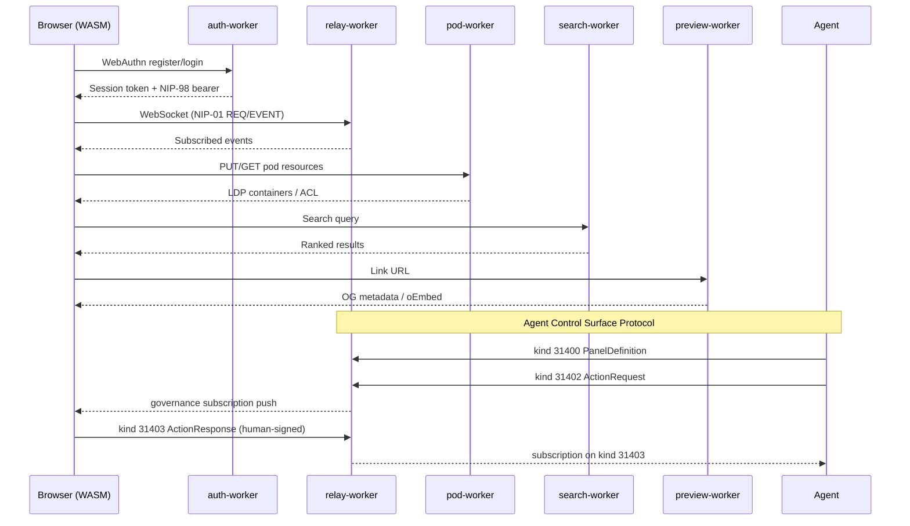
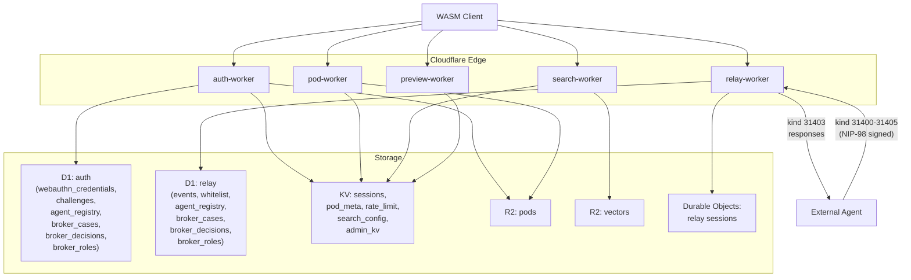
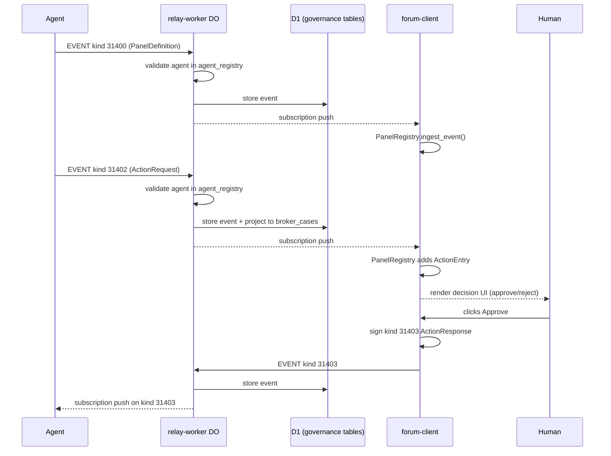
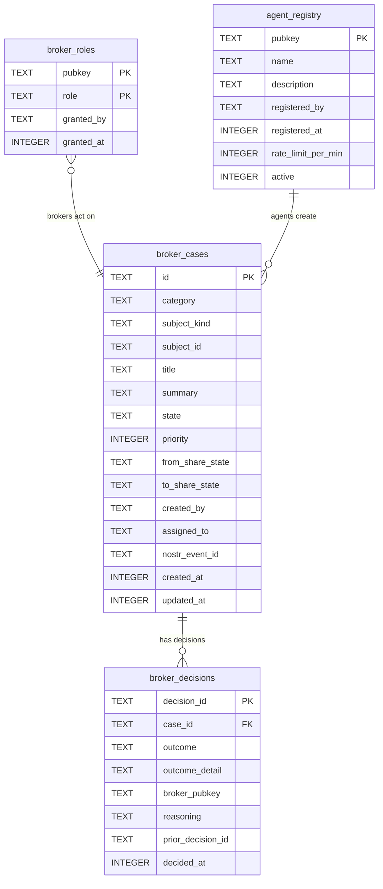
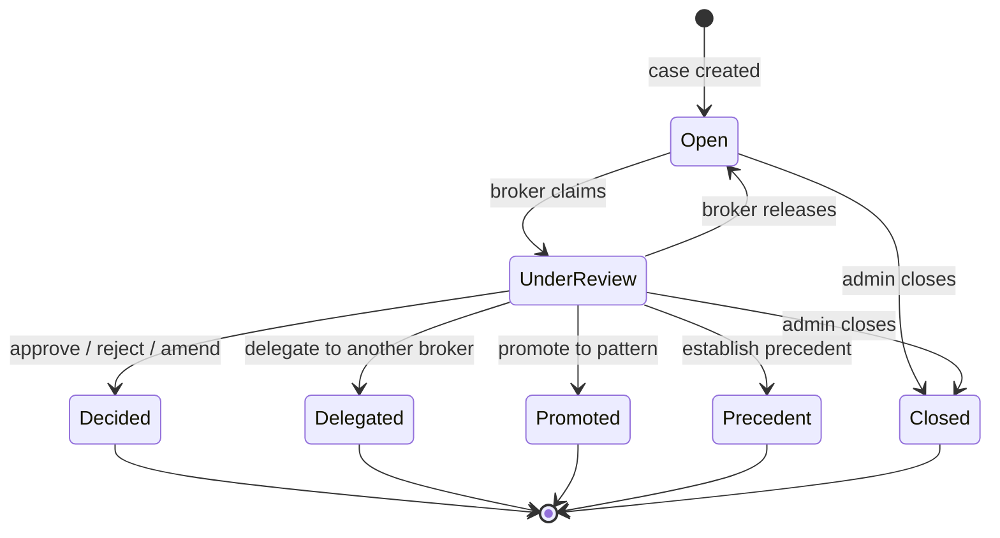

# Architecture Overview

nostr-rust-forum deploys as a set of Cloudflare Workers backed by D1, KV, R2,
and Durable Objects, with a Leptos WASM client served as static assets.

## Request Lifecycle

## Worker Responsibilities

| Worker | Bindings | Responsibilities |
|--------|----------|-----------------|
| `nostr-bbs-auth-worker` | D1, KV (SESSIONS, POD_META, ADMIN_KV), R2 | WebAuthn passkey registration and authentication, PRF-based Nostr key derivation, NIP-98 token issuance and verification, first-user-is-admin flow, pod provisioning, governance REST API (agent registry, broker cases/decisions, role management), rate limiting |
| `nostr-bbs-relay-worker` | D1, Durable Objects | NIP-01 WebSocket relay, event persistence, subscription management, hibernation-safe sessions, NIP-42 AUTH gate, whitelist/cohort enforcement, NIP-29 group access, Agent Control Surface event routing (kinds 31400-31405), agent registry gate, action request projection to broker_cases |
| `nostr-bbs-pod-worker` | KV (POD_META), R2 | Solid pod CRUD, LDP container management, WAC access control, JSON Patch, conditional requests (ETag/If-Match), per-user quotas, WebID profiles, HTTP 402 micropayments |
| `nostr-bbs-search-worker` | R2, KV (SEARCH_CONFIG) | Vector indexing in RVF binary format, in-memory cosine k-NN search, NIP-50 search protocol, rate limiting |
| `nostr-bbs-preview-worker` | KV (RATE_LIMIT) | URL metadata extraction, Open Graph and oEmbed parsing, SSRF protection (private IP rejection, redirect limits), response caching |

## Data Flow

## Library Crates

| Crate | Purpose |
|-------|---------|
| `nostr-bbs-core` | Nostr protocol primitives shared by all workers and the client. Event creation, signing, validation, filter matching, NIP-44 encryption, NIP-98 HTTP auth, bech32 encoding, WASM bridge. **Includes `governance` module**: Agent Control Surface types (kinds 31400-31405), `BrokerCase` aggregate root with `DecisionOrchestrator`, `RegisteredAgent`, tag-extraction helpers. |
| `nostr-bbs-config` | Operator configuration schema. Zone definitions, deployment topology, branding overlay points. Consumed by `forum-config/` packages. |
| `nostr-bbs-mesh` | Private relay mesh federation. NIP-42 AUTH gate, peer discovery, cross-system message routing via IS-Envelope. |
| `nostr-bbs-setup-skill` | Provider-abstracted AI configurator. Guides operators through initial deployment setup with LLM backend independence. |

## NIP Coverage by Worker

| NIP | auth | relay | pod | search | preview | core | client |
|-----|------|-------|-----|--------|---------|------|--------|
| 01  |      | X     |     |        |         | X    | X      |
| 07  |      |       |     |        |         |      | X      |
| 09  |      | X     |     |        |         | X    |        |
| 11  |      | X     |     |        |         |      |        |
| 16  |      | X     |     |        |         |      |        |
| 29  |      | X     |     |        |         | X    |        |
| 33  |      | X     |     |        |         | X    |        |
| 40  |      | X     |     |        |         | X    |        |
| 42  |      | X     |     |        |         |      |        |
| 44  |      |       |     |        |         | X    |        |
| 45  |      | X     |     |        |         |      |        |
| 50  |      |       |     | X      |         |      |        |
| 52  |      |       |     |        |         | X    |        |
| 98  | X    | X     | X   | X      |         | X    |        |
| app:31400-31405 | X | X |  |     |         | X    | X      |

**Note:** Kinds 31400-31405 (Agent Control Surface Protocol) are application-specific
parameterized replaceable events. The auth-worker exposes REST endpoints for the
governance tables; the relay-worker validates agent events at ingress and projects
action requests to D1; the core crate defines the domain model; the client renders
panels and signs action responses.

## Authentication Flow

1. Client initiates WebAuthn registration with `auth-worker`
2. `auth-worker` stores credentials in D1, derives Nostr keypair via PRF
3. Client receives session token (KV-backed) and NIP-98 bearer
4. All subsequent worker requests include the NIP-98 bearer for verification
5. `relay-worker` validates NIP-98 on WebSocket upgrade (NIP-42 AUTH)
6. `pod-worker` validates NIP-98 on every LDP request, enforces WAC ACL

## Zone Enforcement

The relay worker enforces the 3-zone access model:

1. On WebSocket connect, the relay checks the user's whitelist entry in D1
2. The `cohorts` JSON array determines which zones the user can access
3. REQ filters are intersected with the user's permitted zones
4. EVENT submissions are rejected if the user lacks write access to the target zone
5. Zone definitions are operator-configurable via `BbsConfig` (from `nostr-bbs-config`)

## Agent Control Surface Protocol

The forum acts as a universal human-in-the-loop (HITL) control plane. Agents
publish interactive panels via nostr events; humans respond with signed decisions.

### Governance Event Flow

### D1 Governance Schema

### Broker Case Lifecycle

### Trust & Gating

| Actor | Permissions | Gate |
|-------|------------|------|
| Agent (registered) | Publish PanelDefinition, PanelState, ActionRequest, PanelUpdate, PanelRetired | `agent_registry` D1 table (admin-approved) |
| Agent (unregistered) | None | Rejected at relay ingress |
| Human (broker role) | Respond to ActionRequests, bulk actions, claim cases | `broker_roles` D1 table |
| Human (member) | View panels, respond if `p`-tagged | Standard forum membership |
| Admin | Register/deregister agents, grant broker roles | `whitelist.is_admin` |

### Forum Client Components

The governance dashboard at `/governance` uses these components:

| Component | Source | Purpose |
|-----------|--------|---------|
| `GovernancePage` | `pages/governance.rs` | Top-level dashboard: stats, pending actions, panel grid |
| `PanelCard` | `pages/governance.rs` | Renders a panel definition: title, schema badge, fields, action buttons |
| `ActionRow` | `pages/governance.rs` | Renders an action request: priority badge, reasoning, approve/reject buttons |
| `PanelRegistry` | `stores/panel_registry.rs` | Reactive store: ingests kind 31400/31402/31405 events, maintains panel + action state |

### Governance REST API (auth-worker)

Seven NIP-98-gated endpoints for programmatic access to governance data:

| Method | Path | Gate | Purpose |
|--------|------|------|---------|
| GET | `/api/governance/agents` | any authenticated | List registered agents |
| POST | `/api/governance/agents/register` | admin | Register an agent pubkey |
| POST | `/api/governance/agents/revoke` | admin | Deactivate an agent |
| GET | `/api/governance/cases` | any authenticated | List broker cases (optional `?state=` filter) |
| GET | `/api/governance/cases/:id` | any authenticated | Get a single broker case with details |
| POST | `/api/governance/roles/grant` | admin | Grant a broker role to a pubkey |
| GET | `/api/governance/roles` | any authenticated | List all broker role assignments |

All endpoints validate the `Authorization: Nostr <base64>` header via
`nostr_bbs_core::nip98` with D1-backed replay protection.
