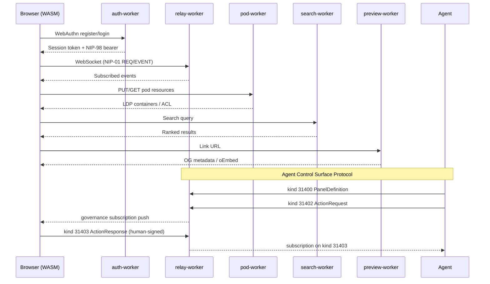
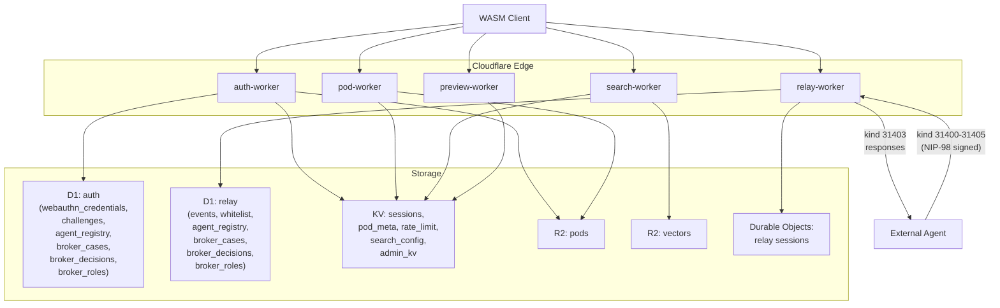
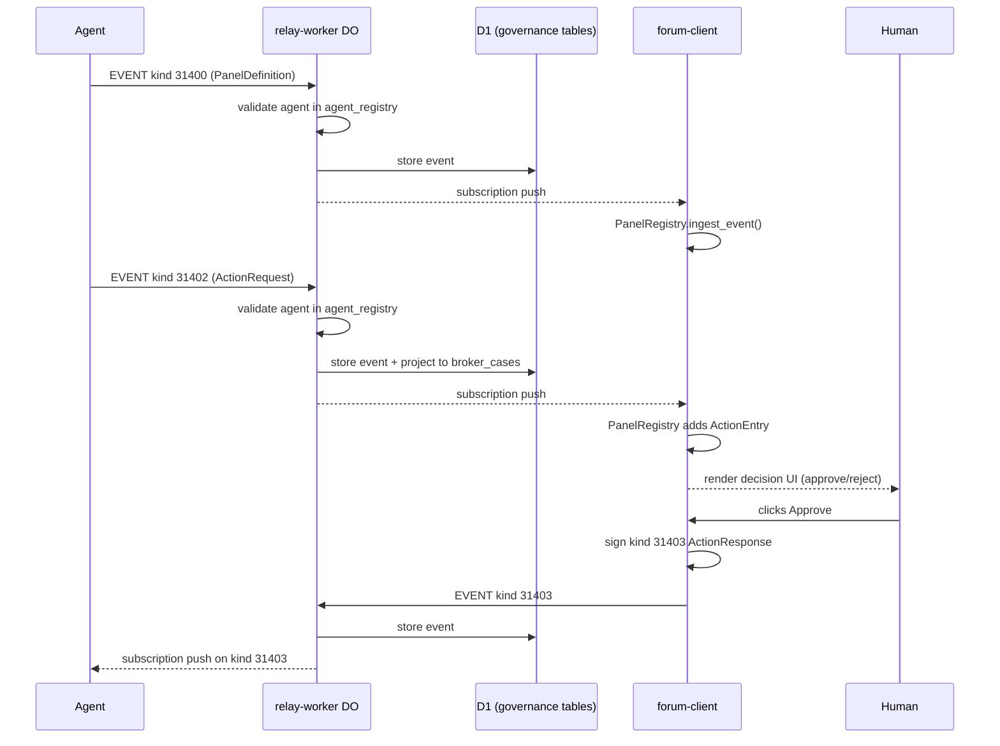
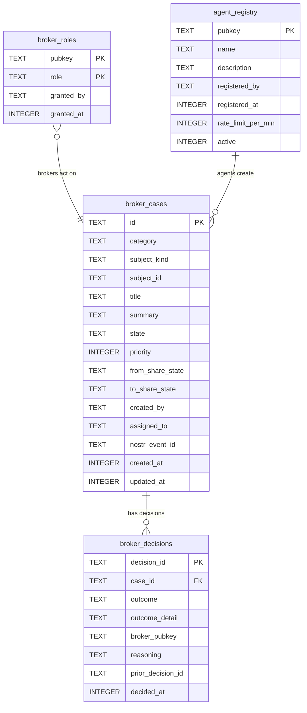
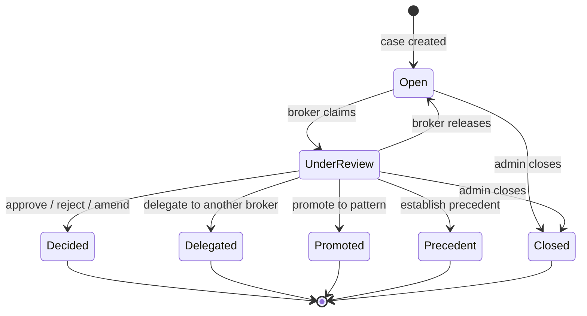

# Architecture Overview

nostr-rust-forum deploys as a set of Cloudflare Workers backed by D1, KV, R2,
and Durable Objects, with a Leptos WASM client served as static assets.

## Request Lifecycle



## Worker Responsibilities

| Worker | Bindings | Responsibilities |
|--------|----------|-----------------|
| `nostr-bbs-auth-worker` | D1, KV (SESSIONS, POD_META, ADMIN_KV), R2 | WebAuthn passkey registration and authentication, PRF-based Nostr key derivation, NIP-98 token issuance and verification, first-user-is-admin flow, pod provisioning, governance REST API (agent registry, broker cases/decisions, role management), rate limiting |
| `nostr-bbs-relay-worker` | D1, Durable Objects | NIP-01 WebSocket relay, event persistence, subscription management, hibernation-safe sessions, NIP-42 AUTH gate, whitelist/cohort enforcement, NIP-29 group access, Agent Control Surface event routing (kinds 31400-31405), agent registry gate, action request projection to broker_cases |
| `nostr-bbs-pod-worker` | KV (POD_META), R2 | Solid pod CRUD, LDP container management, WAC access control, JSON Patch, conditional requests (ETag/If-Match), per-user quotas, WebID profiles, HTTP 402 micropayments |
| `nostr-bbs-search-worker` | R2, KV (SEARCH_CONFIG) | Vector indexing in RVF binary format, in-memory cosine k-NN search, NIP-50 search protocol, rate limiting |
| `nostr-bbs-preview-worker` | KV (RATE_LIMIT) | URL metadata extraction, Open Graph and oEmbed parsing, SSRF protection (private IP rejection, redirect limits), response caching |

## Pod Storage Tiers

NRF operates two independent pod storage tiers. Users are assigned to one tier
at provisioning time; the pod browser auto-discovers which tiers are available
on mount.

```
Browser (WASM)
    │
    ├─── NIP-98 signed ──► CF Workers tier (pods.dreamlab-ai.com)
    │                        nostr-bbs-pod-worker
    │                        Storage: R2 + KV
    │                        Git: No (returns 501 on /_git/*)
    │                        Provisioned: automatically at registration
    │
    └─── NIP-98 signed ──► Native tier (pods-native.dreamlab-ai.com)
                             solid-pod-rs-server --features git
                             Storage: host filesystem
                             Git: Yes (/_git/<pubkey>/ smart HTTP)
                             /.well-known/apps: Yes (JSS #464)
                             Provisioned: admin action via auth-worker PSK
                             Transport: Cloudflare Tunnel (zero-config TLS)
```

### Trust bridge

Both tiers verify requests using NIP-98 Schnorr signatures over the user's
secp256k1 pubkey. The signature is self-contained — it covers the URL, HTTP
method, and optional body hash — so each tier verifies independently from the
same pubkey. No token exchange and no cross-tier session sharing is required.

### WebID-based tier routing

Each user's WebID document includes a `pod_base_url` field that encodes which
tier they are on:

| Tier | WebID URL | `pod_base_url` value |
|------|-----------|---------------------|
| CF Workers | `https://pods.dreamlab-ai.com/{pubkey}/profile/card#me` | `https://pods.dreamlab-ai.com` |
| Native | `https://pods-native.dreamlab-ai.com/{pubkey}/profile/card#me` | `https://pods-native.dreamlab-ai.com` |

Consumers that need to resolve a user's pod storage root (e.g. link-preview
worker, external Solid clients) dereference the WebID and read `pod_base_url`
rather than assuming a fixed hostname.

### Pod browser auto-probe

`pages/pod_browser.rs` mounts two independent `Effect::new` probes on
component load:

1. **CF probe** — always runs; calls `{CF_POD_URL}/{pubkey}/` and renders the
   standard pod card (LDP container listing, quota, WAC ACL editor).
2. **Native probe** — runs only when the `NATIVE_POD_URL` build-time env var
   is set and the authenticated user's cohort is in `[native_pod].allowlist_cohorts`;
   calls `{NATIVE_POD_URL}/{pubkey}/` and renders a second pod card with a git
   badge, `git clone` URL, and `AppManifestPanel` (JSS #464 app index).

Each probe fails independently; a network error or 404 on one does not suppress
the other. On CF-only deployments where `NATIVE_POD_URL` is unset, the native
probe is never scheduled.

### Cloudflare Tunnel

The native `solid-pod-rs-server` instance runs in the agentbox container and is
exposed via a Cloudflare Tunnel at `pods-native.dreamlab-ai.com`. The tunnel
terminates TLS at the Cloudflare edge and forwards plaintext to the container on
an internal port — no public inbound port is opened on the host, and no TLS
certificate management is required on the operator side.

### Admin provisioning

Native pods are provisioned on demand by an administrator. The provisioning
path is:

```
Admin UI  →  POST /api/native-pod/provision  →  auth-worker
                                                  │ X-Pod-Admin-Key (PSK)
                                                  ↓
                                         POST /_admin/provision/{pubkey}
                                              (native server)
                                                  │
                                         mkdir + .acl + git init -b main
```

The pre-shared key (`X-Pod-Admin-Key`) is stored in `ADMIN_KV` and never
returned to clients. See ADR-093 for the full decision record and PSK
rotation procedure.

## Data Flow



## Library Crates

| Crate | Purpose |
|-------|---------|
| `nostr-bbs-core` | Nostr protocol primitives shared by all workers and the client. Event creation, signing, validation, filter matching, NIP-44 encryption, NIP-98 HTTP auth, bech32 encoding, WASM bridge. **Includes `governance` module**: Agent Control Surface types (kinds 31400-31405), `BrokerCase` aggregate root with `DecisionOrchestrator`, `RegisteredAgent`, tag-extraction helpers. |
| `nostr-bbs-config` | Operator configuration schema. Zone definitions, deployment topology, branding overlay points. Consumed by `forum-config/` packages. |
| `nostr-bbs-mesh` | Private relay mesh federation. NIP-42 AUTH gate, peer discovery, cross-system message routing via IS-Envelope. |
| `nostr-bbs-setup-skill` | Provider-abstracted AI configurator. Guides operators through initial deployment setup with LLM backend independence. |
| `nostr-bbs-rate-limit` | Shared application-layer rate limiting via Cloudflare KV, consumed by all workers. |

## NIP Coverage by Worker

| NIP | auth | relay | pod | search | preview | core | client |
|-----|------|-------|-----|--------|---------|------|--------|
| 01  |      | X     |     |        |         | X    | X      |
| 07  |      |       |     |        |         |      | X      |
| 09  |      | X     |     |        |         | X    |        |
| 11  |      | X     |     |        |         |      |        |
| 16  |      | X     |     |        |         |      |        |
| 29  |      | X     |     |        |         | X    |        |
| 33  |      | X     |     |        |         | X    |        |
| 40  |      | X     |     |        |         | X    |        |
| 42  |      | X     |     |        |         |      |        |
| 44  |      |       |     |        |         | X    |        |
| 45  |      | X     |     |        |         |      |        |
| 50  |      |       |     | X      |         |      |        |
| 52  |      |       |     |        |         | X    |        |
| 56  |      | X     |     |        |         |      |        |
| 59  |      | X     |     |        |         | X    |        |
| 65  |      | X     |     |        |         |      |        |
| 90  |      | X     |     |        |         |      |        |
| 98  | X    | X     | X   | X      |         | X    |        |
| app:31400-31405 | X | X |  |     |         | X    | X      |

**Note:** Kinds 31400-31405 (Agent Control Surface Protocol) are application-specific
parameterized replaceable events. The auth-worker exposes REST endpoints for the
governance tables; the relay-worker validates agent events at ingress and projects
action requests to D1; the core crate defines the domain model; the client renders
panels and signs action responses.

**Note (NIP-56/65/90):** Reporting (kind-1984, relay-enforced moderation), relay
list metadata, and data vending machines are validated at ingress by the
relay-worker. **NIP-59 gift wrap (kind-1059)** carries the only direct-message
transport: the relay-worker enforces a recipient-whitelist admission gate on
kind-1059 events (see `relay-worker/src/relay_do/nip_handlers.rs`). There is no
NIP-17 kind-14 inbox routing — only the NIP-59 gift-wrap envelope.

## Authentication Flow

1. Client initiates WebAuthn registration with `auth-worker`
2. `auth-worker` stores credentials in D1, derives Nostr keypair via PRF
3. Client receives session token (KV-backed) and NIP-98 bearer
4. All subsequent worker requests include the NIP-98 bearer for verification
5. `relay-worker` validates NIP-98 on WebSocket upgrade (NIP-42 AUTH)
6. `pod-worker` validates NIP-98 on every LDP request, enforces WAC ACL

## Zone Enforcement

The relay worker enforces the 3-zone access model:

1. On WebSocket connect, the relay checks the user's whitelist entry in D1
2. The `cohorts` JSON array determines which zones the user can access
3. REQ filters are intersected with the user's permitted zones
4. EVENT submissions are rejected if the user lacks write access to the target zone
5. Zone definitions are operator-configurable via `BbsConfig` (from `nostr-bbs-config`)

## Agent Control Surface Protocol

The forum acts as a universal human-in-the-loop (HITL) control plane. Agents
publish interactive panels via nostr events; humans respond with signed decisions.

### Governance Event Flow



### D1 Governance Schema



### Broker Case Lifecycle



### Trust & Gating

| Actor | Permissions | Gate |
|-------|------------|------|
| Agent (registered) | Publish PanelDefinition, PanelState, ActionRequest, PanelUpdate, PanelRetired | `agent_registry` D1 table (admin-approved) |
| Agent (unregistered) | None | Rejected at relay ingress |
| Human (broker role) | Respond to ActionRequests, bulk actions, claim cases | `broker_roles` D1 table |
| Human (member) | View panels, respond if `p`-tagged | Standard forum membership |
| Admin | Register/deregister agents, grant broker roles | `whitelist.is_admin` |

### Forum Client Components

The governance dashboard at `/governance` uses these components:

| Component | Source | Purpose |
|-----------|--------|---------|
| `GovernancePage` | `pages/governance.rs` | Top-level dashboard: stats, pending actions, panel grid |
| `PanelCard` | `pages/governance.rs` | Renders a panel definition: title, schema badge, fields, action buttons |
| `ActionRow` | `pages/governance.rs` | Renders an action request: priority badge, reasoning, approve/reject buttons |
| `PanelRegistry` | `stores/panel_registry.rs` | Reactive store: ingests kind 31400/31402/31405 events, maintains panel + action state |

### Governance REST API (auth-worker)

Eight NIP-98-gated endpoints for programmatic access to governance data:

| Method | Path | Gate | Purpose |
|--------|------|------|---------|
| GET | `/api/governance/agents` | any authenticated | List registered agents |
| POST | `/api/governance/agents/provision` | admin | Atomic `whitelist` + `agent_registry` provisioning in one D1 `batch()` (ADR-097) |
| POST | `/api/governance/agents/register` | admin | Register an agent pubkey |
| POST | `/api/governance/agents/revoke` | admin | Deactivate an agent |
| GET | `/api/governance/cases` | any authenticated | List broker cases (optional `?state=` filter) |
| GET | `/api/governance/cases/:id` | any authenticated | Get a single broker case with details |
| POST | `/api/governance/roles/grant` | admin | Grant a broker role to a pubkey |
| GET | `/api/governance/roles` | any authenticated | List all broker role assignments |

All endpoints validate the `Authorization: Nostr <base64>` header via
`nostr_bbs_core::nip98` with D1-backed replay protection.

## Upstream Kit Surfaces (2026-06-11)

Four cross-stack surfaces landed in the June 2026 upstream-kit wave. Each is
consumed downstream by agentbox and/or the dreamlab operator overlay.

### Atomic agent provisioning (ADR-097)

`POST /api/governance/agents/provision` (auth-worker, NIP-98 admin) replaces the
prior four-call seed sequence (key gen → `/api/whitelist/add` → `/register` →
client publishes kind-0/NIP-65) with a single admin operation that performs the
two **admin-side** writes atomically:

```
POST /api/governance/agents/provision        (NIP-98 admin)
{ "pubkey": "<64-hex>", "name": "scribe-bot",
  "cohorts": ["ai-agents","members"], "rate_limit_per_min": 60 }
→ 200 { "pubkey": "<64-hex>", "cohorts": [...], "registered": true }
```

Because `whitelist` and `agent_registry` co-reside in the `nostr-bbs-relay` D1
(reached via the auth-worker's `RELAY_DB` binding), the two upserts issue as one
`db.batch(...)` — all-or-nothing, idempotent on `pubkey`. Key material (often an
ADR-094 subkey) and the agent's own signed kind-0/NIP-65 stay client-side.

### Per-container ACL delegation (ADR-096)

The pod-worker resolver `find_effective_acl` now probes the per-container sidecar
`<dir>/.acl` at every walk-up level (own resource sidecar `inherited=false`,
every ancestor `inherited=true`), fixing the previously-unreachable container ACL
and closing a latent `accessTo`-leak. Delegation is a first-class PUT:

```
PUT /pods/<owner>/<container>/.acl        (NIP-98; acl:Control on parent required)
Content-Type: application/json
{ "@delegation": { "agent": "did:nostr:<hex>",
                   "modes": ["acl:Read", "acl:Write"] } }
```

`build_delegation_acl` emits the canonical merged doc: the `#owner` grant always
re-asserts `Read+Write+Control` (the owner can never be locked out, even for an
empty `modes`), and the `#delegate` grant is the requested modes **minus
`acl:Control`** (delegation never confers Control). Non-`@delegation` bodies fall
through to the existing raw-JSON-LD PUT path. The flat-sidecar workaround is
retired; both forms remain reachable so migration is non-breaking.

### Deterministic subkey derivation (ADR-094)

`nostr-bbs-core` exposes `derive_subkey(root: &SecretKey, tag: &str) ->
Result<SecretKey, KeyError>` = HMAC-SHA-256(`root.secret_bytes_32`, utf8(`tag`))
mapped through the validating secp256k1 scalar constructor, with a wasm bridge
(`derive_subkey_js`). It is byte-for-byte identical to agentbox's JS mirror
derivation, pinned by a known-answer vector (root `0x01`×32 + tag
`agentbox-mirror-v1` → `2d07f2ce93d0361687fdd81d2690082b5d6c35b93e3ece2d44bcf115ef8f695d`).
Rotation is by tag suffix. It provides domain separation, **not** compromise
isolation (subkeys are recoverable from the root) — for revocable delegation use
NIP-26. This is distinct from `derive_from_prf` (HKDF, WebAuthn-PRF path), which
is kept separate.

### Recovery & device-onboarding sheet (ADR-095)

The forum-client `RecoverySheet` Leptos component renders a 100% client-side,
print-optimised one-page sheet at signup: nsec/npub/relay QR codes (generated
in-WASM via a pure-Rust QR crate, bech32 via the existing NIP-19 path), metadata,
restore steps, and an optional relay "sweep" block. Save-as-PDF via
`window.print()`. The nsec never leaves WASM or touches the network. It is
additive to `NsecBackup` and gated by an insist-with-override exit control. The
target mobile client is 0xchat (NIP-17 DMs, NIP-28 channels, NIP-42 AUTH);
ncryptsec/NIP-49 is deferred until core exposes a NIP-49 surface.

### Magic-link onboarding, gated device keys, NIP-59 admission (ADR-098/099)

**ADR-098 — `/connect` magic-link onboarding** (`forum-client/src/pages/connect.rs`):
an operator-issued single-use link lands a new member on the `/connect` route,
which performs client-side key generation and first-publish without exposing the
admin seed sequence to the invitee. The nsec is minted in-WASM and never leaves
the browser.

**ADR-099 — gated revocable device keys** (`auth-worker/src/devices.rs`): a
member may tear off per-device subkeys (ADR-094 derivation) so a lost device can
be revoked without rotating the root identity. The feature is gated behind
`DEVICE_KEYS_ENABLED` (exact string `"true"`, default off) and must be set on the
auth-worker, the relay-worker, and the client's `window.__ENV__` together;
phase-2 multi-device DMs are deferred.

**NIP-59 recipient-admission rule** (`relay-worker/src/relay_do/nip_handlers.rs`):
the relay admits a kind-1059 gift wrap only when its `#p` recipient tag resolves
to a whitelisted member, so DM transport cannot be used as an unsolicited-mail
vector. This is the gift-wrap envelope only — there is no NIP-17 kind-14 inbox
routing.
