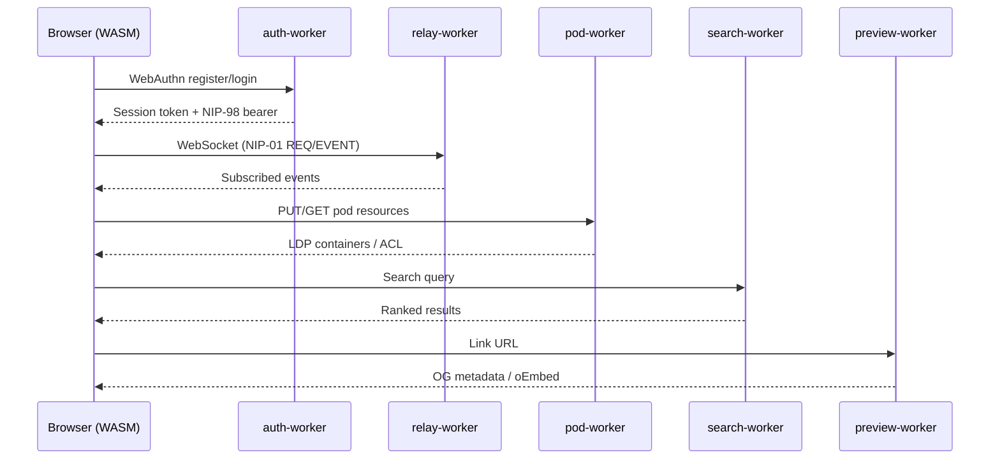
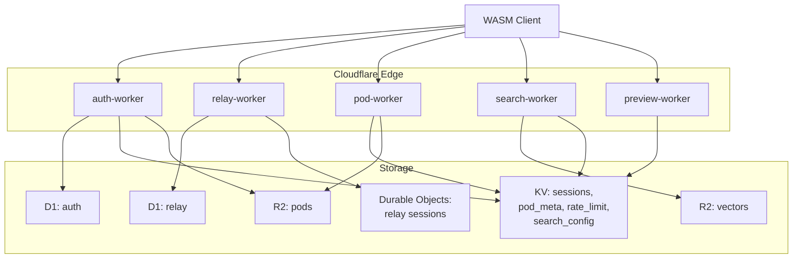

# Architecture Overview

nostr-rust-forum deploys as a set of Cloudflare Workers backed by D1, KV, R2,
and Durable Objects, with a Leptos WASM client served as static assets.

## Request Lifecycle

## Worker Responsibilities

| Worker | Bindings | Responsibilities |
|--------|----------|-----------------|
| `nostr-bbs-auth-worker` | D1, KV (SESSIONS, POD_META), R2 | WebAuthn passkey registration and authentication, PRF-based Nostr key derivation, NIP-98 token issuance and verification, first-user-is-admin flow, pod provisioning, rate limiting |
| `nostr-bbs-relay-worker` | D1, Durable Objects | NIP-01 WebSocket relay, event persistence, subscription management, hibernation-safe sessions, NIP-42 AUTH gate, whitelist/cohort enforcement, NIP-29 group access |
| `nostr-bbs-pod-worker` | KV (POD_META), R2 | Solid pod CRUD, LDP container management, WAC access control, JSON Patch, conditional requests (ETag/If-Match), per-user quotas, WebID profiles, HTTP 402 micropayments |
| `nostr-bbs-search-worker` | R2, KV (SEARCH_CONFIG) | Vector indexing in RVF binary format, in-memory cosine k-NN search, NIP-50 search protocol, rate limiting |
| `nostr-bbs-preview-worker` | KV (RATE_LIMIT) | URL metadata extraction, Open Graph and oEmbed parsing, SSRF protection (private IP rejection, redirect limits), response caching |

## Data Flow

## Library Crates

| Crate | Purpose |
|-------|---------|
| `nostr-bbs-core` | Nostr protocol primitives shared by all workers and the client. Event creation, signing, validation, filter matching, NIP-44 encryption, NIP-98 HTTP auth, bech32 encoding, WASM bridge. |
| `nostr-bbs-config` | Operator configuration schema. Zone definitions, deployment topology, branding overlay points. Consumed by `forum-config/` packages. |
| `nostr-bbs-mesh` | Private relay mesh federation. NIP-42 AUTH gate, peer discovery, cross-system message routing via IS-Envelope. |
| `nostr-bbs-setup-skill` | Provider-abstracted AI configurator. Guides operators through initial deployment setup with LLM backend independence. |

## NIP Coverage by Worker

| NIP | auth | relay | pod | search | preview | core | client |
|-----|------|-------|-----|--------|---------|------|--------|
| 01  |      | X     |     |        |         | X    | X      |
| 07  |      |       |     |        |         |      | X      |
| 09  |      | X     |     |        |         | X    |        |
| 11  |      | X     |     |        |         |      |        |
| 16  |      | X     |     |        |         |      |        |
| 29  |      | X     |     |        |         | X    |        |
| 33  |      | X     |     |        |         | X    |        |
| 40  |      | X     |     |        |         | X    |        |
| 42  |      | X     |     |        |         |      |        |
| 44  |      |       |     |        |         | X    |        |
| 45  |      | X     |     |        |         |      |        |
| 50  |      |       |     | X      |         |      |        |
| 52  |      |       |     |        |         | X    |        |
| 98  | X    | X     | X   | X      |         | X    |        |

## Authentication Flow

1. Client initiates WebAuthn registration with `auth-worker`
2. `auth-worker` stores credentials in D1, derives Nostr keypair via PRF
3. Client receives session token (KV-backed) and NIP-98 bearer
4. All subsequent worker requests include the NIP-98 bearer for verification
5. `relay-worker` validates NIP-98 on WebSocket upgrade (NIP-42 AUTH)
6. `pod-worker` validates NIP-98 on every LDP request, enforces WAC ACL

## Zone Enforcement

The relay worker enforces the 3-zone access model:

1. On WebSocket connect, the relay checks the user's whitelist entry in D1
2. The `cohorts` JSON array determines which zones the user can access
3. REQ filters are intersected with the user's permitted zones
4. EVENT submissions are rejected if the user lacks write access to the target zone
5. Zone definitions are operator-configurable via `BbsConfig` (from `nostr-bbs-config`)
