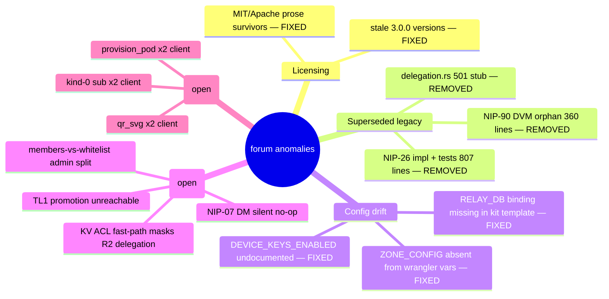

# Anomaly Register — nostr-rust-forum

Ecosystem audit 2026-06-11 (diagram-driven, ruflo mesh: 4 sonnet cartographers + 2 opus auditors + 2 opus fixers, Fable queen). Companion diagrams in this directory are the ground-truth maps this register ranks:

- [relay-event-admission.md](relay-event-admission.md)
- [auth-governance-flows.md](auth-governance-flows.md)
- [pod-acl-and-identity.md](pod-acl-and-identity.md)
- [client-onboarding-and-messaging.md](client-onboarding-and-messaging.md)

## Resolved in this sweep (commit refs in CHANGELOG)

| ID | Finding | Resolution |
|----|---------|------------|
| R1 | README/CONTRIBUTING/3 crate READMEs claimed MIT/Apache on the AGPL-3.0-only codebase (404 LICENSE links) | All licence prose → AGPL-3.0-only |
| R2 | Version drift: README `v3.0.0-rc11`, SECURITY rc7/rc6 table, NIP-11 served `"3.0.0"` | All → 1.0.0-beta.2; nip11.rs now `env!("CARGO_PKG_VERSION")` |
| R3 | NIP-17 over-advertised (README list + coverage table) — only NIP-59 gift-wrap transport exists | List corrected; row re-labelled transport-only |
| R4 | NIP-26 implementation + 435-line test suite + auth-worker `/api/delegation/verify` 501 stub — superseded by ADR-099 device keys; CHANGELOG even *recommended* NIP-26 | Deleted (~860 lines); CHANGELOG corrected to point at ADR-099. **API-breaking for next publish → 1.0.0-beta.3** |
| R5 | NIP-90 DVM module exported with zero consumers | Deleted (~360 lines) |
| R6 | `DEVICE_KEYS_ENABLED`, `ZONE_CONFIG`, pod/auth vars absent from SETUP + wrangler `[vars]`; `RELAY_DB` D1 binding missing from kit auth-worker wrangler.toml (downstream deploys patch it — template drift only) | SETUP + both wrangler.toml templates corrected |
| R7 | ~15 ad-hoc `format!("did:nostr:{...}")` sites bypassing exported `did_nostr_uri` (itself orphaned) | Routed through the helper |
| R8 | auth-worker dual `cors_headers()` — `http.rs` fallback-granted `https://example.com` on misconfigured deploys | Consolidated fail-closed |
| R9 | architecture.md missing NIP-56/59/65/90 rows, rate-limit crate, ADR-098/099 coverage; ADR-099 status stale | Added/updated |

## Open — behavioural (need decisions/tests, not auto-fixed)

| ID | Sev | Where | Finding |
|----|-----|-------|---------|
| O1 | HIGH | `relay-worker/src/trust.rs:419` | `increment_posts_read` is dead code → `posts_read` never leaves 0 → **TL1 promotion unreachable** via relay activity. `check_demotion` (trust.rs:287) also unwired. Decide: wire on REQ/EOSE, or drop the read-count dimension. |
| O2 | HIGH | `relay-worker/src/relay_do/nip_handlers.rs:325-338` | NIP-29 group metadata (39000-39002) admitted from admin clients instead of relay-key-signed (acknowledged TODO). Spec drift. |
| O3 | MED | `pod-worker/src/acl.rs:241-247` + `auth-worker/src/pod.rs:29` | KV fast-path `acl:{pubkey}` unconditionally shadows R2 sidecars for auth-worker-provisioned pods → **delegation grants silently unreachable** on those pods. Auth-worker `provision_pod` is also a dead under-provisioning path. Needs repro test + resolution order decision. |
| O4 | MED | `relay-worker/src/auth.rs:143-162` | Admin in `members` but not `whitelist` passes `is_admin()` yet fails admission as unknown pubkey — inconsistent dual-table authority. |
| O5 | MED | `relay-worker nip_handlers.rs:270-297` | Kind-40 deletion (NIP-09) destroys `is_channel_creator` lookup → TL2 author locked out of own channel. |
| O6 | HIGH | `forum-client/src/dm/mod.rs:217-220` | NIP-07 (extension) users get a silent no-op DM subscription — no UI warning. |
| O7 | HIGH | `forum-client/src/pages/settings.rs:30` | `NIP05_USERNAME_HOST` hardcoded `"example.test"` in settings path; env only read in signup.rs. |
| O8 | MED | client | Duplications: `provision_pod` (signup.rs:191 / settings.rs:1436), `qr_svg` (recovery_sheet.rs:64 / devices.rs:230), per-page kind-0 sub duplicating app-root ProfileCache (settings.rs:312), relay-URL read twice (relay.rs:720 / utils/relay_url.rs:8), overlapping kind-42 store writers. |
| O9 | LOW | `nostr-bbs-mesh` crate | Trait scaffold with no impl and no relay import — relay mesh checks are inline env reads. Intentional (Sprint v12+ scaffold) — keep documented. |
| O10 | LOW | core | `wasm_bridge` NIP-98/schnorr exports with no JS consumers; pod-worker deferral shims (`key_provisioning.rs`, `nip05_endpoint.rs`); `#[ignore]`d upstream-vector suite runs only if fixtures synced — confirm CI wiring. |
| O11 | MED | auth-worker | `KV` and `SESSIONS` bindings share one physical namespace (key-collision risk); `/api/native-pod/provision` route has no caller and missing vars (always 503); `broker_decisions` is write-only (no read endpoint). |

## Verdict

Workers' SQL parameterisation, request-path unwraps, NIP-98 consolidation (one authoritative core impl), device-key gating coverage, and licence headers in source all verified **clean**. The repo's debt is now concentrated in O1-O8: behavioural gaps best attacked with failing repro tests (diagram-driven diagnosis phase 3) rather than doc edits.
