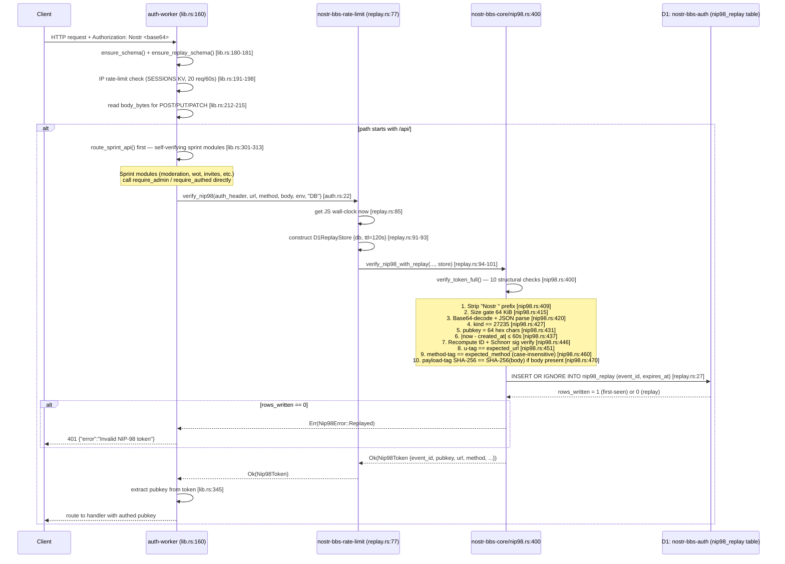
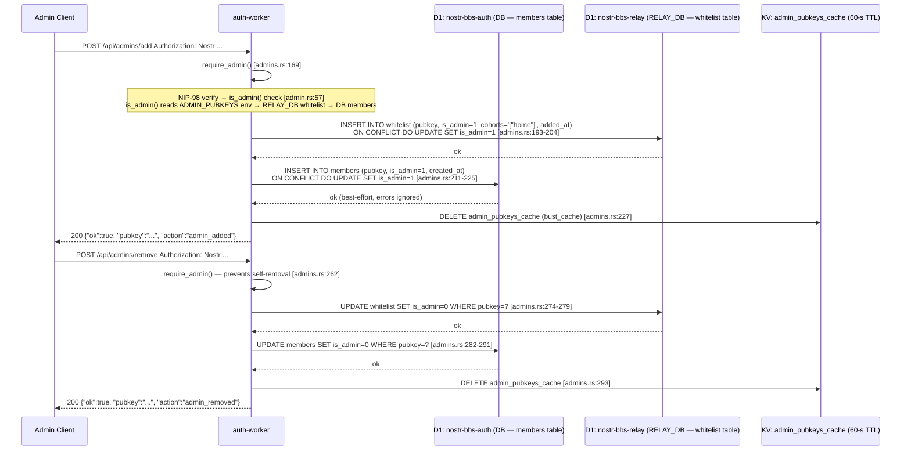
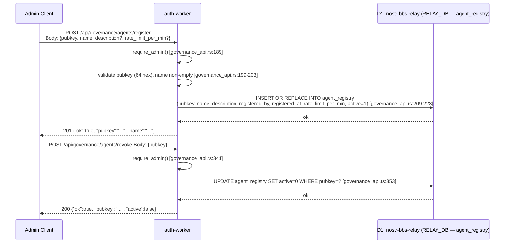
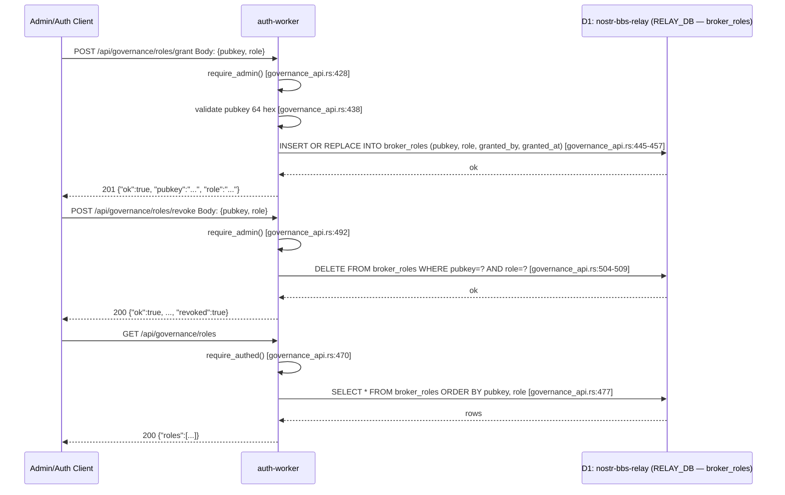
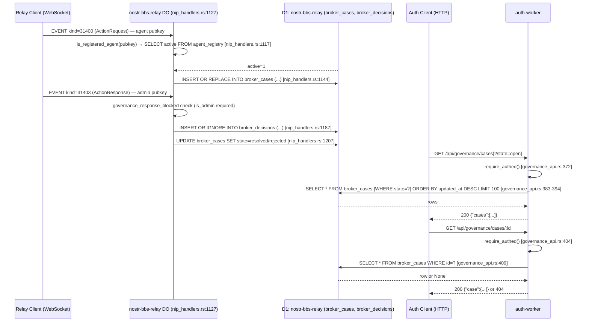
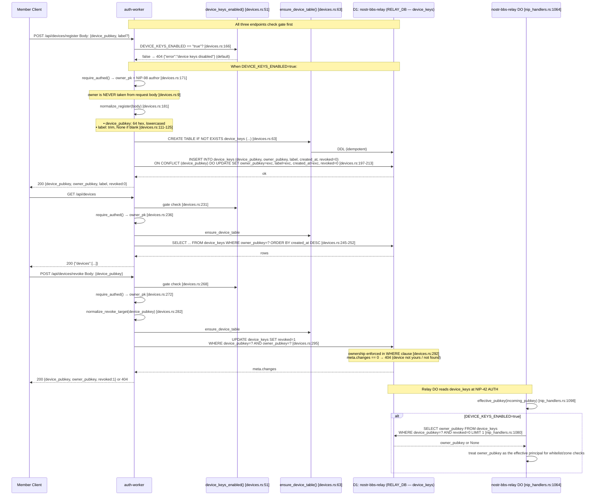

# Auth-Worker Flows: Sequence Diagrams

Generated from source code — not from documentation. All file:line references point at
the Rust source under `crates/nostr-bbs-auth-worker/`.

---

## 1. NIP-98 Request Verification Path

Every `/api/*` route (and the `POST /api/native-pod/provision` out-of-band handler)
passes through this path before any business logic executes.

Sources:
- `lib.rs:160-231` — outer `fetch` + `handle_request`
- `lib.rs:233-363` — `route()`
- `admin.rs:28-36` — `verify()` (thin wrapper)
- `auth.rs:15-31` — `verify_nip98_replay()` (thin wrapper selecting `REPLAY_DB = "DB"`)
- `crates/nostr-bbs-rate-limit/src/replay.rs:77-103` — `verify_nip98()` (actual D1 path)
- `crates/nostr-bbs-core/src/nip98.rs:400-496` — `verify_token_full()` (all structural checks)
- `crates/nostr-bbs-core/src/nip98.rs:547-577` — `verify_nip98_with_replay()` (replay layer)



### Author extraction and authorisation

`Nip98Token.pubkey` is the **recomputed-and-verified** signer pubkey — never trusted
from the client body. Two gate levels consume it:

- `require_authed()` (`admin.rs:136-158`): any valid NIP-98 token; returns `pubkey`.
- `require_admin()` (`admin.rs:99-131`): additionally calls `is_admin(pubkey, env)`,
  which checks three sources in order: `ADMIN_PUBKEYS` env var → `RELAY_DB whitelist.is_admin` → `DB members.is_admin`.

---

## 2. Governance Flows

### 2a. Whitelist Add / Remove

These operate on `RELAY_DB` (the relay's `nostr-bbs-relay` D1, bound as `RELAY_DB` in
the auth-worker — **but this binding is absent from `wrangler.toml`**; see Finding 1).

Sources: `admins.rs:160-297`, `admin.rs:57-97`



### 2b. Agent Provisioning — POST /api/governance/agents/provision (ADR-097)

Atomic D1 batch writing both `whitelist` and `agent_registry` in one implicit D1
transaction. Both tables live in `nostr-bbs-relay` (accessed via `RELAY_DB`).

Sources: `governance_api.rs:259-332`

```mermaid
sequenceDiagram
    participant A as Admin Client
    participant W as auth-worker
    participant V as normalize_provision() [governance_api.rs:84]
    participant D1R as D1: nostr-bbs-relay (RELAY_DB)<br/>tables: whitelist, agent_registry

    A->>W: POST /api/governance/agents/provision<br/>Body: {pubkey, name, description, cohorts, rate_limit_per_min?}
    W->>W: require_admin() [governance_api.rs:266]
    Note over W: NIP-98 verify → admin gate

    W->>W: serde_json::from_slice body [governance_api.rs:271]
    W->>V: normalize_provision(body) [governance_api.rs:276]
    Note over V: Rules [governance_api.rs:84-103]:<br/>• pubkey exactly 64 hex chars, lowercased<br/>• name non-empty after trim<br/>• cohorts non-empty Vec

    V-->>W: Ok(NormalizedProvision) or Err(msg) → 400

    W->>W: serde_json::to_string(cohorts) [governance_api.rs:281]

    W->>D1R: PREPARE whitelist upsert<br/>INSERT INTO whitelist (pubkey, cohorts, added_at, added_by)<br/>ON CONFLICT (pubkey) DO UPDATE SET cohorts=excluded.cohorts, added_by=excluded.added_by [governance_api.rs:291-302]

    W->>D1R: PREPARE agent_registry upsert<br/>INSERT OR REPLACE INTO agent_registry<br/>(pubkey, name, description, registered_by, registered_at, rate_limit_per_min, active=1) [governance_api.rs:305-318]

    W->>D1R: db.batch([whitelist_stmt, registry_stmt]) [governance_api.rs:321]
    Note over D1R: D1 batch = implicit transaction<br/>All-or-nothing; no partial state

    D1R-->>W: Ok or Err
    W-->>A: 200 {"pubkey":"...", "cohorts":[...], "registered":true}
```

### 2c. Agent Register / Revoke



### 2d. Broker Roles — Grant / Revoke / List



### 2e. Broker Cases — List / Get (read-only from auth-worker)

Broker cases are **written by the relay worker's Durable Object** (kinds 31400/31402
projected at `nip_handlers.rs:1144`) and **read by the auth-worker** via the same
`RELAY_DB` binding.



---

## 3. Device-Key Registry Lifecycle (ADR-099)

All three handlers are gated by `DEVICE_KEYS_ENABLED == "true"` (exact string,
default off). The `device_keys` table lives in `RELAY_DB` (nostr-bbs-relay D1)
so the relay DO can read it at NIP-42 AUTH without a cross-worker call.

Sources: `devices.rs:1-320`



---

## 4. Findings

Each finding has: severity (HIGH/MEDIUM/LOW/INFO), file:line, description, and
classification.

---

**Finding 1 — HIGH | isolated**
`crates/nostr-bbs-auth-worker/wrangler.toml` (entire file, no `RELAY_DB` stanza)

`governance_api.rs` and `devices.rs` both call `env.d1("RELAY_DB")` at runtime, and
`admin.rs:69` also reads `RELAY_DB` for `whitelist.is_admin`. None of these bindings
appear in `wrangler.toml`. At deploy time every call to `env.d1("RELAY_DB")` will
return `Err`, which propagates as a `worker::Error` and eventually returns a 500. The
entire governance surface (`/api/governance/*`), device-key surface (`/api/devices/*`),
and admin-flag checks are silently broken in the deployed worker until the binding is
added. The relay worker correctly declares `RELAY_DB` pointing at `nostr-bbs-auth`
(for replay protection), but the auth worker's separate `RELAY_DB` — which must point
at `nostr-bbs-relay` (`97c77d23-...`) — has no `[[d1_databases]]` entry.

---

**Finding 2 — HIGH | duplicate**
`crates/nostr-bbs-auth-worker/src/lib.rs:45-69` vs `crates/nostr-bbs-auth-worker/src/http.rs:8-27`

Two `cors_headers()` implementations exist in the same crate. The `lib.rs` version
is fail-closed: when `EXPECTED_ORIGIN` is unset it emits **no** `Access-Control-Allow-Origin`
header (the safe behaviour documented at `lib.rs:38-44`). The `http.rs` version
fallback-fills `"https://example.com"` (`http.rs:12`). Every sprint module (moderation,
wot, invites, welcome, admins, governance, devices) imports from `http.rs` via
`crate::http::json_response`, meaning their CORS responses silently grant `example.com`
on misconfigured deploys — contradicting the hardening note in `lib.rs`. The `lib.rs`
version is only used by the legacy `/api/profile` branch and CORS-preflight path.

---

**Finding 3 — MEDIUM | isolated**
`crates/nostr-bbs-auth-worker/src/delegation.rs:26-38`, routed at `lib.rs:582-585`

`POST /api/delegation/verify` is registered in the router and responds `501 Not Implemented`.
No client in the repo calls this endpoint (confirmed by grep across all crates). The
route carries no auth requirement: `_auth_header` is ignored. This is stub scaffolding
from a deferred work item (NIP-26 delegation, commented "W6") that has no consumer,
exercises no logic, and cannot be tested end-to-end.

---

**Finding 4 — MEDIUM | legacy**
`crates/nostr-bbs-auth-worker/wrangler.toml:29-30` — `KV` binding

The `KV` namespace binding (`id = 901345296c2848788066686aa67d5909`) resolves to the
same physical KV namespace as `SESSIONS` (`id = 901345296c2848788066686aa67d5909`).
The comment says "Legacy alias used by admins.rs cache". `admins.rs:54` uses `env.kv("KV")`
to read/write the `admin_pubkeys_cache` key. Since `KV` and `SESSIONS` are the same
namespace, the rate-limit counter bucket and the admin-pubkey cache share a namespace
and a keyspace. A key collision (e.g. if an IP address coincidentally matches
`admin_pubkeys_cache`) would corrupt the admin cache or inflate rate-limit counters.

---

**Finding 5 — MEDIUM | doc-drift**
`crates/nostr-bbs-auth-worker/src/governance_api.rs:25-31`

The module doc comment states "broker_decisions" lives in `RELAY_DB`. The handler
`handle_list_cases` and `handle_get_case` read `broker_cases` from `RELAY_DB` via
the governance API, but `broker_decisions` (the append-only audit trail of individual
decisions) has **no read endpoint** in the auth-worker. The relay DO writes to
`broker_decisions` (`nip_handlers.rs:1187`) and the auth-worker references it in
comments, but there is no `GET /api/governance/decisions` or equivalent. Callers who
want the decision trail must query D1 directly.

---

**Finding 6 — LOW | duplicate**
`crates/nostr-bbs-auth-worker/src/governance_api.rs:199-203` vs `governance_api.rs:87-92`

`handle_register_agent` (`governance_api.rs:199-203`) performs pubkey/name validation
inline using copied if-blocks. `handle_provision_agent` (`governance_api.rs:276`) calls
the extracted `normalize_provision()` which is unit-tested (`governance_api.rs:544-642`).
The `register` path's inline validation is functionally equivalent but untested in the
same way: a future change to validation rules would need to be applied in two places.

---

**Finding 7 — LOW | ok (cross-worker D1 sharing — explicit note)**
`crates/nostr-bbs-relay-worker/src/relay_do/nip_handlers.rs:1072` reads `device_keys`
from `self.env.d1("DB")` (the relay's own D1, `nostr-bbs-relay`).
`crates/nostr-bbs-auth-worker/src/devices.rs:44` writes `device_keys` via `env.d1("RELAY_DB")`
(which is the same physical D1 when the binding is correctly declared, see Finding 1).
This cross-worker D1 sharing is **intentional** and documented in `devices.rs:26-31` and
`governance_api.rs:25-31`. The relay reads; the auth-worker writes. There is no
cross-worker D1 transaction; both ends are designed to tolerate eventual consistency
within a single D1 write (which is synchronous from D1's perspective).

---

**Finding 8 — LOW | isolated**
`crates/nostr-bbs-auth-worker/src/lib.rs:588-592` — `POST /api/native-pod/provision`

This endpoint (`handle_native_pod_provision`, `lib.rs:639-758`) requires `NATIVE_POD_URL`
and `NATIVE_POD_ADMIN_KEY` env vars (`lib.rs:712-732`). Neither is declared in
`wrangler.toml`. The endpoint returns `503 {"error":"native pod not configured"}` when
either is missing — a proper fail-closed response — but the endpoint is effectively
always disabled on the current deploy configuration. The forum client's
`pod_browser.rs:19` reads `NATIVE_POD_URL` as a build-time `option_env!` constant,
not as a runtime auth-worker call, so there is no client-side HTTP consumer for this
auth-worker route.

---

**Finding 9 — INFO | ok**
`crates/nostr-bbs-auth-worker/src/lib.rs:180-181` — `ensure_schema()` called on every cold start

`schema.rs:ensure_schema()` runs every cold start, issuing `CREATE TABLE IF NOT EXISTS`
for ~14 table/index DDL statements against `DB`. The relay's `ensure_tables_exist()`
independently manages the governance tables (`lib.rs:630-707` in the relay crate). There
is no coordination between the two, which is correct: they target different D1
databases and neither can safely create the other's tables.

---

**Finding 10 — INFO | isolated**
`crates/nostr-bbs-relay-worker/src/trust.rs:287` — `check_demotion()` is `#[allow(dead_code)]`

`check_demotion()` is implemented but never called. `check_promotion()` is called from
`nip_handlers.rs` after qualifying events, but the symmetric demotion pass has no
scheduled invocation (the cron at `crates/nostr-bbs-relay-worker/wrangler.toml` runs
`scheduled()` every 5 minutes but does not invoke `check_demotion`). Demotion logic
exists only in tests; no user can be automatically demoted in the current deployment.
This is not in scope for the auth-worker audit but is directly adjacent to the
governance trust model.

---

## D1 Table / Binding Cross-Reference

| Table | Physical D1 | Writer(s) | Reader(s) |
|-------|-------------|-----------|-----------|
| `whitelist` | nostr-bbs-relay (RELAY_DB in auth, DB in relay) | auth-worker `/api/admins/add`, `/api/governance/agents/provision` | relay DO trust checks, auth `is_admin()` |
| `agent_registry` | nostr-bbs-relay | auth-worker `/api/governance/agents/register`, `/provision` | relay DO `is_registered_agent()` |
| `broker_cases` | nostr-bbs-relay | relay DO (kinds 31400, 31402 events) | auth-worker `/api/governance/cases/*` |
| `broker_decisions` | nostr-bbs-relay | relay DO (kind 31403 events) | **no HTTP read endpoint** (Finding 5) |
| `broker_roles` | nostr-bbs-relay | auth-worker `/api/governance/roles/grant` | auth-worker `/api/governance/roles` list |
| `device_keys` | nostr-bbs-relay | auth-worker `/api/devices/register`, `/revoke` | relay DO `device_owner()` at NIP-42 AUTH |
| `nip98_replay` | nostr-bbs-auth (DB in auth, REPLAY_DB in relay) | both workers atomically via `INSERT OR IGNORE` | both workers (same table = cross-worker replay detected) |
| `members` | nostr-bbs-auth | auth-worker invite redemption, `/api/admins/add` | auth-worker `is_admin()` |
| `moderation_actions` | nostr-bbs-auth | auth-worker `/api/mod/ban` etc. | auth-worker `/api/mod/actions` list |
| `mod_reports` | nostr-bbs-auth | auth-worker `/api/mod/report` | auth-worker `/api/mod/reports` list |
| `wot_entries` | nostr-bbs-auth | auth-worker `/api/wot/*` | auth-worker wot module |
| `instance_settings` | nostr-bbs-auth | auth-worker welcome/wot configure | auth-worker welcome/wot status |
| `username_reservations` | nostr-bbs-auth | auth-worker `/api/username/claim` | auth-worker `/api/username/check`, `/resolve` |
| `nip1984_reports` | nostr-bbs-auth | relay-worker (kind-1984 event projection — **written by relay, not auth**) | auth-worker `GET /api/moderation/reports` |
| `challenges` | nostr-bbs-auth | auth-worker WebAuthn register flow | auth-worker WebAuthn auth flow |
| `webauthn_credentials` | nostr-bbs-auth | auth-worker WebAuthn register/verify | auth-worker login flows |
