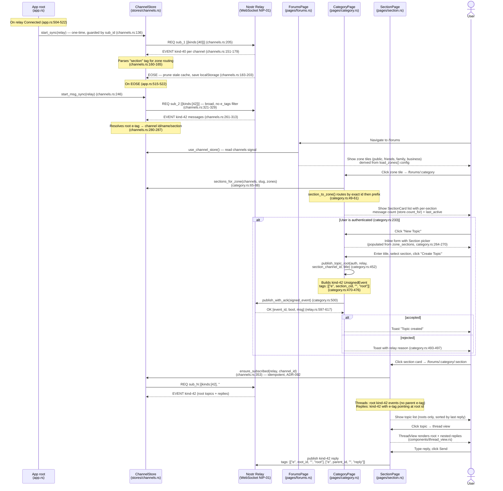
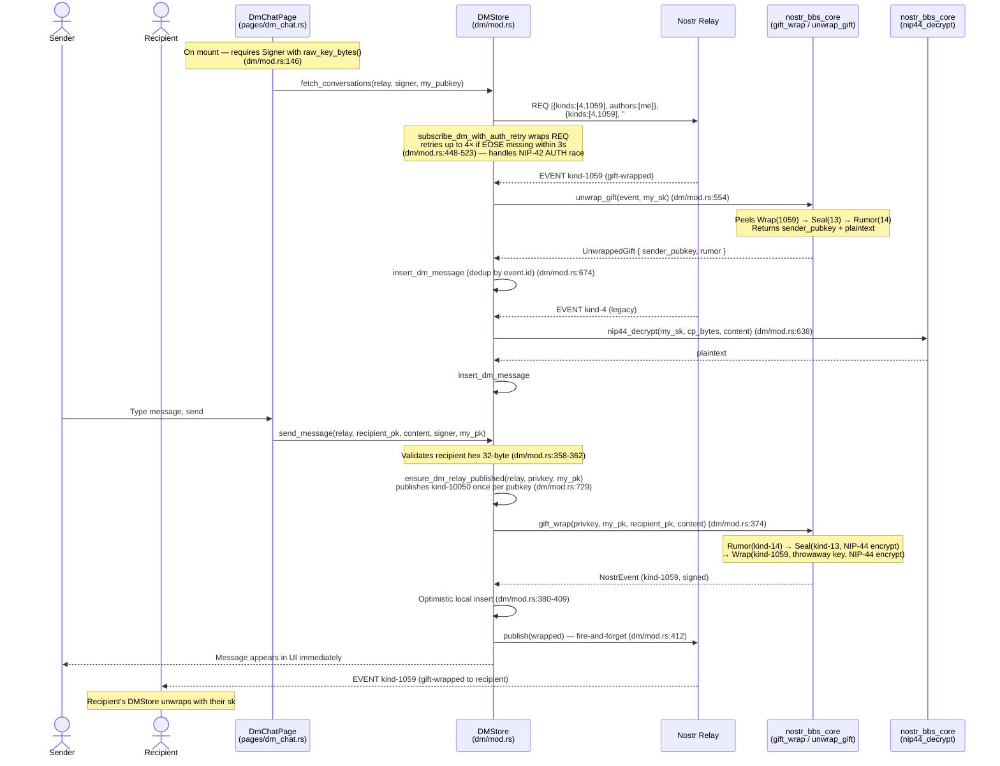
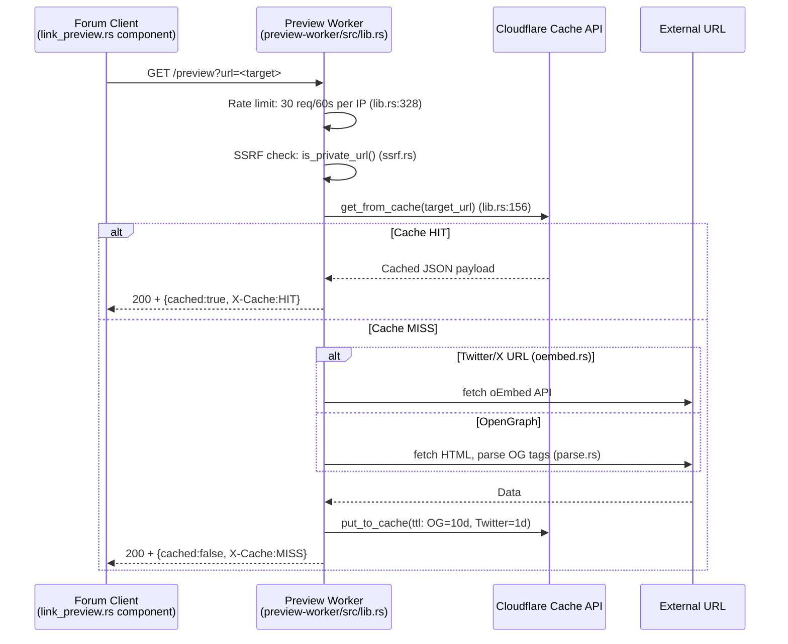
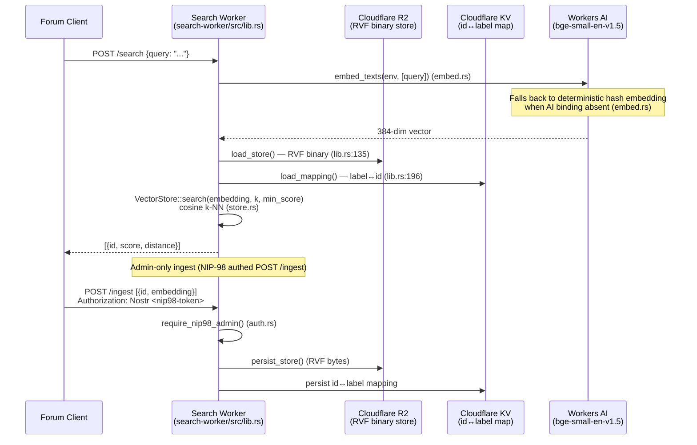

# Client Onboarding and Messaging — Sequence Diagrams

Cartography audit. All flows are traced from the **actual source code** in
`crates/nostr-bbs-forum-client/`. File:line references are included in prose
and in the findings section.

---

## 1. Signup Wizard

The wizard is a three-phase component in `pages/signup.rs`. Phase transitions
are driven by the `phase: RwSignal<Phase>` signal; no page navigation occurs
until `finish_signup` is called at the end of Phase 3.

```mermaid
sequenceDiagram
    actor User
    participant SignupPage as SignupPage<br/>(pages/signup.rs)
    participant Auth as AuthStore<br/>(auth/mod.rs)
    participant AuthAPI as Auth Worker<br/>(POST /api/username/*)
    participant PodAPI as Pod Worker<br/>(POST /.provision)
    participant Relay as Nostr Relay<br/>(WebSocket)
    participant RecoverySheet as RecoverySheet<br/>(components/recovery_sheet.rs)
    participant NsecBackup as NsecBackup<br/>(components/nsec_backup.rs)
    participant DevicesUtil as devices.rs<br/>(utils/devices.rs)
    participant Browser as Browser<br/>(window.print / Clipboard)

    Note over SignupPage: Phase::Identity (signup.rs:65)
    User->>SignupPage: Enter display_name, username, optional real_name
    SignupPage->>AuthAPI: GET /api/username/check?name=<handle><br/>(debounced 350ms, signup.rs:108-133)
    AuthAPI-->>SignupPage: { "available": bool }
    SignupPage-->>User: NameState::Available / Taken / NetworkError<br/>(signup.rs:551-558)
    User->>SignupPage: Click "Create Account"<br/>(signup.rs:584 — disabled unless Available)

    Note over SignupPage: do_create() (signup.rs:316)
    SignupPage->>Auth: register_with_generated_key(display_name)<br/>(auth/mod.rs:341)
    Auth-->>SignupPage: Ok(privkey_hex) — keypair generated in-WASM, Signer installed

    par Claim username
        SignupPage->>AuthAPI: POST /api/username/claim<br/>NIP-98 signed, body: {username, real_name?}<br/>(signup.rs:135-183)
        AuthAPI-->>SignupPage: 200 OK / error
    and Provision pod (fire-and-forget)
        SignupPage->>PodAPI: POST /.provision<br/>NIP-98 signed, no body<br/>(signup.rs:191-216)
        PodAPI-->>SignupPage: 201 Created / 409 Exists (both OK)
    end

    Note over SignupPage: phase.set(Phase::Profile) (signup.rs:391)

    Note over SignupPage: Phase::Profile — identity bundle reveal (signup.rs:601)
    SignupPage-->>User: Show npub (shortened hex), NIP-05 handle,<br/>Solid WebID (solid-pod-rs::webid_url),<br/>git clone URL (pod_git_clone_url) (signup.rs:452-468)
    User->>SignupPage: Click "Continue → Back up key"
    Note over SignupPage: phase.set(Phase::Backup) (signup.rs:706)

    Note over SignupPage: Phase::Backup (signup.rs:713)
    SignupPage->>NsecBackup: render(nsec=privkey_hex, on_dismiss=on_backup_done)
    SignupPage->>RecoverySheet: render(privkey_hex, pubkey_hex, relay_url,<br/>display_name, nip05, on_ready) (signup.rs:721-728)

    Note over RecoverySheet: QR generation — all in-WASM (recovery_sheet.rs:64-75)
    RecoverySheet->>RecoverySheet: qr_svg(connect_url) — /connect#k=<nsec1…><br/>(recovery_sheet.rs:116)
    RecoverySheet->>RecoverySheet: qr_svg(nsec) — raw nsec for 0xchat/Amber<br/>(recovery_sheet.rs:117)
    RecoverySheet->>RecoverySheet: qr_svg(relay_url) — relay add QR<br/>(recovery_sheet.rs:118)
    RecoverySheet->>RecoverySheet: qr_svg(npub) — public identity QR<br/>(recovery_sheet.rs:119)

    alt DEVICE_KEYS_ENABLED == true (utils/devices.rs:92)
        RecoverySheet-->>User: Show tear-off section with "Generate device key" button<br/>(recovery_sheet.rs:344)
        User->>RecoverySheet: Click "Generate device key"
        RecoverySheet->>DevicesUtil: register_device_with_master(master_hex, label)<br/>(devices.rs:162)
        DevicesUtil->>DevicesUtil: derive_subkey(master, "device:<uuid>")<br/>(devices.rs:176-177)
        DevicesUtil->>AuthAPI: POST /api/devices/register<br/>NIP-98 signed with master, body: {device_pubkey, label}<br/>(devices.rs:184-188)
        AuthAPI-->>DevicesUtil: 200 OK
        DevicesUtil-->>RecoverySheet: RegisteredDevice { device_pubkey, device_nsec, tag }
        RecoverySheet->>RecoverySheet: qr_svg(device_connect_url(device_nsec))<br/>(recovery_sheet.rs:178-179)
        RecoverySheet-->>User: Render device /connect QR in tear-off strip
    end

    alt sweep toggle checked (recovery_sheet.rs:144-146)
        RecoverySheet-->>User: Show "Single-relay lockdown" instructions<br/>(recovery_sheet.rs:460-476)
    end

    User->>Browser: Click "Download / Print sheet" (recovery_sheet.rs:132-137)
    Browser-->>RecoverySheet: window.print() fires; printed.set(true)
    User->>RecoverySheet: Tick "I've saved my recovery sheet" checkbox
    Note over RecoverySheet: confirmed.set(true); on_ready.run(()) (recovery_sheet.rs:126-130)
    Note over SignupPage: sheet_ready.set(true) (signup.rs:727)

    User->>SignupPage: Click "Finish — enter the forum" (signup.rs:742)<br/>(enabled only when sheet_ready || advanced_override)
    SignupPage->>Auth: confirm_nsec_backup() (signup.rs:403)
    SignupPage->>Relay: navigate to /forums
```

**Key invariants:**
- Private key is generated entirely in-WASM; never leaves the browser
  (`auth/mod.rs:341-403`).
- `provision_pod` is fire-and-forget; a failure is non-fatal because the lazy
  path in `settings.rs:459` also provisions on the first avatar upload 404
  (`signup.rs:384-390`).
- The "Finish" button is disabled until `sheet_ready || advanced_override`
  (`signup.rs:734`). The gate propagates from `RecoverySheet::on_ready` →
  `sheet_ready.set(true)`.
- `real_name` is admin-only; it is passed to the auth-worker D1 but never
  published to the relay or written to kind-0 (`signup.rs:145`).

---

## 2. `/connect` Magic-Link Login

Route `/connect` is intentionally NOT auth-gated — it is the route that
authenticates the device (`app.rs:554-556`).

```mermaid
sequenceDiagram
    actor User as User (phone camera)
    participant QR as Recovery Sheet QR<br/>(printed, browser origin)
    participant Browser as Browser / PWA
    participant ConnectPage as ConnectPage<br/>(pages/connect.rs)
    participant Auth as AuthStore<br/>(auth/mod.rs)
    participant History as window.history

    User->>QR: Scan QR with phone camera
    Note over QR: URL = {origin}/connect#k=<nsec1…><br/>(recovery_sheet.rs:111-113)
    Browser->>ConnectPage: Navigate to /connect<br/>Fragment #k=<nsec1…> is in window.location.hash

    Note over ConnectPage: On-mount Effect (connect.rs:100)
    ConnectPage->>ConnectPage: (1) read_key_from_hash()<br/>strips # prefix, strips "k=" prefix<br/>(connect.rs:52-67)
    ConnectPage->>History: (2) history.replaceState(null, "", "/connect")<br/>strip_fragment_from_history() — BEFORE any import<br/>(connect.rs:75-84)
    Note over History: nsec no longer in address bar,<br/>browser history, or back button

    alt key present
        ConnectPage->>Auth: (3) login_with_local_key(key)<br/>(auth/mod.rs:409)
        Note over Auth: Accepts nsec1… (bech32 decoded via NIP-19)<br/>or 64-hex; sets privkey + Signer
        Auth-->>ConnectPage: Ok(())
        ConnectPage->>ConnectPage: state.set(ConnectState::Success)
        ConnectPage-->>User: Show success panel + red bearer warning<br/>(connect.rs:153-175)
        Note over ConnectPage: set_timeout_once(1500ms) (connect.rs:117-123)
        ConnectPage->>Browser: navigate to /forums (current_app_path)
    else no key in fragment
        ConnectPage->>ConnectPage: state.set(ConnectState::Error("No sign-in key…"))
        ConnectPage-->>User: Show error + "Go to sign-in" link (connect.rs:177-190)
    else key present but invalid
        ConnectPage->>ConnectPage: state.set(ConnectState::Error(e))
        ConnectPage-->>User: Show error message
    end
```

**Key invariants:**
- Fragment is read synchronously, then stripped, then imported — all three steps
  in one `Effect::new` closure with no `.await` between read and strip
  (`connect.rs:100-133`). The key cannot persist in history.
- The key never reaches the server: URL fragments are not sent in HTTP requests.
- Bearer credential warning is shown in red immediately on success
  (`connect.rs:158-165`).

---

## 3. BBS Navigation: Category → Section → Topic → Reply Threading



**Key design points:**
- `ChannelStore` subscribes globally once at app root; no per-page relay
  subscriptions exist for kind-40/kind-42 on the category page (previously
  there were duplicates — the comment at `category.rs:25-26` records the fix).
- Message counts are derived exclusively from `channel_messages.len()` at
  runtime; they are never persisted as an independent field (ADR-091,
  `channels.rs:57-62`).
- The kind-42 subscription is broad (no `e_tags` filter) because legacy relay
  data tags messages with slugs rather than kind-40 event ids; client-side
  resolution handles both (`channels.rs:280-287`).

---

## 4. Device Management

```mermaid
sequenceDiagram
    actor User
    participant SettingsPage as SettingsPage<br/>(pages/settings.rs)
    participant DevicesUtil as devices.rs<br/>(utils/devices.rs)
    participant AuthAPI as Auth Worker<br/>(GET|POST /api/devices/*)
    participant ConnectPage as ConnectPage<br/>(pages/connect.rs)
    participant Browser as Phone Browser

    Note over SettingsPage: Gated on window.__ENV__.DEVICE_KEYS_ENABLED (settings.rs:115)
    alt DEVICE_KEYS_ENABLED == false
        Note over SettingsPage: Entire Devices section hidden,<br/>no API calls made (settings.rs:1079)
    end

    Note over SettingsPage: On mount, if authed (settings.rs:125-142)
    SettingsPage->>DevicesUtil: list_devices(auth) (devices.rs:199)
    DevicesUtil->>AuthAPI: GET /api/devices<br/>NIP-98 signed by master (devices.rs:202-203)
    AuthAPI-->>DevicesUtil: [{device_pubkey, label, created_at, revoked}, ...]
    Note over DevicesUtil: Accepts bare JSON array OR {devices:[...]} envelope<br/>(devices.rs:263-275)
    DevicesUtil-->>SettingsPage: Vec<DeviceKey>
    SettingsPage-->>User: Render device list with Revoke buttons<br/>(active devices only, settings.rs:1141)

    User->>SettingsPage: Click "Add a device"
    Note over SettingsPage: on_add_device (settings.rs:145)
    SettingsPage->>DevicesUtil: register_device(auth, label) (devices.rs:122)
    Note over DevicesUtil: Via AuthStore.get_privkey_bytes() path
    DevicesUtil->>DevicesUtil: derive_subkey(master, "device:<uuid>")<br/>(devices.rs:132-133 — nostr_bbs_core::derive_subkey)
    DevicesUtil->>DevicesUtil: encode_nsec(device_hex) — in-WASM (devices.rs:138)
    DevicesUtil->>AuthAPI: POST /api/devices/register<br/>NIP-98 signed by master<br/>body: {device_pubkey, label} (devices.rs:142-145)
    AuthAPI-->>DevicesUtil: 200 OK
    DevicesUtil-->>SettingsPage: RegisteredDevice { device_pubkey, device_nsec, tag }
    SettingsPage->>DevicesUtil: device_connect_url(device_nsec)<br/>= {origin}/connect#k=<device_nsec> (devices.rs:253)
    SettingsPage->>DevicesUtil: qr_svg(url) — in-WASM (devices.rs:230-248)
    SettingsPage-->>User: Show /connect QR + URL (scan with phone)
    SettingsPage->>DevicesUtil: list_devices(auth) — refresh list (settings.rs:159-163)

    User->>Browser: Scan QR with phone → /connect#k=<device_nsec>
    Browser->>ConnectPage: login_with_local_key(device_nsec)
    Note over ConnectPage: Device nsec imports identically to master nsec;<br/>relay grants access because device pubkey is registered

    User->>SettingsPage: Click "Revoke" on a device
    Note over SettingsPage: on_revoke_device(pubkey) (settings.rs:172)
    SettingsPage->>DevicesUtil: revoke_device(auth, device_pubkey) (devices.rs:210)
    DevicesUtil->>AuthAPI: POST /api/devices/revoke<br/>NIP-98 signed by master<br/>body: {device_pubkey} (devices.rs:213-215)
    AuthAPI-->>DevicesUtil: 200 OK (idempotent)
    Note over SettingsPage: Optimistic update: revoked=1 in devices_list<br/>(settings.rs:178-183)
    SettingsPage-->>User: Device shows "(revoked)", Revoke button hidden
```

---

## 5. DM / Gift-Wrap Client Path



**NIP-07 limitation:** `signer.raw_key_bytes()` returns `None` for NIP-07
browser extension signers. The DM store surfaces an error for
`fetch_conversations` (`dm/mod.rs:147-155`) and silently skips
`subscribe_incoming` (`dm/mod.rs:218-220`). NIP-07 users cannot send or
receive DMs through this client.

---

## 6. App-Root Relay Connection and Global Subscriptions

```mermaid
sequenceDiagram
    participant App as App<br/>(app.rs)
    participant AuthStore as AuthStore
    participant RelayConn as RelayConnection<br/>(relay.rs)
    participant ChannelStore as ChannelStore
    participant ProfileCache as ProfileCache

    App->>AuthStore: provide_auth() — restore_session from localStorage<br/>(auth/mod.rs:706-710)
    App->>RelayConn: RelayConnection::new() — not connected yet (relay.rs:157)
    App->>ChannelStore: provide_channel_store() — hydrates from localStorage cache

    Note over App: Effect: is_authed changes (app.rs:270)
    App->>RelayConn: set_auth_signer[_async](signer) — NIP-42 AUTH callback
    App->>RelayConn: connect() — WebSocket to VITE_RELAY_URL (relay.rs:221)
    RelayConn->>RelayConn: onopen: flush pending messages,<br/>replay subscriptions (relay.rs:259-287)
    RelayConn-->>App: state → Connected

    Note over App: Effect: Connected (app.rs:296-378)
    App->>RelayConn: publish kind-0 (profile, auto-whitelist) (app.rs:299)
    App->>RelayConn: publish kind-10002 (relay list NIP-65) (app.rs:384)

    Note over App: Effect: Connected (app.rs:444-472)
    App->>RelayConn: REQ [{kinds:[0], limit:500}] → ProfileCache.upsert_from_kind0

    Note over App: Effect: Connected (app.rs:476-500)
    App->>RelayConn: REQ [{kinds:[31400-31405], limit:200}] → PanelRegistry (governance)

    Note over App: Effect: Connected (app.rs:504-512)
    App->>ChannelStore: start_sync(relay) — REQ [{kinds:[40]}]

    Note over App: Effect: eose_received (app.rs:515-522)
    App->>ChannelStore: start_msg_sync(relay) — REQ [{kinds:[42]}]

    Note over RelayConn: On AUTH challenge (relay.rs:620)
    RelayConn->>AuthStore: sign_event(kind-22242, relay+challenge tags)
    AuthStore-->>RelayConn: signed AUTH event
    RelayConn->>RelayConn: send AUTH; replay all active subscriptions<br/>(relay.rs:659-681)
```

---

## 7. Preview Worker and Search Worker (Brief Survey)

### Preview Worker (`crates/nostr-bbs-preview-worker/`)



### Search Worker (`crates/nostr-bbs-search-worker/`)



---

## Findings

### F-01 — MEDIUM | `provision_pod` duplicated across two modules

**Files:** `pages/signup.rs:191-216`, `pages/settings.rs:1436-1461`

Both are identical `async fn provision_pod(auth: AuthStore)` implementations
making the same `POST /.provision` call. The `settings.rs` copy was introduced
for accounts that predate eager provisioning (its doc-comment says this
explicitly). However they share no code. **Classification:** Code duplication /
maintenance risk. Either extract to `utils/pod_client.rs` or re-export via an
existing helper.

---

### F-02 — MEDIUM | `qr_svg` duplicated: `recovery_sheet.rs` and `devices.rs`

**Files:** `components/recovery_sheet.rs:64-75`, `utils/devices.rs:230-248`

Identical `qr_svg(data: &str) -> String` functions using the same `qrcode`
crate path. The `devices.rs` copy was added "so the Settings 'add a device'
flow can render the device /connect QR without crossing the WASM/JS boundary"
(devices.rs:233-234). **Classification:** Code duplication. Extract to a shared
utility in `utils/mod.rs`.

---

### F-03 — HIGH | `NIP05_USERNAME_HOST` hardcoded to `"example.test"` in `settings.rs`

**File:** `pages/settings.rs:30`

```rust
const NIP05_USERNAME_HOST: &str = "example.test";
```

`signup.rs:58-61` reads `NOSTR_BBS_NIP05_DOMAIN` from compile-time env with
`option_env!`, falling back to `"example.test"`. `settings.rs` uses only the
hardcoded fallback — the env var is never read here. This means a production
build that sets `NOSTR_BBS_NIP05_DOMAIN` will show the correct NIP-05 at
signup but revert to `user@example.test` in Settings. **Classification:**
Feature gate the UI reads but no deployment sets this correctly in
`settings.rs`; the env var is ignored there.

---

### F-04 — LOW | `/chat` route redirects to `/forums` but `ChatPage` remains

**File:** `app.rs:567`

```rust
<Route path=path!("/chat") view=|| view! { <Redirect path="/forums" /> } />
```

The `ChatPage` component (`pages/chat.rs`) is compiled in and still reachable
via `/chat/:channel_id` (`app.rs:568`). The redirect comment says "Chat is
consolidated into Forums … chat.rs (ChatPage) remains reachable only by direct
URL for the channel-list dashboard." This creates an unreachable-from-nav
route. **Classification:** Unreachable route / dead navigation surface. Either
remove `ChatPage` or add it back to nav.

---

### F-05 — MEDIUM | `ChannelStore` broad kind-42 subscription vs. per-channel `ensure_subscribed`

**Files:** `stores/channels.rs:246-329` (broad), `stores/channels.rs:353-418`
(narrow per channel)

Two independent relay subscriptions receive kind-42 events: the broad
`start_msg_sync` (no `#e` filter) and the per-channel `ensure_subscribed`
(filtered to one channel id). Both write to the same `channel_messages`
`RwSignal`. Deduplication by event id prevents double-counting (ADR-091), but
the broad sub and the narrow sub fire the same event to different closures,
both calling `channel_msgs.update`. On a channel with many topics this causes
every kind-42 event to trigger two separate reactive updates. **Classification:**
Overlapping state-store authority / redundant relay traffic.

---

### F-06 — HIGH | DM subscriptions silently no-op for NIP-07 users, with no UI signal

**File:** `dm/mod.rs:217-220`

```rust
let sk = match signer.raw_key_bytes() {
    Some(bytes) => bytes,
    None => return, // NIP-07 cannot decrypt DMs — silently skip subscription
};
```

`fetch_conversations` shows an error (`dm/mod.rs:147-155`) but
`subscribe_incoming` is a silent no-op. NIP-07 users who expect real-time DM
delivery get no indication that DMs are not being delivered. **Classification:**
Silent feature degradation. At minimum `subscribe_incoming` should set
`state.error` or the DM UI should check `auth.is_nip07` and display a
permanent banner.

---

### F-07 — MEDIUM | `DEVICE_KEYS_ENABLED` feature gate has no deployment documentation

**Files:** `utils/devices.rs:88-113`, `components/recovery_sheet.rs:154`,
`pages/settings.rs:115`

`device_keys_enabled()` reads `window.__ENV__.DEVICE_KEYS_ENABLED`. All three
callers gate the feature on this flag. Nothing in the codebase sets or
documents this flag in `index.html`, `Trunk.toml`, or any environment file —
it exists only in the Rust source. The feature is therefore off in all builds
that haven't manually injected `__ENV__.DEVICE_KEYS_ENABLED = true` into
`window`. **Classification:** Feature gate the UI reads but no deployment sets.

---

### F-08 — LOW | Relay URL read in two places with slightly different fallback chains

**Files:** `relay.rs:720-738`, `utils/relay_url.rs:8-15`

`relay.rs::get_relay_url()` reads `window.__ENV__.VITE_RELAY_URL` then falls
back to `option_env!("VITE_RELAY_URL")` then uses a hardcoded URL. 
`utils/relay_url::relay_url()` does the same in the same order. These are
independent copies, not one calling the other. If the fallback URL is ever
changed, it must be updated in two places. **Classification:** Duplicated relay
connection logic.

---

### F-09 — LOW | `auth_gated!` macro and per-page `AuthGatedChat`/`AuthGatedChannel` are
inconsistent

**File:** `app.rs:922-971` (manual), `app.rs:1052-1080` (macro)

`AuthGatedChat`, `AuthGatedChannel`, `AuthGatedDmList`, and `AuthGatedDmChat`
are written out manually with identical boilerplate. All other auth gates use
the `auth_gated!` macro (`app.rs:1082-1092`). The manual versions predate the
macro and were not refactored. **Classification:** Code duplication.

---

### F-10 — LOW | `onboarding_modal` functions imported in `settings.rs` but modal not rendered there

**File:** `pages/settings.rs:18-20`

```rust
use crate::components::onboarding_modal::{
    cache_claimed_username, claimed_username_cached, open_onboarding_with_prefill,
    release_username, use_claimed_username, username_from_nip05,
};
```

The `OnboardingModal` itself is rendered only in `app.rs:867`. Settings calls
`open_onboarding_with_prefill` (a signal setter) to ask the app-root modal to
open. This is correct, but `open_onboarding_with_prefill` in `settings.rs:565`
does not document the indirect dependency on the app-root modal context.
**Classification:** Implicit inter-component coupling; not a bug but an audit
note for future extraction.

---

### F-11 — MEDIUM | Pre-`/connect` QR leftover code path

**File:** `components/recovery_sheet.rs:38-50` (doc-comment)

The comment records "ncryptsec (NIP-49) — deferred: `nostr-bbs-core` does not
expose a NIP-49 encryption surface, so the optional `ncryptsec1…` QR is
omitted." There is no corresponding stub or TODO in the view code, but the QR
layout hardcodes exactly three sections (📱, 🔑, 📡, 🪪). The comment also
notes the bare `nsec1` QR is for 0xchat "Login with private key" and explicitly
warns against 0xchat's "Login with QR code" button (`recovery_sheet.rs:280-285`).
This is a correctness note, not dead code, but the 0xchat "Login with QR"
confusion risk is high for users. **Classification:** UX documentation gap;
bearer-credential confusion.

---

### F-12 — HIGH | `settings.rs` subscribes kind-0 per page-load, auto-unsubscribes after 5s

**File:** `pages/settings.rs:312-331`

```rust
let sub_id = relay.subscribe(
    vec![Filter { kinds: Some(vec![0]), authors: Some(vec![pk]), limit: Some(1), .. }],
    on_event, None,
);
crate::utils::set_timeout_once(move || { relay_unsub.unsubscribe(&sub_id); }, 5_000);
```

A per-page kind-0 subscription is opened and then forcibly closed after 5
seconds. The app root already subscribes to all kind-0 events via `ProfileCache`
(`app.rs:444-472`). This is a redundant subscription that also only covers the
logged-in user's own kind-0, while the app-root subscription covers the entire
contact graph. **Classification:** Duplicated relay-connection logic / redundant
subscription.

---

*Diagrams generated from source code as of 2026-06-11.*
*All file:line references are to `crates/nostr-bbs-forum-client/` unless otherwise noted.*
