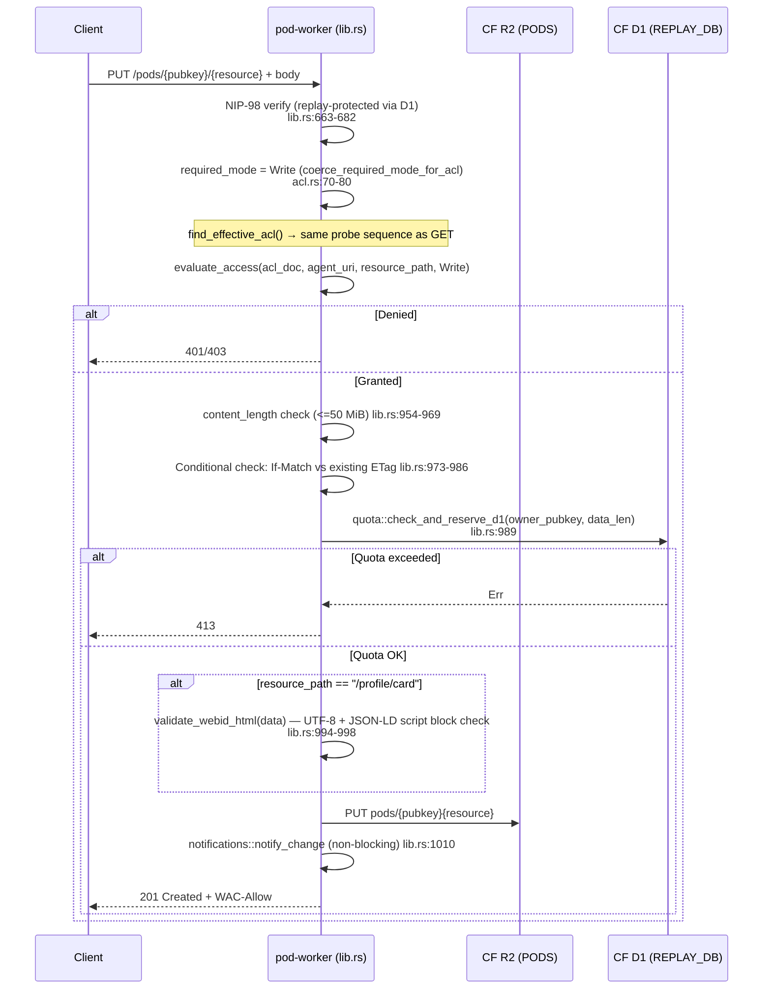
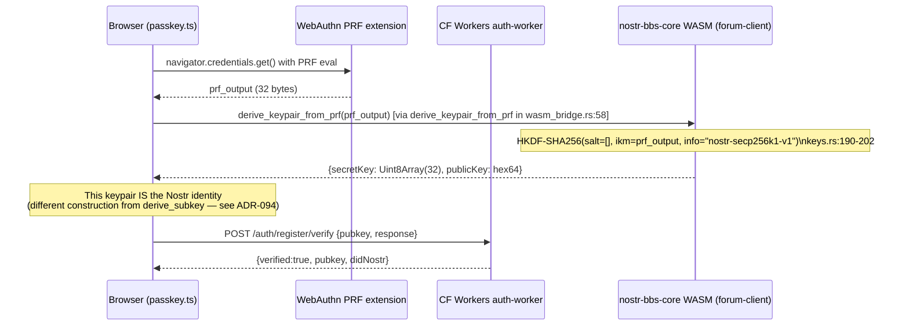

# Pod ACL and Identity Layer — Cartography Audit

Generated from source code. All file:line references are to the live codebase.

---

## 1. Pod Resource GET/PUT with WAC Authorisation

The `find_effective_acl` resolver in `crates/nostr-bbs-pod-worker/src/acl.rs:257`
drives every request. It is called from two places in `lib.rs`:

- Line 786 — standard resource flow (GET, PUT, POST, PATCH, DELETE)
- Line 1291 — ACL resource flow (`handle_acl_request`), for the *parent* resource

> **Resolution-order change (commit 682a948):** the R2 sidecar walk is now
> AUTHORITATIVE and runs first; the KV `acl:{owner_pubkey}` key is a legacy
> pod-level document consulted ONLY when no R2 sidecar resolves at any level.
> The previous KV-first fast path let a stale owner-granular KV entry shadow
> every R2 sidecar — including ADR-096 delegation grants (former Finding 1,
> now resolved). The pure ordering lives in `resolve_effective_acl`
> (`acl.rs:325`) for unit testing.

### 1a. GET /pods/{pubkey}/{resource} — Full ACL Walk

```mermaid
sequenceDiagram
    participant C as Client
    participant W as pod-worker (lib.rs)
    participant KV as CF KV (POD_META)
    participant R2 as CF R2 (PODS)
    participant WAC as solid_pod_rs::wac::evaluate_access

    C->>W: GET /pods/{pubkey}/{resource}
    Note over W: parse_pod_route() validates pubkey hex<br/>and resource path (P2 traversal guard)<br/>lib.rs:95-116

    W->>W: NIP-98 verify (auth::verify_nip98_replay)<br/>agent_uri = "did:nostr:{requester_pk}"<br/>lib.rs:663-682

    W->>W: required_mode = coerce_required_mode_for_acl(resource_path, "GET")<br/>→ Read (non-acl path)<br/>acl.rs:70-80

    Note over W: find_effective_acl(bucket, kv, owner_pubkey, resource_path)<br/>acl.rs:257 — R2 sidecars AUTHORITATIVE, KV miss-fallback only (commit 682a948)

    Note over W: Build probe sequence via acl_probe_sequence(resource_path)<br/>acl.rs:152

    Note over W: Probe 1 (non-inherited): {resource}.acl<br/>e.g. /private/agent/SOUL.md.acl<br/>acl.rs:172

    W->>R2: GET pods/{pubkey}/{resource}.acl
    alt R2 hit and <=64 KiB
        R2-->>W: bytes → AclDocument (inherited=false)
    else miss or oversized
        Note over W: Probe 2 (inherited): {dir}/.acl for immediate container<br/>e.g. /private/agent/.acl (ADR-096 fix)<br/>acl.rs:183

        W->>R2: GET pods/{pubkey}{dir}/.acl
        alt R2 hit
            R2-->>W: bytes → AclDocument (inherited=true)
        else miss
            Note over W: Probe 3 (inherited): legacy flat {dir-without-slash}.acl<br/>e.g. /private/agent.acl<br/>acl.rs:190-195

            W->>R2: GET pods/{pubkey}/private/agent.acl
            alt R2 hit
                R2-->>W: bytes → AclDocument (inherited=true)
            else miss
                Note over W: Continue walk: parent dir = /private/<br/>Probe: /private/.acl then /private.acl then /.acl<br/>acl.rs:196

                W->>R2: GET pods/{pubkey}/private/.acl
                W->>R2: GET pods/{pubkey}/private.acl
                W->>R2: GET pods/{pubkey}/.acl
                R2-->>W: first hit wins; doc.inherited = true

                alt no R2 sidecar at ANY level
                    Note over W: KV MISS-FALLBACK only — legacy pod-level ACL<br/>acl.rs:280-289
                    W->>KV: GET acl:{owner_pubkey}
                    alt KV hit and parseable (<=64 KiB)
                        KV-->>W: AclDocument (pod-level, non-inherited)
                    end
                end
            end
        end
    end

    alt No ACL found at any level
        W-->>C: 401/403 (deny-all; None → !has_access)<br/>lib.rs:791-797
    else AclDocument resolved
        W->>WAC: evaluate_access(acl_doc, agent_uri, resource_path, Read)
        Note over WAC: If inherited=true: only acl:default rules apply<br/>(WAC §4.2, enforced upstream)
        WAC-->>W: bool

        alt Access denied
            W-->>C: 401 (unauthenticated) or 403 (authenticated)<br/>lib.rs:791-797
        else Access granted
            W->>R2: GET pods/{pubkey}{resource}
            R2-->>W: object bytes
            W->>W: add_ldp_headers / add_wac_allow / add_cache_control
            W-->>C: 200 OK + WAC-Allow header
        end
    end
```

### 1b. PUT /pods/{pubkey}/{resource} — Write Path



---

## 2. Delegation Grant: PUT `{"@delegation":{...}}` to Container Sidecar

This is the "structured grant" shortcut documented in ADR-096.
The ACL-write handler in `lib.rs:1387-1449` detects the `@delegation` envelope
before the generic JSON-LD path and calls `build_delegation_acl` in `acl.rs:367`.

```mermaid
sequenceDiagram
    participant C as Client (acl:Control holder)
    participant W as handle_acl_request (lib.rs:1266)
    participant ACL as acl::build_delegation_acl (acl.rs:367)
    participant R2 as CF R2

    C->>W: PUT /pods/{pubkey}/{container}/.acl<br/>body: {"@delegation":{"agent":"did:nostr:...","modes":["acl:Read","acl:Write"]}}
    Note over W: is_acl_path() → true → handle_acl_request() lib.rs:762

    W->>W: parent_path = acl_path.strip_suffix(".acl")<br/>e.g. "/private/agent/" lib.rs:1282

    W->>W: find_effective_acl(bucket, kv, owner_pubkey, parent_path)<br/>→ parent_acl (same probe sequence as §1a)

    W->>W: evaluate_access(parent_acl, agent_uri, parent_path, Control)
    alt No acl:Control
        W-->>C: 401/403 "acl:Control required to modify ACL" lib.rs:1365
    else Has Control
        W->>W: JSON parse body → detect "@delegation" key lib.rs:1397
        W->>W: validate agent starts with "did:nostr:" lib.rs:1399-1412
        W->>W: parse modes array; "acl:Control" silently ignored lib.rs:1414-1438

        W->>ACL: build_delegation_acl(owner_did, agent_did, container, modes)
        Note over ACL: 1. ALWAYS emit #owner auth:<br/>   agent=owner_did, accessTo+default=container<br/>   modes=[Read,Write,Control] acl.rs:405-423
        Note over ACL: 2. Strip acl:Control from delegate modes acl.rs:425-431
        Note over ACL: 3. If delegate_modes non-empty, emit #delegate auth:<br/>   agent=agent_did, accessTo+default=container<br/>   modes=requested_minus_Control acl.rs:435-450
        Note over ACL: Result: AclDocument {inherited:false, @graph:[#owner,#delegate]}
        ACL-->>W: AclDocument

        W->>W: serde_json::to_vec(doc) — canonical wire JSON-LD
        W->>W: Validate round-trips as AclDocument
        W->>R2: PUT pods/{owner}/{container}/.acl (content-type: application/ld+json)
        W-->>C: 201 {"status":"ok"}
    end
```

**Owner lock-out invariant**: `build_delegation_acl` always re-emits the owner's
`[Read, Write, Control]` grant regardless of what the caller requested. The delegate
never receives `acl:Control` even if `"acl:Control"` is included in the modes array
— it is silently dropped at `acl.rs:427-431`.

---

## 3. Identity Derivation: `derive_subkey` HMAC-SHA-256

Defined in `crates/nostr-bbs-core/src/keys.rs:236`.
Scheme (ADR-094): `child_sk = HMAC-SHA-256(key=root_sk_32bytes, msg=utf8(tag))`.

```mermaid
flowchart TD
    ROOT["SecretKey (32 bytes)\n(secp256k1 scalar)"]

    ROOT -->|"HMAC-SHA256(root, tag)"| HMAC["hmac::Hmac<Sha256>\nkeys.rs:239-241"]
    HMAC -->|"32-byte output"| VALIDATE["SecretKey::from_bytes(child)\nreject if zero or ≥ curve order\nkeys.rs:247"]
    VALIDATE --> CHILDSK["child SecretKey"]

    CHILDSK -->|"child.public_key()"| CHILDPK["child PublicKey (x-only BIP-340)"]

    subgraph "Known production tags (keys.rs + wasm_bridge.rs + devices.rs)"
        T1["\"agentbox-mirror-v1\"\nNostr session mirror child key\nagentbox CLAUDE.md; keys.rs:428,437,457"]
        T2["\"agentbox-agent-v1\"\nAgentbox agent identity\nkeys.rs:438 (test/domain-separation only)"]
        T3["\"device:{uuid}\"\nRevocable device subkey (ADR-099)\nformat!(\"device:{}\", Uuid::new_v4())\nforum-client/src/utils/devices.rs:132,176\nauth-worker/src/devices.rs:4 (doc)"]
    end

    CHILDSK -.->|used as| T1
    CHILDSK -.->|used as| T2
    CHILDSK -.->|used as| T3

    subgraph "JS parity (ADR-094)"
        JSP["crypto.createHmac('sha256', root)\n  .update(tag, 'utf8').digest()\nKnown-answer vector: root=[0x01×32],\ntag='agentbox-mirror-v1'\n→ 2d07f2ce…695d\nkeys.rs:449-462"]
    end

    HMAC -.->|byte-for-byte identical| JSP

    subgraph "WASM bridge export (wasm32 only)"
        WB["derive_subkey_js(root_hex, tag)\nwasm_bridge.rs:81\nReturns {publicKey, secretKeyHex, nsec}"]
    end

    CHILDSK -.->|wrapped by| WB
```

### 3a. PRF Key Derivation (separate construction — HKDF-Expand)



`derive_from_prf` (HKDF-Expand, keys.rs:190) and `derive_subkey` (HMAC, keys.rs:236)
are intentionally different constructions. The PRF path produces the **root** identity
keypair from the authenticator secret. `derive_subkey` produces **child** keys from
that root.

---

## 4. Pod Provisioning — Eager `provision_pod`

There are two entry points that trigger provisioning. Neither is triggered
automatically during WebAuthn `register_verify` — provisioning is an explicit
separate call.

```mermaid
sequenceDiagram
    participant C as Client
    participant PW as pod-worker (lib.rs)
    participant AW as auth-worker (pod.rs)
    participant R2 as CF R2 (PODS)
    participant KV as CF KV (POD_META)

    rect rgb(230, 240, 255)
        Note over C,KV: Path A: POST /.pods (JSS-compatible; lib.rs:499)
        C->>PW: POST /.pods {"name":"{64-hex-pubkey}"}<br/>+ Authorization: Nostr <nip98>
        PW->>PW: NIP-98 verify; requester_pubkey must equal name lib.rs:526
        PW->>R2: pod_exists(bucket, name) lib.rs:532
        alt Already provisioned
            PW-->>C: 409 "Pod already provisioned"
        else Not yet provisioned
            PW->>PW: provision_pod(bucket, kv, name, pod_base, None) lib.rs:537
        end
    end

    rect rgb(240, 255, 230)
        Note over C,KV: Path B: POST /pods/{pubkey}/.provision (lib.rs:697)
        C->>PW: POST /pods/{pubkey}/.provision<br/>+ Authorization: Nostr <nip98><br/>+ body (optional): {"display_name":"..."}
        PW->>PW: NIP-98 verify; require owner OR admin lib.rs:703-713
        PW->>R2: pod_exists(bucket, owner_pubkey) lib.rs:716
        alt Already provisioned
            PW-->>C: 409
        else Not yet provisioned
            PW->>PW: provision_pod(bucket, kv, owner_pubkey, pod_base, display_name) lib.rs:731
        end
    end

    rect rgb(255, 245, 220)
        Note over C,AW: Path C: Auth-worker pod.rs (auth-worker only, no R2 container tree)
        Note over AW: auth-worker::pod::provision_pod writes ONLY:<br/>1. KV: acl:{pubkey} (pod-level ACL JSON)<br/>2. R2: pods/{pubkey}/profile/card (JSON-LD profile)<br/>3. KV: meta:{pubkey} (timestamp + usage)<br/>pod.rs:29-113<br/>NOTE: never called from webauthn.rs — only pod::handle_profile is<br/>called (lib.rs:318, GET /api/profile); provision_pod is dead code
    end

    Note over PW,R2: pod-worker provision_pod() creates full tree:
    PW->>R2: PUT pods/{pubkey}/ (root container marker) provision.rs:121
    PW->>R2: PUT pods/{pubkey}/profile/ (x7 sub-containers) provision.rs:133-149
    PW->>R2: PUT pods/{pubkey}/profile/card (WebID HTML) provision.rs:153
    PW->>R2: PUT pods/{pubkey}/.acl (root ACL: owner RWC + default) provision.rs:166-186
    PW->>R2: PUT pods/{pubkey}/public/.acl (foaf:Agent R + owner RWC) provision.rs:189-215
    PW->>R2: PUT pods/{pubkey}/media/public/.acl (same as public) provision.rs:222-230
    PW->>R2: PUT pods/{pubkey}/private/.acl (owner-only RWC) provision.rs:233-253
    PW->>R2: PUT pods/{pubkey}/inbox/.acl (authenticated Append + owner RWC) provision.rs:256-282
    PW->>R2: PUT pods/{pubkey}/profile/.acl (foaf:Agent R + owner RWC) provision.rs:285-311
    PW->>R2: PUT pods/{pubkey}/settings/.acl (owner-only) provision.rs:314-334
    PW->>R2: PUT pods/{pubkey}/settings/publicTypeIndex.jsonld provision.rs:349-357
    PW->>R2: PUT pods/{pubkey}/settings/privateTypeIndex.jsonld provision.rs:359-368
    PW->>R2: PUT pods/{pubkey}/settings/publicTypeIndex.jsonld.acl (owner RWC + foaf:Agent R) provision.rs:370-381
    PW->>KV: update_usage(kv, owner_pubkey, 0) provision.rs:385
    PW-->>C: 201 {"status":"provisioned","podUrl":"...","webId":"...","didNostr":"..."}
```

---

## Findings

### Finding 1 — RESOLVED (commit 682a948) | KV Fast-Path Masked R2 Sidecars

**File**: `crates/nostr-bbs-pod-worker/src/acl.rs:257-298`
**Classification**: Fixed design gap

~~The KV fast-path read `acl:{owner_pubkey}` FIRST and returned unconditionally
on a hit, shadowing every R2 sidecar — so delegation grants written into R2
(via `build_delegation_acl`) were unreachable for pods carrying that KV key.~~
Fixed at the single resolver every access decision funnels through:
`find_effective_acl` now runs the most-specific-first R2 probe sequence first
and authoritatively; the legacy pod-level KV key is consulted only when no R2
sidecar resolves at any level, so it can never mask a more-specific R2
delegation sidecar. The ordering is extracted into the pure
`resolve_effective_acl` helper (`acl.rs:325`) with regression tests (masking
repro + KV-fallback + deny-all preserved). The auth-worker `pod::provision_pod`
— the only writer of the masking KV key — remains dead code (see Finding 4).

---

### Finding 2 — LOW | Duplicated `is_acl_path` / `path_is_acl` Predicate

**File**: `crates/nostr-bbs-pod-worker/src/acl.rs:53-55` and
`crates/nostr-bbs-pod-worker/src/lib.rs:119-121`
**Classification**: Duplication / maintenance risk

`acl.rs` defines a private `fn path_is_acl(path: &str) -> bool { path.ends_with(".acl") }`
and `lib.rs` defines an identical private `fn is_acl_path(path: &str) -> bool { path.ends_with(".acl") }`.
They are the same predicate with different names. `lib.rs` could simply call the
public surface from `acl.rs` (which already exports `coerce_required_mode_for_acl`
that internally uses `path_is_acl`), or `acl.rs` could export `path_is_acl` and
`lib.rs` can import it. A future maintainer who changes the predicate in one place
(e.g. to also match `.acl.gz` for compressed ACLs) will silently miss the other.

---

### Finding 3 — LOW | `parse_acl_with_cap` and `parse_acl_text_with_cap` are Private but Mentioned in Module Doc as Kit-Specific

**File**: `crates/nostr-bbs-pod-worker/src/acl.rs:12-14`, functions at `acl.rs:101` and `acl.rs:109`
**Classification**: Export/visibility inconsistency

The module-level doc comment (`acl.rs:12-14`) calls out both `parse_acl_with_cap`
and `parse_acl_text_with_cap` as named kit-specific extensions alongside
`find_effective_acl` and `coerce_required_mode_for_acl`, all of which are
described as the public kit surface. However `parse_acl_with_cap` (line 101) and
`parse_acl_text_with_cap` (line 109) are declared `fn` (private). This is a doc/
visibility mismatch. If callers outside the module ever need to apply the size cap
independently (e.g. a future partial-ACL merge path), they cannot without
duplicating the cap logic. Either make them `pub(crate)` to match the doc intent,
or remove them from the module doc description.

---

### Finding 4 — MEDIUM | Auth-Worker `pod::provision_pod` Is Dead Code as a Provisioner

**File**: `crates/nostr-bbs-auth-worker/src/pod.rs:29-113`
**Classification**: Dead code / architectural drift

`pod::provision_pod` in the auth-worker is never called for actual provisioning.
It is defined at `pod.rs:29` and the only call to `pod::` in `lib.rs` is at
line 318 (`pod::handle_profile`). Provisioning is performed by the pod-worker's
own `provision::provision_pod` (`pod-worker/src/provision.rs:106`), reachable via
`POST /.pods` or `POST /pods/{pubkey}/.provision`.

The two implementations have diverging behaviour:
- `auth-worker::pod::provision_pod` writes only 3 objects (KV ACL, R2 profile
  card, KV meta) with a single flat ACL document in KV.
- `pod-worker::provision::provision_pod` writes 13+ R2 objects (per-container
  ACLs, TypeIndex documents, WebID HTML, sub-containers) and no KV ACL entry.

If `auth-worker::pod::provision_pod` were ever wired into a signup flow, it would
produce an under-provisioned pod with a legacy KV ACL. Since commit 682a948 the
resolver treats that KV key as a miss-fallback only (it can no longer suppress R2
sidecars — former Finding 1), but the function remains an under-provisioning dead
path flagged for deletion.

---

### Finding 5 — LOW | WASM Bridge Exports Without Production JS Consumers

**File**: `crates/nostr-bbs-core/src/wasm_bridge.rs`
**Classification**: Dead export surface

The following `#[wasm_bindgen]` exports in `wasm_bridge.rs` have no production JS
consumers in the repo. They appear only in the benchmark harness
(`benchmarks/js-vs-wasm/bench.mjs`) or not at all:

| Export | File:Line | Benchmark only | No consumers found |
|--------|-----------|---------------|--------------------|
| `create_nip98_token` | `wasm_bridge.rs:113` | Yes (bench.mjs:38, noted to panic in WASM due to `SystemTime`) | — |
| `verify_nip98_token` | `wasm_bridge.rs:133` | — | No JS caller found |
| `verify_nip98_token_at` | `wasm_bridge.rs:151` | — | No JS caller found |
| `schnorr_verify` | `wasm_bridge.rs:241` | — | No JS caller found |

`derive_keypair_from_prf`, `schnorr_sign`, `compute_event_id`, and `nip44_encrypt`/
`nip44_decrypt` are used in the benchmark. `derive_subkey_js` and
`generate_keypair` are consumed by `forum-client` via the Rust WASM target (not
via the exported JS symbols directly, since `forum-client` is itself a Rust WASM
crate). The four symbols above have no identified JS callers; `create_nip98_token`
is additionally documented in the benchmark to panic in WASM due to
`std::time::SystemTime::now()` being unavailable. These should either gain
consumers or be removed from the public WASM surface to reduce the compiled
bundle size.

---

### Finding 6 — LOW | `key_provisioning.rs` and `nip05_endpoint.rs` Are Permanently-Parked Stubs

**File**: `crates/nostr-bbs-pod-worker/src/key_provisioning.rs` and
`crates/nostr-bbs-pod-worker/src/nip05_endpoint.rs`
**Classification**: Dead module / maintenance debt

Both modules compile to a single `const _: () = ();` line. They are gated behind
`#[cfg(feature = "solid-pod-rs-phase1")]` which is never enabled in the workspace.
The comments document why: `key_provisioning` requires `solid-pod-rs-idp` (a sibling
crate not depended on), and `nip05_endpoint` requires actix-web (incompatible with
the CF Workers runtime). Neither blocker is in the near-term roadmap per the
consumer-surface-map. The modules exist only as source-level breadcrumbs but add
noise to `lib.rs:40-42` (`mod export; mod key_provisioning; mod nip05_endpoint;`).
They should be removed or moved to a `//! TODO: Phase 1` ADR comment until
activation is realistic.

---

### Finding 7 — INFO | `acl_probe_sequence` Legacy Flat `{dir}.acl` Form Remains Reachable — Noted, Not a Bug

**File**: `crates/nostr-bbs-pod-worker/src/acl.rs:188-196`
**Classification**: Informational

The resolver retains the legacy flat-sidecar probe (`/private/agent.acl` for a
resource under `/private/agent/`) interleaved between the container sidecar probe
(`/private/agent/.acl`) and the grandparent container probe. This is intentional
for backward-compatibility during migration (documented at `acl.rs:129-148`). Newly
provisioned pods write container sidecars (`{dir}/.acl`) per `provision.rs`. Older
pods may have only flat sidecars. Both remain reachable with correct precedence
(own > container > legacy flat > ancestor). No action required.
