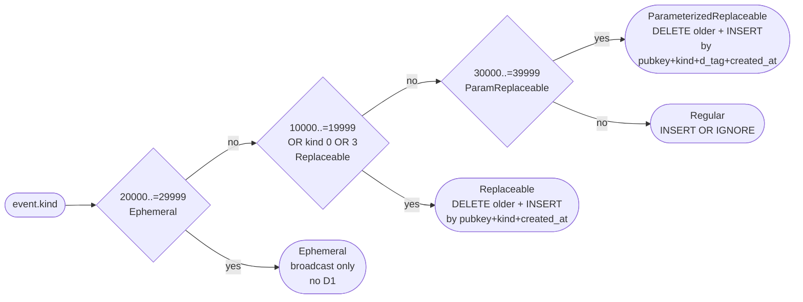
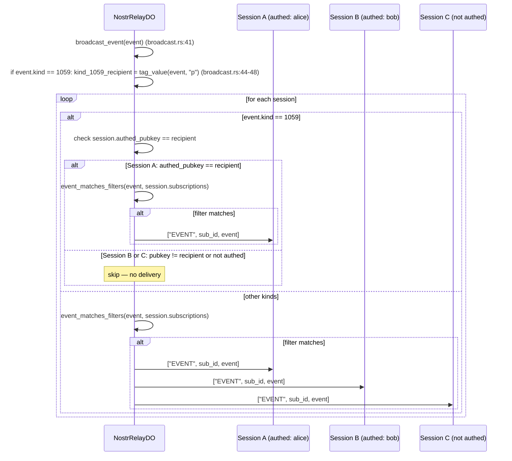
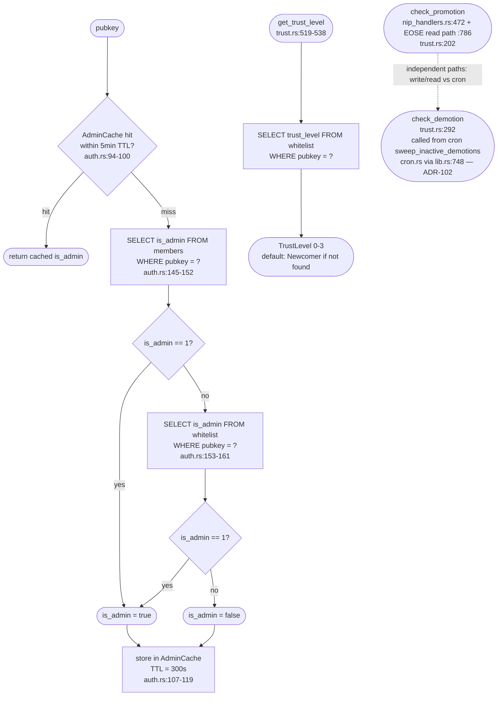
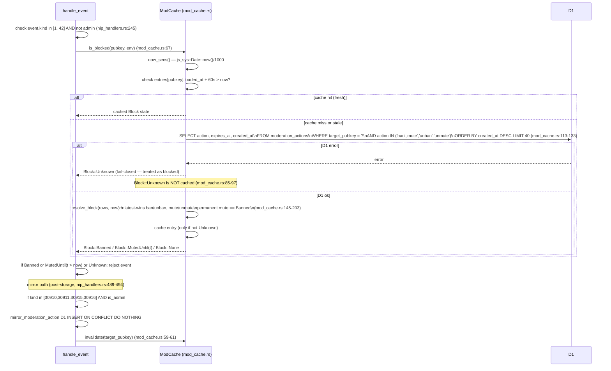
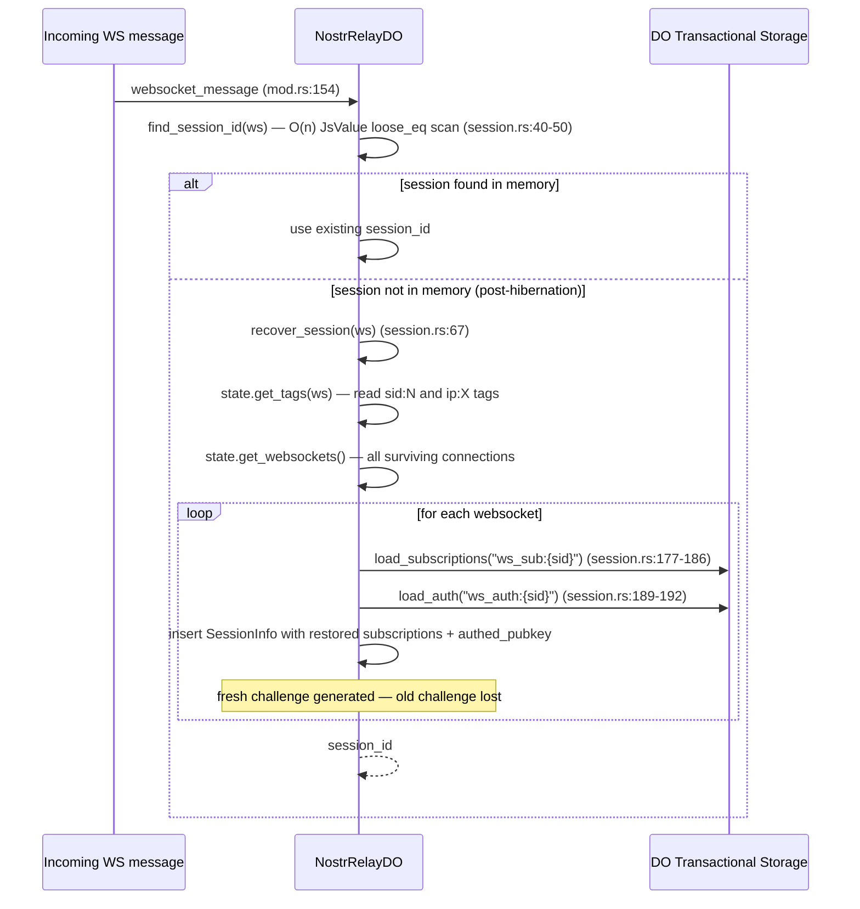

# Relay Event Admission — Mermaid Diagrams

Cartography built from actual source code, not documentation.
All file:line citations reference `crates/nostr-bbs-relay-worker/src/`.

---

## 1. WebSocket Connect → NIP-42 AUTH → Session Scope Establishment

The entry point is `DurableObject::fetch` in `relay_do/mod.rs:85-151`. The DO
checks per-IP connection cap (`MAX_CONNECTIONS_PER_IP = 20`, `mod.rs:50`), then
creates a `SessionInfo` (`relay_do/session.rs:20-28`) with `authed_pubkey: None`
and immediately sends an `["AUTH", challenge]` frame. The challenge is a 128-bit
CSPRNG draw XOR-mixed with the session id (`session.rs:292-298`). The session
survives Durable Object hibernation via tagged WebSockets; `recover_session`
restores subscriptions and auth state from DO transactional storage
(`session.rs:67-174`). NIP-42 AUTH response handling lives in
`nip_handlers.rs:912-975`.

The device-key attribution path (ADR-099) is resolved in
`nip_handlers.rs:1088-1135` via `device_keys_enabled()` reading the
`DEVICE_KEYS_ENABLED` Worker var and `device_owner()` querying
`device_keys WHERE device_pubkey = ?1 AND revoked = 0`. The effective
principal for cohort/zone READ scope is then computed by `effective_pubkey()`
(`nip_handlers.rs:1129-1135`), which calls the pure `effective_principal()`
(`nip_handlers.rs:125-132`). Crucially, the kind-1059 DM `#p` filter in
`handle_req` is deliberately NOT rebound to the owner — it stays on the literal
`session_pubkey` to prevent a device key receiving owner DMs it cannot decrypt
(`nip_handlers.rs:642-658`).

```mermaid
sequenceDiagram
    participant C as Client
    participant DO as NostrRelayDO (mod.rs)
    participant Sess as SessionInfo (session.rs)
    participant Store as DO Storage
    participant D1

    C->>DO: HTTP Upgrade (WebSocket)
    DO->>DO: check connection_counts[ip] < 20 (mod.rs:96-100)
    alt too many connections
        DO-->>C: 429 Too Many Connections
    end
    DO->>DO: generate_challenge(session_id) via CSPRNG (session.rs:292-298)
    DO->>Sess: insert SessionInfo {authed_pubkey: None, challenge, subscriptions: {}}
    DO->>DO: connection_counts[ip] += 1
    DO-->>C: ["AUTH", challenge]  (broadcast.rs:121-123)
    Note over C,DO: Session established; authed_pubkey remains None

    C->>DO: ["AUTH", {kind:22242, pubkey, sig, tags:[["challenge","..."],["relay","..."]]}]
    DO->>DO: handle_auth(session_id, ws, event) (nip_handlers.rs:912)
    DO->>DO: check event.kind == 22242 (nip_handlers.rs:914-917)
    DO->>DO: verify_event_strict (Schnorr sig) (nip_handlers.rs:920-927)
    DO->>Sess: compare challenge tag vs session.challenge (nip_handlers.rs:930-944)
    DO->>DO: timestamp within 600s (nip_handlers.rs:946-950)
    alt any check fails
        DO-->>C: ["OK", id, false, "invalid: ..."]
    end
    DO->>Sess: session.authed_pubkey = Some(event.pubkey) (nip_handlers.rs:953-958)
    DO->>Store: put("ws_auth:{session_id}", pubkey) (session.rs:216-225)
    DO-->>C: ["OK", id, true, ""]

    Note over DO,D1: ADR-099 device-key scope resolution (runs on REQ, not on AUTH)
    DO->>DO: device_keys_enabled() reads DEVICE_KEYS_ENABLED var (nip_handlers.rs:1088-1093)
    alt DEVICE_KEYS_ENABLED == "true"
        DO->>D1: SELECT owner_pubkey FROM device_keys WHERE device_pubkey=? AND revoked=0 (nip_handlers.rs:1102-1120)
        alt device row found (non-revoked)
            DO->>DO: effective_pubkey = owner_pubkey (nip_handlers.rs:1129-1135)
        else no row / revoked / feature off
            DO->>DO: effective_pubkey = session_pubkey (identity passthrough)
        end
    end
    Note over DO: access_pubkey drives zone-read + cohort scope in handle_req
    Note over DO: kind-1059 #p filter stays on literal session_pubkey (NOT rebound)
```

---

## 2. EVENT Admission Pipeline

`handle_event` in `nip_handlers.rs:139-510` is the single admission gate for
all incoming events. It is a linear waterfall — any failing check short-circuits
with `["OK", id, false, ...]` and returns immediately.

The NIP-59 gift-wrap split at `nip_handlers.rs:181-207` is the most
architecturally significant branch: kind-1059 is admitted by checking the
**recipient** `p` tag (via `gift_wrap_recipient()`, `nip_handlers.rs:87-95`),
not the ephemeral author, because the author is a fresh random key per message
and would never be whitelisted.

After all gates, NIP-16 event treatment (`broadcast.rs:24-34`) decides between
ephemeral (broadcast-only), replaceable (delete older + insert), parameterized
replaceable (delete by pubkey+kind+d_tag + insert), and regular (insert) paths.
Ephemeral events skip D1 storage entirely (`nip_handlers.rs:452-456`).

Admin status is resolved via `AdminCache.is_admin()` (`auth.rs:91-120`), a
5-minute TTL in-memory cache that queries `members` first then `whitelist`
(`auth.rs:143-162`). Two separate call sites in `handle_event` call
`admin_cache.is_admin()` for the same pubkey (`nip_handlers.rs:255` and
`nip_handlers.rs:246`) — the second is redundant (cache hit), but not a bug.

The moderation-action mirror (`nip_handlers.rs:489-494`) applies only when the
signer is an admin, and immediately invalidates the `mod_cache` entry for the
target so subsequent events from the banned/muted pubkey fail immediately.

```mermaid
flowchart TD
    START([CLIENT sends EVENT])
    RL{check_rate_limit\nip: 10 evt/s\nbroadcast.rs:76-92}
    RATE_FAIL([NOTICE: rate limit exceeded])
    STRUCT{validate_event:\nid/pubkey/sig lengths,\ncontent size, tag limits,\n±7d timestamp drift\nnip_handlers.rs:512-545}
    STRUCT_FAIL([OK false: event validation failed])
    EXP{NIP-40 expiration tag\nexp < now?\nnip_handlers.rs:153-160}
    EXP_FAIL([OK false: event expired])
    SIG{verify_event_strict\nSchnorr + ID hash\nnip_handlers.rs:164-172}
    SIG_FAIL([OK false: id or sig failed])

    GIFT{event.kind == 1059?\nnip_handlers.rs:181}
    GIFT_RECIP[gift_wrap_recipient:\nextract first p tag\nnip_handlers.rs:87-95]
    GIFT_WL{is_whitelisted\nrecipient\nstorage.rs:310-326}
    GIFT_FAIL([OK false: recipient not whitelisted])

    DEV[effective_pubkey:\ndevice_keys_enabled + device_owner D1\nnip_handlers.rs:1129-1135]
    WL{is_whitelisted\nallowlist_pubkey\nstorage.rs:310-326}
    WL_FAIL([OK false: pubkey not whitelisted])

    MESH{is_mesh_peer?\nMESH_MODE != standalone\nAND pubkey in MESH_ALLOWED_REMOTE_DIDS\nnip_handlers.rs:1304-1324}
    MESH_KIND{is_federated_kind_allowed?\nMESH_FEDERATED_KINDS comma list\nnip_handlers.rs:1332-1346}
    MESH_FAIL([OK false: kind not in federated_kinds])

    SUSP{check_suspension:\nsuspended_until > now\nOR silenced flag\ntrust.rs:549-577}
    SUSP_FAIL([OK false: suspended or silenced])
    SILENCE_FAIL([OK false: silenced])

    MOD_CHK{kind in 1,42 AND\nnot admin AND\nmod_cache.is_blocked?\nmod_cache.rs:67-75\nnip_handlers.rs:245-251}
    MOD_FAIL([OK false: banned or muted])

    ADMIN_Q[admin_cache.is_admin\n5min TTL: members then whitelist\nauth.rs:91-162]

    TL_GATE{Trust-level gating\nnip_handlers.rs:259-323}
    TL_FAIL([OK false: restricted])

    NIP29{is_nip29_admin_kind?\nkinds 9000-9020, 39000-39002\nnip_handlers.rs:46-48}
    NIP29_H{has h tag?\nnip_handlers.rs:330-337}
    NIP29_ADMIN{is_admin?\nnip_handlers.rs:334}
    NIP29_FAIL([OK false: missing group tag or admin-only])

    GOV{is_governance_kind\nAND != KIND_ACTION_RESPONSE\nnip_handlers.rs:345-356}
    GOV_REG{is_registered_agent D1\nnip_handlers.rs:1137-1156}
    GOV_FAIL([OK false: not in agent registry])
    GOV_RESP{governance_response_blocked:\nkind==31403 AND not admin\nnip_handlers.rs:103-105}
    GOV_RESP_FAIL([OK false: admin-only governance response])

    ZONE42{kind == 42?\nnip_handlers.rs:371}
    ZONE42_GET[get_channel_zone D1\ntrust.rs:586-602]
    ZONE42_WA{has_zone_write_access:\nwrite_cohorts ?? required_cohorts\ntrust.rs:667-674}
    ZONE42_FAIL([OK false: zone access denied])

    CAL_RSVP{kind == 31925 AND\nnot admin?\nnip_handlers.rs:406}
    CAL_RSVP_T[resolve_rsvp_target D1:\nSELECT tags FROM events\nWHERE id = e_tag\nnip_handlers.rs:864-891]
    CAL_TIER[project_tier + rsvp_write_permitted:\nonly Full admitted\ncalendar_projection]
    CAL_RSVP_FAIL([OK false: rsvp not permitted])
    CAL_EV{kind 31922/31923 AND\nnot admin?\nnip_handlers.rs:431-447}
    CAL_EV_Z[read_zone_tag from event\nhas_zone_write_access D1]
    CAL_EV_FAIL([OK false: zone access denied])

    NIP16{event_treatment\nbroadcast.rs:24-34}
    EPHEMERAL([OK true + broadcast_event\nskip D1 storage])
    SAVE[save_event D1\nstorage.rs:58-148]
    SAVE_OK{stored?}
    SAVE_FAIL([OK false: failed to save])

    BROADCAST[broadcast_event\nbroadcast.rs:41-67]
    ACTIVITY[increment_posts_created\nupdate_last_active\ncheck_promotion\ntrust.rs:420, 461, 202]
    NIP09{kind == 5?\nprocess_deletion}
    NIP56{kind == 1984?\nprocess_report}
    MOD_MIRROR{kind in 30910/11/15/16\nAND is_admin?\nnip_handlers.rs:489}
    GOV_PROJECT{kind 31402/31403?\nproject_action_request/response\nnip_handlers.rs:498-507}

    START --> RL
    RL -->|fail| RATE_FAIL
    RL -->|pass| STRUCT
    STRUCT -->|fail| STRUCT_FAIL
    STRUCT -->|pass| EXP
    EXP -->|expired| EXP_FAIL
    EXP -->|ok| SIG
    SIG -->|fail| SIG_FAIL
    SIG -->|pass| GIFT

    GIFT -->|yes 1059| GIFT_RECIP
    GIFT_RECIP --> GIFT_WL
    GIFT_WL -->|not whitelisted or no p tag| GIFT_FAIL
    GIFT_WL -->|whitelisted| MESH

    GIFT -->|no| DEV
    DEV --> WL
    WL -->|not whitelisted| WL_FAIL
    WL -->|whitelisted| MESH

    MESH -->|is mesh peer| MESH_KIND
    MESH_KIND -->|kind not allowed| MESH_FAIL
    MESH_KIND -->|allowed| SUSP
    MESH -->|not mesh peer| SUSP

    SUSP -->|suspended| SUSP_FAIL
    SUSP -->|silenced| SILENCE_FAIL
    SUSP -->|ok| MOD_CHK

    MOD_CHK -->|blocked| MOD_FAIL
    MOD_CHK -->|not blocked| ADMIN_Q

    ADMIN_Q --> TL_GATE
    TL_GATE -->|restricted| TL_FAIL
    TL_GATE -->|pass| NIP29

    NIP29 -->|yes| NIP29_H
    NIP29_H -->|no h tag| NIP29_FAIL
    NIP29_H -->|has h| NIP29_ADMIN
    NIP29_ADMIN -->|not admin| NIP29_FAIL
    NIP29_ADMIN -->|admin| GOV
    NIP29 -->|no| GOV

    GOV -->|governance kind and not response| GOV_REG
    GOV_REG -->|not registered| GOV_FAIL
    GOV_REG -->|registered| GOV_RESP
    GOV -->|not gov| GOV_RESP
    GOV_RESP -->|blocked| GOV_RESP_FAIL
    GOV_RESP -->|pass| ZONE42

    ZONE42 -->|yes| ZONE42_GET
    ZONE42_GET --> ZONE42_WA
    ZONE42_WA -->|denied| ZONE42_FAIL
    ZONE42_WA -->|granted| CAL_RSVP
    ZONE42 -->|no| CAL_RSVP

    CAL_RSVP -->|yes| CAL_RSVP_T
    CAL_RSVP_T -->|unresolvable target| CAL_RSVP_FAIL
    CAL_RSVP_T -->|resolved| CAL_TIER
    CAL_TIER -->|FreeBusy or Omit| CAL_RSVP_FAIL
    CAL_TIER -->|Full| NIP16
    CAL_RSVP -->|no| CAL_EV

    CAL_EV -->|yes| CAL_EV_Z
    CAL_EV_Z -->|denied| CAL_EV_FAIL
    CAL_EV_Z -->|granted or untagged| NIP16
    CAL_EV -->|no| NIP16

    NIP16 -->|Ephemeral 20000-29999| EPHEMERAL
    NIP16 -->|Regular/Replaceable/ParamReplaceable| SAVE
    SAVE --> SAVE_OK
    SAVE_OK -->|no| SAVE_FAIL
    SAVE_OK -->|yes| BROADCAST
    BROADCAST --> ACTIVITY
    ACTIVITY --> NIP09
    NIP09 -->|kind 5| NIP09
    NIP09 --> NIP56
    NIP56 -->|kind 1984| NIP56
    NIP56 --> MOD_MIRROR
    MOD_MIRROR -->|kind 30910/11/15/16 + admin| MOD_MIRROR
    MOD_MIRROR --> GOV_PROJECT
```



---

## 3. NIP-16 Event Treatment Detail

`event_treatment()` in `broadcast.rs:24-34` classifies each kind. Kind-22242
(NIP-42 AUTH response) falls into the ephemeral range `20000..30000`, so it
would be broadcast-and-dropped without persistence if somehow routed here —
but AUTH responses are handled by `handle_auth`, not `handle_event`, so this
is a non-issue in practice. Kind-1059 (gift-wrap) is `Regular` — it is stored
and never replaced.



---

## 4. REQ Filter Handling and DM #p Scoping

`handle_req` in `nip_handlers.rs:553-788` executes these filtering stages:

1. **Subscription cap**: max 20 subscriptions per session (`nip_handlers.rs:568-576`).
2. **NIP-59 kind-1059 AUTH gate** (`nip_handlers.rs:599-638`): if any filter requests
   kind-1059, the session must be authenticated. If unauthenticated, a NOTICE is
   returned and the REQ is rejected. If authenticated, each filter that includes
   kind-1059 has its `#p` field overwritten with the authenticated pubkey — overriding
   any client-supplied `#p` to prevent cross-recipient leakage.
3. **ADR-099 effective pubkey** (`nip_handlers.rs:655-658`): `access_pubkey` is the
   device→owner-resolved principal for zone/cohort checks. The kind-1059 `#p` is
   NOT rebound (note comment at `nip_handlers.rs:650-654`).
4. **Zone filtering of results** (`nip_handlers.rs:696-763`): for each event returned
   from D1, channel kinds (40/42) and calendar kinds (31922/31923/31925) are filtered
   per the viewer's cohort/zone membership. Non-calendar events from zones the viewer
   cannot access are silently dropped.
5. **Read-activity tracking at EOSE** (`nip_handlers.rs:774-787`, O1 fix /
   ADR-102): delivered events are tallied post-zone-filtering and, for an
   authenticated session with at least one delivered event, a single batched
   `increment_posts_read_by(pk, delivered)` plus `update_last_active` and
   `check_promotion` run after EOSE — charged to the literal session pubkey,
   not the device→owner rebinding. This makes TL0→TL1 promotion reachable for
   readers and resets the ADR-102 inactivity-demotion clock for lurkers.

The SQL query builder (`filter.rs:53-183`) uses `instr()` for tag matching to avoid
SQLite LIKE complexity errors on 64-char hex values (`filter.rs:152-164`).

```mermaid
sequenceDiagram
    participant C as Client
    participant DO as NostrRelayDO
    participant D1
    participant ZC as ZoneConfig (ZONE_CONFIG env var)

    C->>DO: ["REQ", sub_id, filter1, filter2, ...]
    DO->>DO: websocket_message dispatch (mod.rs:213-226)
    DO->>DO: parse filters into Vec<NostrFilter> (filter.rs:20-38)
    DO->>DO: check subscriptions.len() < 20 (nip_handlers.rs:568-576)
    alt too many subscriptions
        DO-->>C: ["NOTICE", "too many subscriptions"]
    end
    DO->>DO: store subscription in sessions map (nip_handlers.rs:579-588)
    DO->>DO: save_subscriptions to DO storage (nip_handlers.rs:589)

    Note over DO: NIP-59 kind-1059 AUTH gate (nip_handlers.rs:599-638)
    DO->>DO: any filter requests kind 1059?
    alt filter includes kind 1059
        DO->>DO: session_pubkey = sessions[session_id].authed_pubkey
        alt session not authenticated
            DO-->>C: ["NOTICE", "auth-required: must authenticate to receive kind-1059 DMs"]
        end
        DO->>DO: rewrite each 1059-filter: force #p = [authed_pubkey]
        Note over DO: client-supplied #p overridden to prevent DM leakage
    end

    Note over DO: ADR-099 effective pubkey (nip_handlers.rs:655-658)
    DO->>DO: access_pubkey = effective_pubkey(session_pubkey)
    Note over DO: access_pubkey drives zone/cohort; DM #p stays on session_pubkey

    DO->>ZC: ZoneConfig::load(env) reads ZONE_CONFIG var (zone_config.rs:83-96)
    DO->>DO: is_admin = admin_cache.is_admin(access_pubkey)
    DO->>DO: get_viewer_cohorts(access_pubkey) for calendar tier (trust.rs:638-660)

    DO->>D1: query_events(filters) — per-filter SQL with instr() tag matching (storage.rs:241-302)
    D1-->>DO: Vec<NostrEvent>

    Note over DO: Zone + calendar filtering of results
    loop for each event in results
        alt calendar kind 31922/31923/31925
            DO->>D1: resolve_rsvp_target if kind 31925 (nip_handlers.rs:864-891)
            DO->>DO: project_calendar_for_viewer:\ncalendar_projection::project_tier (nip_handlers.rs:805-853)
            alt Projection::Full or viewer is owner/admin
                DO-->>C: ["EVENT", sub_id, event]
            else Projection::FreeBusy or Omit
                Note over DO: event silently dropped
            end
        else channel kind 40 or 42
            DO->>D1: get_channel_zone(channel_id) (trust.rs:586-602)
            DO->>DO: is_member = has_zone_access(access_pubkey, zone)\nor is_public_read (zone_config.rs:110-114)
            alt admin or is_member
                DO-->>C: ["EVENT", sub_id, event]
            else non-member
                alt kind 40 and zone not Hidden
                    DO-->>C: ["EVENT", sub_id, event — def only, content withheld]
                else kind 42 or Hidden zone
                    Note over DO: event silently dropped
                end
            end
        else other kinds
            DO-->>C: ["EVENT", sub_id, event]
        end
    end
    DO-->>C: ["EOSE", sub_id]

    Note over DO,D1: O1 / ADR-102: read-activity tracking (nip_handlers.rs:774-787)
    alt delivered > 0 and session authenticated
        DO->>D1: increment_posts_read_by(session_pubkey, delivered) (trust.rs:442)
        DO->>D1: update_last_active(session_pubkey) (trust.rs:461)
        DO->>D1: check_promotion(session_pubkey) (trust.rs:202)
    end
```

---

## 5. Broadcast Path: kind-1059 Delivery Gate

`broadcast_event` in `broadcast.rs:41-67` applies a second kind-1059 gate on
the real-time fanout path. When a gift-wrap is stored and broadcast, only the
session whose `authed_pubkey` matches the event's `p` tag receives it. This is
independent of the REQ `#p` rewrite (diagram 4 above) — the REQ rewrite guards
stored-event queries; this gate guards live fanout.

Both gates use the same event `p` tag as the key, but they operate in different
code paths with no shared state. This is deliberate defence-in-depth, not a bug.



---

## 6. Trust Level Resolution and Admin Check Chain

The relay uses two parallel admin sources that are queried in sequence:
`members` table first, then `whitelist` (`auth.rs:143-162`). `check_promotion`
is wired into the event pipeline (`nip_handlers.rs:472`) and, since the O1 fix,
also into the REQ/EOSE read path (`nip_handlers.rs:786`). `check_demotion`
(`trust.rs:292`) is deliberately NOT called from the event pipeline — it is
time-driven and invoked by the 5-minute cron via the paged
`cron::sweep_inactive_demotions` inactivity sweep (ADR-102, `lib.rs:748`,
`cron.rs`), which applies one demotion step per qualifying row and exempts
admins/TL3.



---

## 7. ModCache Ban/Mute Ingress Gate

The `ModCache` (`relay_do/mod_cache.rs`) provides a 60-second in-memory cache
of ban/mute state, queried for kind-1 and kind-42 events only (`nip_handlers.rs:245-251`).
On a D1 fault, `Block::Unknown` is returned and is treated as blocked (fail-closed,
`mod_cache.rs:32-37`). The mirror path (`nip_handlers.rs:489-494`) fires when an
admin sends kind-30910/30911/30915/30916 and immediately invalidates the cache
entry for the target pubkey.



---

## 8. Session Hibernation Recovery

When the Cloudflare Workers runtime hibernates the Durable Object to save
resources, all in-memory state (`sessions`, `rate_limits`, `connection_counts`)
is lost but WebSocket connections and their tags survive. `recover_session`
(`session.rs:67-174`) reconstructs session state from DO transactional storage.

The `generate_challenge` re-issue on recovery (`session.rs:96`) means a
recovered session gets a fresh NIP-42 challenge — the stored `ws_auth:*` key is
used to restore `authed_pubkey` without requiring re-authentication, but the
challenge string cannot be verified after recovery so any AUTH in flight at
hibernation time would fail.



---

## Findings

1. **{severity: medium, file: auth.rs:143-162, description: Dual admin-table lookup (members then whitelist). The `members` table is checked first, then `whitelist`. The relay event path uses `whitelist.is_admin` throughout the DO; `members` is a legacy table that predates the whitelist cohort model. If a pubkey appears in `members` as admin but not in `whitelist`, the relay's `is_whitelisted()` check at `storage.rs:310-326` will reject their events even though `is_admin` returns true. This means an admin from `members` could pass the admin gate but fail the whitelist gate, creating an inconsistent access state., suspected-legacy}**

2. **RESOLVED (commit 42b1ded, ADR-102)** — ~~`check_demotion` is fully implemented with hysteresis logic but is never called~~. `check_demotion` (`trust.rs:292`) is now invoked by the 5-minute cron via the paged `cron::sweep_inactive_demotions` inactivity sweep (`lib.rs:748`), with an added admin/TL3 exemption guard. `last_active_at` is also stamped on the EOSE read path so active lurkers do not drift into demotion.

3. **RESOLVED (commit 1e49c3e)** — ~~`increment_posts_read` is defined but dead~~. Reads are now tallied post-zone-filtering in `handle_req` and batched into a single `increment_posts_read_by(pk, delivered)` at EOSE (`nip_handlers.rs:774-787`), followed by `check_promotion`, so TL0→TL1 promotion (`posts_read >= 10`) is reachable for readers.

4. **{severity: low, file: nip_handlers.rs:245-255, description: `admin_cache.is_admin()` is called twice for the same pubkey per event: once at line 246 (inside the `matches!(event.kind, 1 | 42)` guard) and again at line 255 (unconditional). For a kind-1 or kind-42 event from a non-admin, two cache lookups occur at the same timestamp; for an admin or other kind, only the second call fires. The cache makes this a near-zero-cost hit, but it is a structural duplicate — both resolve to the same value for the same pubkey in the same request., duplicate}**

5. **{severity: medium, file: relay_do/mod_cache.rs:113-133 vs relay_do/storage.rs:310-326, description: Two separate D1 schemas enforced implicitly. `is_whitelisted` queries `whitelist` table; `ModCache` queries `moderation_actions` table. Both are fail-safe (false / Block::Unknown respectively) on D1 error, but `Block::Unknown` is fail-CLOSED (treated as blocked) while `is_whitelisted` D1 error is fail-OPEN (returns false, which rejects events). The asymmetry is intentional per code comments but creates a nuanced security posture: a D1 fault silently drops all events rather than admitting unvalidated ones., ok}**

6. **{severity: medium, file: nip_handlers.rs:1088-1093, description: `DEVICE_KEYS_ENABLED` is read on every call to `effective_pubkey()` (and therefore on every EVENT and every REQ). There is no caching of this env-var read; `self.env.var()` is a JS interop call. When the gate is off the D1 device lookup is skipped entirely (pure passthrough), so the residual overhead is the env-var read only., ok}**

7. **{severity: high, file: nip_handlers.rs:325-338 (NIP-29 admin kinds gate), description: The NIP-29 handler comment at line 328-330 states "NIP-29 TODO: This enforces the h-tag/admin gate, but full group metadata should be relay-key-generated rather than accepted from arbitrary clients." Group metadata events (kinds 39000-39002) are accepted from admin clients but the spec requires relay-generated signatures. A TODO-gated admission path for admin-controlled group metadata that bypasses relay key signing is an incomplete implementation — a rogue admin could inject arbitrary group metadata., doc-drift}**

8. **{severity: low, file: nip_handlers.rs:341-368 (governance kinds gate), description: The agent governance gate (kinds 31400-31405) checks `is_registered_agent` for all governance kinds EXCEPT `KIND_ACTION_RESPONSE` (31403). The comment at line 343 says 31403 is "exempt" because it comes from humans (admins), not agents. However, the subsequent `governance_response_blocked` check at line 360 then enforces admin-only for 31403. The two gates together are correct, but the structural split (one gate exempts, the next gate re-restricts) is non-obvious and could be collapsed into a single check., ok}**

9. **{severity: medium, file: nostr-bbs-mesh/src/lib.rs:1-120, description: The `MeshTransport` trait, `PeerSession` struct, and `broadcast_kind30033` method are defined as a scaffold with no concrete implementation wired into `nostr-bbs-relay-worker`. The relay worker uses `is_mesh_peer()` and `is_federated_kind_allowed()` (nip_handlers.rs:1304-1346) as env-var guards, but these are self-contained inline checks that do not call into `nostr-bbs-mesh`. The mesh crate is a dead library dependency for the relay worker — it is not imported in `relay_do/mod.rs` or any relay source file. Sprint v12+ is cited for the full implementation., suspected-legacy}**

10. **{severity: low, file: relay_do/storage.rs:144-148 (kind-0 profile hook), description: The `upsert_profile` side-effect fires for every successfully stored kind-0 event but failures are silently swallowed (`Err(_) => return`). If the `profiles` table does not exist (e.g. a fresh deployment missing schema migrations), kind-0 events still succeed and the relay logs nothing. This makes the profiles projection silently broken on misconfigured deployments., ok}**

11. **{severity: low, file: relay_do/filter.rs:628-637 (test comment at line 629), description: The test `empty_ids_array_matches_all` has a comment that says "an empty array means 'no constraint' -- the field is set but effectively a no-op" but then the assertion proves it DOES reject (returns false), contradicting the comment. The code is correct (NIP-01: empty ids = impossible match), but the comment is wrong (it says it should match but the assert says it shouldn't). Documentation drift within the test., doc-drift}**

12. **{severity: medium, file: relay_do/nip_handlers.rs:271-297 (kind-41 TL gate), description: For kind-41 (channel metadata/pin), TL2 authors are allowed to modify their OWN channel, while TL3 is required to modify others'. The `is_channel_creator` check (`nip_handlers.rs:1064-1086`) queries `events WHERE id = ? AND kind = 40` to find the original channel. If the kind-40 event was deleted via kind-5 (NIP-09), the creator lookup returns false and a TL2 author loses access to their own channel even though they created it. No tombstone or separate creator index exists., isolated}**

13. **{severity: low, file: relay_do/nip_handlers.rs:1207-1213 (ActionResponse projection), description: `project_action_response` parses `event.content` as `ActionResponse` twice in sequence (lines 1207 and 1211) for the same string, extracting `action` on the first parse and `reasoning` on the second. Both calls allocate and drop a `governance::ActionResponse`. A single parse into a local variable would suffice., ok}**
